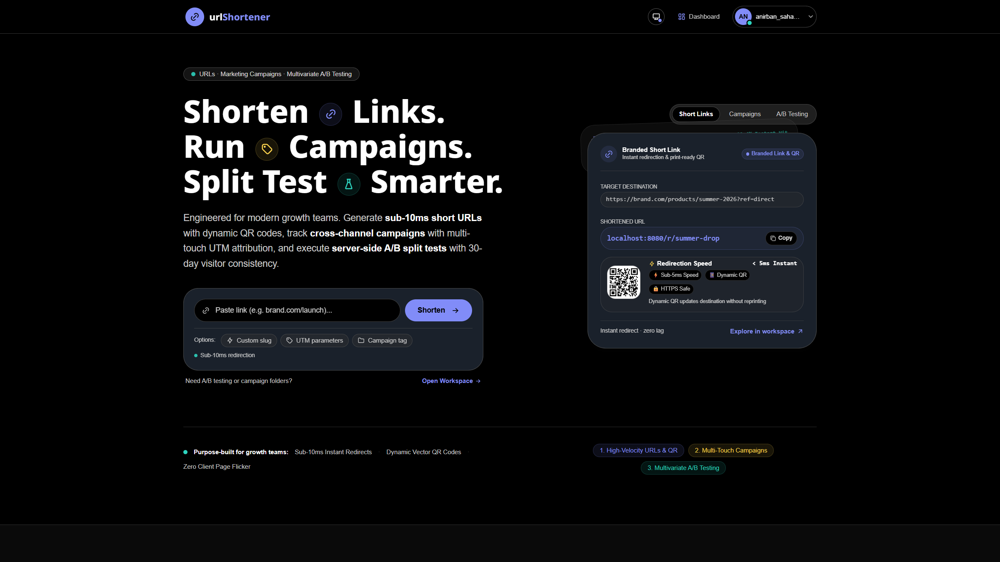
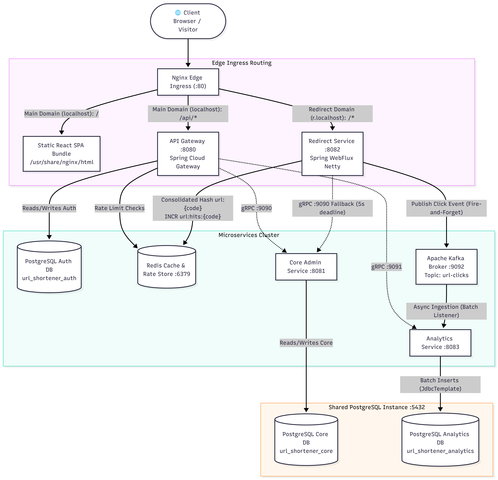
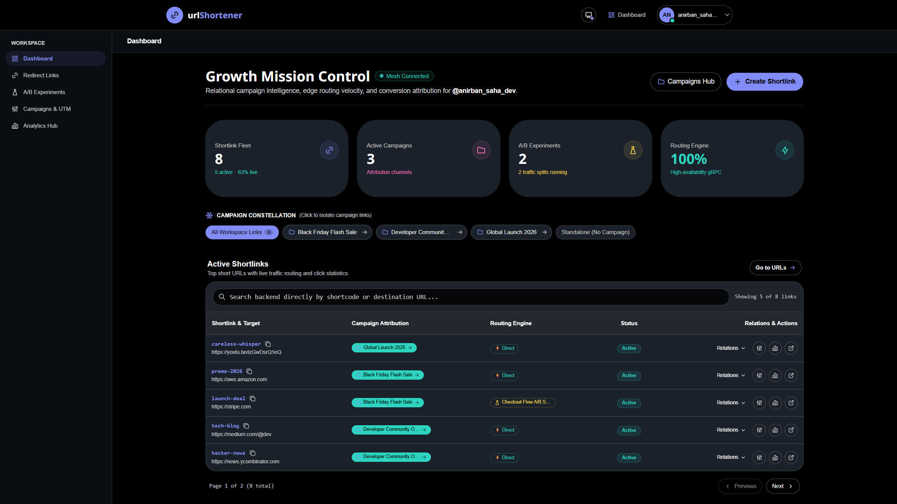
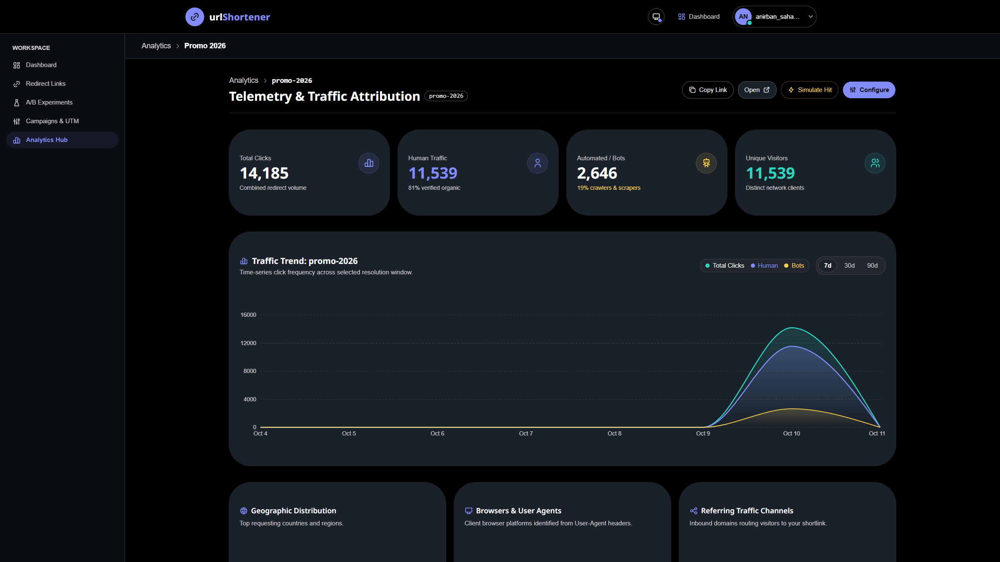
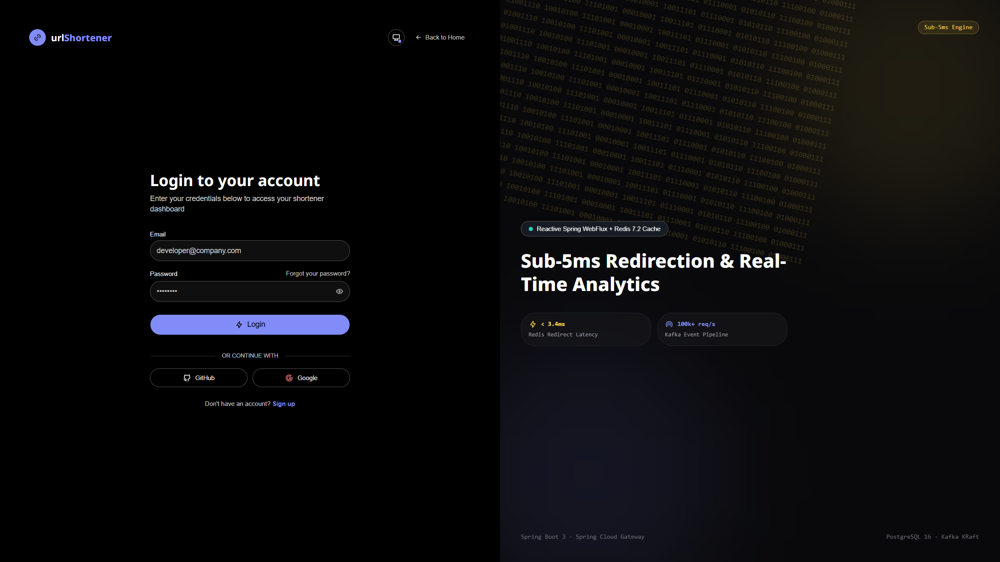

# urlShortener — Enterprise Multi-Tenant URL Shortener Platform

A high-throughput, event-driven URL shortening and analytics platform built with **Java 17, Spring Boot 3, Spring Cloud Gateway, Reactive WebFlux, gRPC, jOOQ, PostgreSQL, Redis, Apache Kafka (KRaft), Nginx, and React 19 (Vite)**.



---

## System Architecture & Ingress Matrix



### Application UI & Operations Hub

|       Growth Mission Control       |  Telemetry & Traffic Attribution   |
| :--------------------------------: | :--------------------------------: |
|  |  |

| Authentication & Security  |               Mobile Responsive View               |
| :------------------------: | :------------------------------------------------: |
|  |  |

---

## What is urlShortener?

**urlShortener** is an enterprise-grade URL shortening, intelligent traffic routing, and real-time marketing analytics platform engineered for modern growth teams. It decouples high-velocity edge redirection from asynchronous analytics ingestion and relational data stores, delivering sub-2ms response times under heavy load.

### Key Capabilities & Highlights

- **Sub-2ms Redirection Engine**: Reactive Spring WebFlux Netty runtime (`url-redirect-service`) using a **Consolidated Single Redis Hash** (`url:<shortCode>`), adaptive TTL caching, and Nginx HTTP/1.1 keep-alive connection pooling. Delivers clean URLs on `http://r.localhost/{shortCode}` with zero path-prefix overhead.
- **Smart Device Routing & Deep-Linking**: Inspects User-Agent headers to dynamically route visitors to native mobile destinations (iOS App Store, Android Google Play) or desktop fallbacks.
- **Multivariate A/B Testing**: Configurable weighted traffic splits with 30-day sticky visitor cookies (`ab_<shortCode>`) for consistent user journeys and zero client-side flicker.
- **Marketing Campaigns & Multi-Touch UTM Tracking**: Organizes short links into relational campaigns with predefined UTM parameters (`source`, `medium`, `campaign`, `term`, `content`) for full attribution modeling.
- **Event-Driven Click Telemetry**: Non-blocking Kafka click stream (`url-clicks`) consumed in micro-batches (500 items / 50ms) by `url-analytics-service`, with MaxMind GeoIP country/city resolution, automated bot filtering, and PostgreSQL bulk writes (`reWriteBatchedInserts=true`).
- **Enterprise Security Perimeter**: Spring Cloud Gateway with stateless JWT verification, R2DBC reactive database access, Refresh Token Rotation (RTR) via secure `HttpOnly` cookies, OAuth2 (Google & GitHub), and Token Bucket rate limiting.
- **Decoupled Database Isolation**: Zero cross-database queries across 3 logically isolated PostgreSQL databases (`url_shortener_auth`, `url_shortener_core`, `url_shortener_analytics`), connected internally via strongly-typed gRPC channels.

---

### Host Port Exposure & Isolation Matrix

Only **Nginx Ingress** publishes a port (`80`) to the host machine. All databases, message brokers, and internal microservices run isolated inside the private Docker bridge network (`url-shortener-net`):

| Service           | Internal Port                | Host Port Exposed  | Role & Routing                                                                                                                                        |
| :---------------- | :--------------------------- | :----------------- | :---------------------------------------------------------------------------------------------------------------------------------------------------- |
| **Nginx Ingress** | `80`                         | **`80:80`**        | Single public entrypoint. Serves React SPA & API Gateway on `localhost`, and handles clean short link redirection on `r.localhost` (or `r.<domain>`). |
| **React Client**  | `80`                         | _Built into Nginx_ | Single Page Application bundled directly into the Nginx image.                                                                                        |
| **`redirect`**    | `8082`                       | _Internal only_    | Sub-5ms reactive redirect engine (302 redirects, Redis cache, Kafka producer).                                                                        |
| **`apigateway`**  | `8080`                       | _Internal only_    | Spring Cloud Gateway (JWT authentication, role authorization, routing).                                                                               |
| **`core`**        | `8081` (REST), `9090` (gRPC) | _Internal only_    | URL & UTM management, campaigns, A/B testing, gRPC resolution engine.                                                                                 |
| **`analytics`**   | `8083` (REST), `9091` (gRPC) | _Internal only_    | Kafka batch consumer, MaxMind GeoIP resolution, time-series aggregations.                                                                             |
| **PostgreSQL**    | `5432`                       | _Internal only_    | Multi-database instance (`url_shortener_auth`, `url_shortener_core`, `url_shortener_analytics`).                                                      |
| **Redis**         | `6379`                       | _Internal only_    | In-memory cache for fast link lookup & distributed rate limiting.                                                                                     |
| **Kafka (KRaft)** | `29092`                      | _Internal only_    | High-throughput event stream for click tracking (`url-clicks` topic).                                                                                 |

---

## Running with Docker Compose (Production End-to-End)

The entire platform—including in-Docker Maven compilation for all 4 Spring Boot microservices, Node.js compilation for the React frontend, database initialization, and Nginx reverse proxying—builds and boots with a single command.

### 1. Build and Start All Services

```bash
docker compose up --build -d
```

### 2. Verify Container Health & Status

```bash
docker compose ps
```

All containers will start in deterministic dependency order:

1. `postgres`, `redis`, and `kafka` boot and pass health checks (`service_healthy`).
2. `core` and `analytics` initialize their database schemas and gRPC listeners.
3. `redirect` and `apigateway` connect to cache, brokers, and upstream services.
4. `nginx` serves the unified frontend and routing.

### 3. Stream Container Logs

```bash
# View live logs across all services
docker compose logs -f

# View logs for a specific service
docker compose logs -f apigateway
docker compose logs -f redirect
docker compose logs -f core
docker compose logs -f analytics
docker compose logs -f nginx
```

### 4. Access the Platform

- **Web UI (React SPA):** [http://localhost](http://localhost)
- **Clean Short Link Redirection:** `http://r.localhost/{shortCode}` (e.g., `http://r.localhost/spring-launch` or `http://r.localhost/xyz789`)
    > **How `r.localhost` Redirection Works:**
    >
    > - **Zero Path Prefix:** Ingress matches the `r.*` subdomain regex (`~^r\.(?<main_domain>.+)$`) and proxies `/{shortCode}` directly to `redirect:8082/r/{shortCode}` without requiring ugly `/r/` or `/s/` path prefixes.
    > - **Root Fallback:** Visiting root `http://r.localhost/` bounces back to the parent web app `http://localhost/` via HTTP 302.
    > - **Local Resolution:** Modern web browsers (Chrome, Edge, Firefox) automatically resolve `*.localhost` subdomains to `127.0.0.1` per [RFC 6761](https://datatracker.ietf.org/doc/html/rfc6761).
    > - **Testing with cURL:** Specify the virtual host header:
    >     ```bash
    >     curl -i -H "Host: r.localhost" http://localhost/spring-launch
    >     ```
    >     _(Optionally, add `127.0.0.1 r.localhost` to your local `hosts` file: `C:\Windows\System32\drivers\etc\hosts` on Windows or `/etc/hosts` on Linux/macOS)._
- **API Gateway Health Check:** `http://localhost/api/v1/health`
- **Public Auth Endpoints:** `http://localhost/api/v1/auth/login`, `http://localhost/api/v1/auth/register`

### 5. Rebuilding a Specific Service After Code Edits

```bash
# Rebuild and restart only the core service
docker compose build core
docker compose up -d core

# Rebuild and restart Nginx & Frontend
docker compose build nginx
docker compose up -d nginx
```

### 6. Stopping & Resetting

```bash
# Stop all running containers
docker compose down

# Stop all containers and wipe persistent volumes (Postgres DBs, Redis cache, Kafka data)
docker compose down -v
```

---

## Local Hybrid Development (Optional for Hot-Reloading)

If you are developing locally and prefer hot-reloading in your IDE and Vite dev server:

### Step 1: Start Shared Infrastructure

```bash
docker compose up postgres redis kafka -d
```

### Step 2: Run Microservices (Separate Terminals)

```bash
# Terminal 1: API Gateway (Port 8080)
cd apigateway && mvn spring-boot:run

# Terminal 2: Core Service (REST 8081 / gRPC 9090)
cd core && mvn spring-boot:run

# Terminal 3: Redirect Service (Port 8082)
cd redirect && mvn spring-boot:run

# Terminal 4: Analytics Service (Port 8083)
cd analytics && mvn spring-boot:run
```

### Step 3: Run React Client (Vite Dev Server)

```bash
cd client
npm install
npm run dev
```

Access the dev server at `http://localhost:5173`.

---

## Database Initialization

The PostgreSQL container automatically runs [scripts/init.sql](scripts/init.sql) on its first boot to create the isolated databases:

- `url_shortener_auth` — Managed by `apigateway` (Flyway migrations for users, roles, tokens)
- `url_shortener_core` — Managed by `core` (Flyway migrations for URL mappings, campaigns, A/B tests)
- `url_shortener_analytics` — Managed by `analytics` (Flyway migrations for click events, geo-data)

---

## jOOQ Code Generation Workflow

Both the **`core`** and **`analytics`** services use **jOOQ** for compile-time type-safe SQL queries. To ensure 100% reproducible, offline builds across Docker, CI/CD, and fresh Git clones, the generated jOOQ classes are version-controlled directly in `src/main/java`:

- **Core Service:** `core/src/main/java/com/urlshortener/core/jooq/`
- **Analytics Service:** `analytics/src/main/java/com/urlshortener/analytics/jooq/`

### Default Build Behavior

By default, `<jooq.codegen.skip>true</jooq.codegen.skip>` is set in each service's `pom.xml`. Standard builds (`mvn compile`, `mvn package`, `docker compose build`) compile the tracked Java files **100% offline without connecting to PostgreSQL**.

### Regenerating Code After Schema Migrations

Whenever you modify database schemas or add new Flyway migrations:

1. **Ensure PostgreSQL is running:**

    ```bash
    docker compose up postgres -d
    ```

2. **Run jOOQ generation for the service:**

    ```bash
    # Regenerate Core service jOOQ classes:
    mvn generate-sources -Djooq.codegen.skip=false -f core/pom.xml

    # Regenerate Analytics service jOOQ classes:
    mvn generate-sources -Djooq.codegen.skip=false -f analytics/pom.xml
    ```

3. **Commit the generated classes to Git:**
    ```bash
    git add core/src/main/java/com/urlshortener/core/jooq/
    git add analytics/src/main/java/com/urlshortener/analytics/jooq/
    git commit -m "chore: regenerate jOOQ classes for schema updates"
    ```

---

## Architecture & Component Guides

The repository documentation in [`docs/`](docs/) provides comprehensive architectural specifications, step-by-step module implementations, and benchmark results:

### Core Architecture & Platform Ingress

- **[Master Architecture & Design Doc](docs/url_shortener_design_doc.md)** — High-level distributed systems design, data models, consolidated single Redis Hash caching, gRPC protocol buffers, and Kafka topology.
- **[Nginx Ingress & Reverse Proxy Guide](docs/nginx.md)** — Single Port 80 ingress architecture, multi-stage Vite bundle compilation, sub-3ms keep-alive connection pooling, and real-IP/cookie rate limiting.
- **[Docker Containerization & Health Architecture Guide](docs/docker.md)** — Multi-stage Maven builds, offline jOOQ compilation, container dependency ordering, PostgreSQL multi-database health checks, and JVM memory bounds (`-Xms256m -Xmx512m`).
- **[API Endpoints Reference & Service Catalog](docs/api_endpoints_reference.md)** — Canonical catalog of all HTTP REST endpoints across all services, gRPC methods, Kafka events, validation rules, and cURL examples.

### Microservices Engineering Guides

- **[Redirect Service Guide](docs/redirect_service_guide.md)** — Reactive WebFlux Netty engine, Consolidated Single Redis Hash (`url:<shortCode>`), parallel `Mono.zip` hit counting, adaptive TTL, and gRPC fallback.
- **[Core Admin Service Guide](docs/core_service_guide.md)** — Base62 Bijective encoding, campaign rollups, A/B configuration, committed jOOQ query layer, and single-key Redis cache invalidation.
- **[API Gateway & Security Guide](docs/api_gateway_security_guide.md)** — Stateless JWT verification filter chain, R2DBC non-blocking database queries, Refresh Token Rotation (RTR), and token-bucket rate limiting.
- **[Analytics Service Guide](docs/analytics_service_guide.md)** — Kafka micro-batch ingestion (500 records / 50ms), MaxMind GeoIP2 resolution, bot classification, and `reWriteBatchedInserts` bulk PostgreSQL writes.
- **[Smart Routing, Campaigns & A/B Testing Master Guide](docs/smart_routing_campaigns_and_ab_testing_master_guide.md)** — Device deep-linking rules (iOS / Android / Desktop), cumulative weighted random variant selection, and sticky visitor cookies.

### Benchmarks & Performance

- **[Redirect Load Testing & Production Scale Plan](docs/redirect_load_testing_and_scale_plan.md)** — Verified 800 RPS soak test benchmark results (1.84ms P50 latency, 0.000% error rate, 0 Kafka lag), unified `load-tests/cli.js` operations tool, and 10,000+ RPS horizontal scaling plan.
