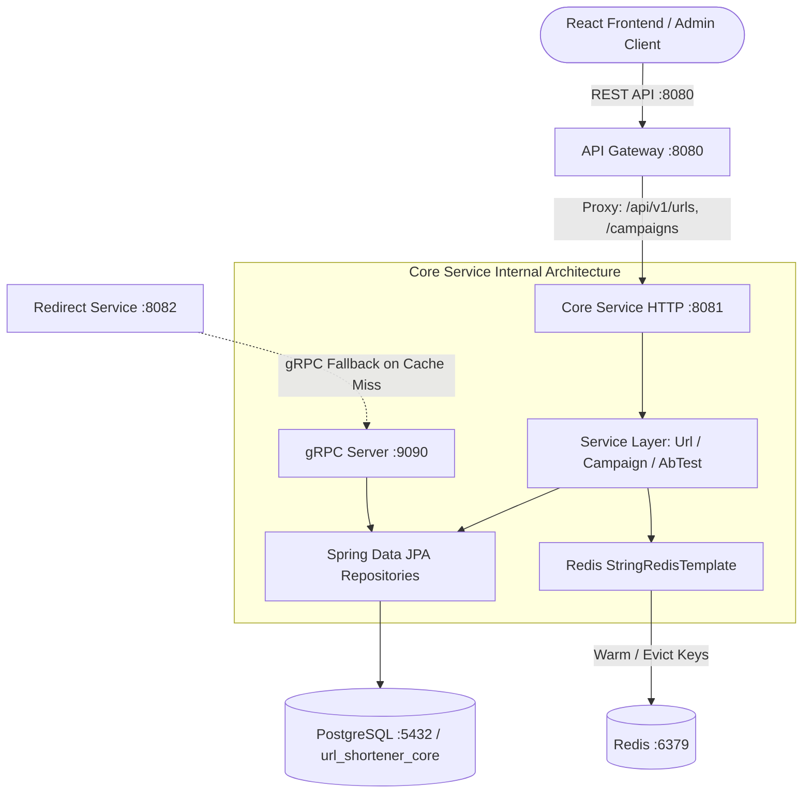
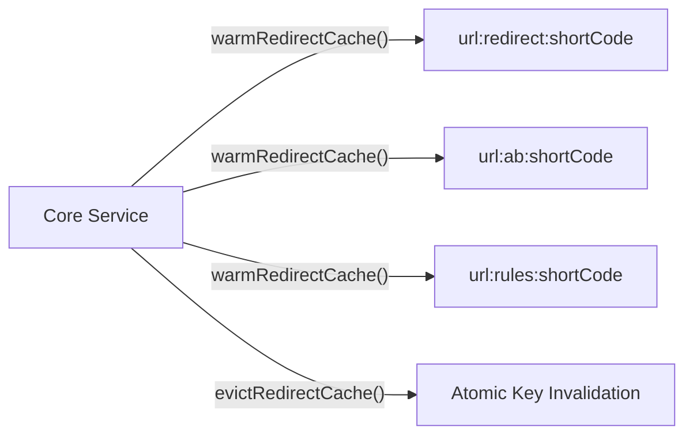

# Developer Guide: Building the Core Service (`url-core-service`)

Welcome! This is the definitive, step-by-step developer implementation guide for the **Core Microservice** (`url-core-service`).

The Core service manages URL persistence, Base62 shortcode generation, marketing campaigns, multivariate A/B/n tests, device/geo smart routing rules, and runs a high-performance **gRPC Server** on port **9090** to serve sub-5ms fallback queries from the Redirect service.

> [!IMPORTANT]
> **Write Path & Cache Synchronization Authority**:
> The Core service is the **authoritative Write Path** for the platform.
> The Redirect service resolves incoming clicks strictly from **Redis L1 memory in < 2ms** using **Strategy 1: Dedicated Dual-Keys (`MGET`)**:
> 1. `url:redirect:{shortCode}` $\rightarrow$ Base Fallback URL
> 2. `url:ab:{shortCode}` $\rightarrow$ In-memory A/B test variants JSON
> 3. `url:rules:{shortCode}` $\rightarrow$ Device / Geo targeting rules JSON
>
> On any link, campaign, or A/B test change, the Core service synchronizes PostgreSQL and immediately **warms or evicts** these Redis keys.

---

## Table of Contents
1. [Architecture Overview & Port Mapping](#architecture-overview--port-mapping)
2. [Flyway Database Migrations (PostgreSQL)](#flyway-database-migrations-postgresql)
3. [JPA Entities & Relationships](#jpa-entities--relationships)
4. [Spring Data Repositories](#spring-data-repositories)
5. [Strategy 1 Redis Cache Management (`warm` & `evict`)](#strategy-1-redis-cache-management)
6. [gRPC Server Implementation (`:9090`) & Protobuf](#grpc-server-implementation-9090--protobuf)
7. [DTO Records](#dto-records)
8. [Service Layer Implementations](#service-layer-implementations)
   - [UrlCoreService](#urlcoreservice)
   - [CampaignService](#campaignservice)
   - [AbTestService](#abtestservice)
9. [REST Controllers](#rest-controllers)
   - [UrlCoreController (`/api/v1/urls`)](#urlcorecontroller)
   - [CampaignController (`/api/v1/campaigns`)](#campaigncontroller)
   - [AbTestController (`/api/v1/urls/{shortCode}/ab-test`)](#abtestcontroller)
10. [Step-by-Step Verification & Testing Guide](#step-by-step-verification--testing-guide)

---

## Architecture Overview & Port Mapping



| Component | Technology | Port | Responsibilities |
| :--- | :--- | :--- | :--- |
| **REST API** | Spring Boot Web / Jackson | `:8081` | URL CRUD, Campaigns, A/B/n test configuration. |
| **gRPC Server** | gRPC / Protobuf 3 | `:9090` | Sub-5ms binary link resolution for Redirect service. |
| **Database** | PostgreSQL 16 + Flyway | `:5432` | DB: `url_shortener_core` (ACID persistence). |
| **Cache** | Redis 7.2 | `:6379` | Writes Strategy 1 keys (`url:redirect`, `url:ab`, `url:rules`). |

---

## Flyway Database Migrations (PostgreSQL)

Located in `core/src/main/resources/db/migration/`.

### Migration 1: Base URL Schema
File: `V1__init_core_schema.sql`
```sql
CREATE EXTENSION IF NOT EXISTS "pgcrypto";

CREATE TABLE IF NOT EXISTS url_mappings (
    id UUID PRIMARY KEY DEFAULT gen_random_uuid(),
    short_code VARCHAR(10) UNIQUE NOT NULL,
    destination_url TEXT NOT NULL,
    tenant_id VARCHAR(50) DEFAULT 'default' NOT NULL,
    user_id UUID NOT NULL, -- Logical FK to Auth DB users
    is_active BOOLEAN DEFAULT TRUE NOT NULL,
    expires_at TIMESTAMP WITH TIME ZONE,
    created_at TIMESTAMP WITH TIME ZONE DEFAULT CURRENT_TIMESTAMP NOT NULL,
    updated_at TIMESTAMP WITH TIME ZONE DEFAULT CURRENT_TIMESTAMP NOT NULL
);

CREATE INDEX IF NOT EXISTS idx_url_mappings_short_code ON url_mappings(short_code);
CREATE INDEX IF NOT EXISTS idx_url_mappings_user_id ON url_mappings(user_id);
```

### Migration 2: Drop Legacy UTM Profiles
File: `V2__drop_utm_profiles.sql`
```sql
-- Purge obsolete separate utm_profiles table
DROP TABLE IF EXISTS utm_profiles CASCADE;
```

### Migration 3: Campaigns, A/B Testing & Smart Rules
File: `V3__create_campaigns_and_ab_testing.sql`
```sql
-- 1. Create Campaigns Table
CREATE TABLE IF NOT EXISTS campaigns (
    id UUID PRIMARY KEY DEFAULT gen_random_uuid(),
    user_id UUID NOT NULL,
    name VARCHAR(100) NOT NULL,
    description TEXT,
    default_utm_source VARCHAR(100),
    default_utm_medium VARCHAR(100),
    created_at TIMESTAMP WITH TIME ZONE DEFAULT CURRENT_TIMESTAMP NOT NULL,
    updated_at TIMESTAMP WITH TIME ZONE DEFAULT CURRENT_TIMESTAMP NOT NULL
);

CREATE INDEX IF NOT EXISTS idx_campaigns_user_id ON campaigns(user_id);
CREATE UNIQUE INDEX IF NOT EXISTS idx_campaigns_user_name ON campaigns(user_id, name);

-- 2. Enhance url_mappings with Campaign FK, A/B Flag, and Smart Rules JSONB
ALTER TABLE url_mappings 
    ADD COLUMN IF NOT EXISTS campaign_id UUID REFERENCES campaigns(id) ON DELETE SET NULL,
    ADD COLUMN IF NOT EXISTS is_ab_test BOOLEAN DEFAULT FALSE NOT NULL,
    ADD COLUMN IF NOT EXISTS smart_rules JSONB;

CREATE INDEX IF NOT EXISTS idx_url_mappings_campaign_id ON url_mappings(campaign_id);

-- 3. Create A/B Tests Table
CREATE TABLE IF NOT EXISTS ab_tests (
    id UUID PRIMARY KEY DEFAULT gen_random_uuid(),
    url_mapping_id UUID NOT NULL UNIQUE REFERENCES url_mappings(id) ON DELETE CASCADE,
    name VARCHAR(100) NOT NULL,
    status VARCHAR(20) DEFAULT 'ACTIVE' NOT NULL, -- 'ACTIVE', 'PAUSED', 'CONCLUDED'
    winning_variant VARCHAR(10),                 -- Set when test is CONCLUDED (e.g. 'B')
    cookie_ttl_seconds INT DEFAULT 2592000 NOT NULL, -- 30 days sticky cookie
    created_at TIMESTAMP WITH TIME ZONE DEFAULT CURRENT_TIMESTAMP NOT NULL,
    updated_at TIMESTAMP WITH TIME ZONE DEFAULT CURRENT_TIMESTAMP NOT NULL
);

CREATE INDEX IF NOT EXISTS idx_ab_tests_url_mapping ON ab_tests(url_mapping_id);

-- 4. Create A/B Variants Table
CREATE TABLE IF NOT EXISTS ab_variants (
    id UUID PRIMARY KEY DEFAULT gen_random_uuid(),
    ab_test_id UUID NOT NULL REFERENCES ab_tests(id) ON DELETE CASCADE,
    variant_key VARCHAR(10) NOT NULL,            -- 'A', 'B', 'C', 'D'
    destination_url TEXT NOT NULL,
    weight INT DEFAULT 50 NOT NULL,              -- Cumulative weight (sums to 100)
    is_control BOOLEAN DEFAULT FALSE NOT NULL,
    created_at TIMESTAMP WITH TIME ZONE DEFAULT CURRENT_TIMESTAMP NOT NULL
);

CREATE INDEX IF NOT EXISTS idx_ab_variants_test_id ON ab_variants(ab_test_id);
```

---

## JPA Entities & Relationships

### 1. `UrlMapping.java`
File: `core/src/main/java/com/urlshortener/core/entity/UrlMapping.java`

```java
package com.urlshortener.core.entity;

import jakarta.persistence.*;
import lombok.*;

import java.time.Instant;
import java.util.UUID;

@Entity
@Table(name = "url_mappings", indexes = {
        @Index(name = "idx_urls_short_code", columnList = "short_code", unique = true),
        @Index(name = "idx_urls_user_id", columnList = "user_id"),
        @Index(name = "idx_urls_campaign_id", columnList = "campaign_id")
})
@Getter
@Setter
@NoArgsConstructor
@AllArgsConstructor
@Builder
public class UrlMapping {

    @Id
    @GeneratedValue(strategy = GenerationType.AUTO)
    private UUID id;

    @Column(name = "short_code", nullable = false, unique = true, length = 10)
    private String shortCode;

    @Column(name = "destination_url", nullable = false, columnDefinition = "TEXT")
    private String destinationUrl;

    @Column(name = "campaign_id")
    private UUID campaignId;

    @Column(name = "is_ab_test", nullable = false)
    @Builder.Default
    private Boolean isAbTest = false;

    @Column(name = "smart_rules", columnDefinition = "TEXT")
    private String smartRules; // JSON string for Geo and Device deep-linking rules

    @Column(name = "tenant_id", nullable = false)
    @Builder.Default
    private String tenantId = "default";

    @Column(name = "user_id", nullable = false)
    private UUID userId;

    @Column(name = "is_active", nullable = false)
    @Builder.Default
    private Boolean isActive = true;

    @Column(name = "expires_at")
    private Instant expiresAt;

    @Column(name = "created_at", nullable = false, updatable = false)
    private Instant createdAt;

    @Column(name = "updated_at", nullable = false)
    private Instant updatedAt;

    @PrePersist
    protected void onCreate() {
        if (createdAt == null) createdAt = Instant.now();
        if (updatedAt == null) updatedAt = Instant.now();
        if (isActive == null) isActive = true;
        if (isAbTest == null) isAbTest = false;
        if (tenantId == null) tenantId = "default";
    }

    @PreUpdate
    protected void onUpdate() {
        updatedAt = Instant.now();
    }
}
```

### 2. `Campaign.java`
File: `core/src/main/java/com/urlshortener/core/entity/Campaign.java`

```java
package com.urlshortener.core.entity;

import jakarta.persistence.*;
import lombok.*;

import java.time.Instant;
import java.util.UUID;

@Entity
@Table(name = "campaigns", indexes = {
        @Index(name = "idx_campaigns_user_id", columnList = "user_id")
})
@Getter
@Setter
@NoArgsConstructor
@AllArgsConstructor
@Builder
public class Campaign {

    @Id
    @GeneratedValue(strategy = GenerationType.AUTO)
    private UUID id;

    @Column(name = "user_id", nullable = false)
    private UUID userId;

    @Column(name = "name", nullable = false, length = 100)
    private String name;

    @Column(name = "description", columnDefinition = "TEXT")
    private String description;

    @Column(name = "default_utm_source", length = 100)
    private String defaultUtmSource;

    @Column(name = "default_utm_medium", length = 100)
    private String defaultUtmMedium;

    @Column(name = "created_at", nullable = false, updatable = false)
    private Instant createdAt;

    @Column(name = "updated_at", nullable = false)
    private Instant updatedAt;

    @PrePersist
    protected void onCreate() {
        if (createdAt == null) createdAt = Instant.now();
        if (updatedAt == null) updatedAt = Instant.now();
    }

    @PreUpdate
    protected void onUpdate() {
        updatedAt = Instant.now();
    }
}
```

### 3. `AbTest.java`
File: `core/src/main/java/com/urlshortener/core/entity/AbTest.java`

```java
package com.urlshortener.core.entity;

import jakarta.persistence.*;
import lombok.*;

import java.time.Instant;
import java.util.UUID;

@Entity
@Table(name = "ab_tests", indexes = {
        @Index(name = "idx_ab_tests_url_mapping", columnList = "url_mapping_id", unique = true)
})
@Getter
@Setter
@NoArgsConstructor
@AllArgsConstructor
@Builder
public class AbTest {

    @Id
    @GeneratedValue(strategy = GenerationType.AUTO)
    private UUID id;

    @Column(name = "url_mapping_id", nullable = false, unique = true)
    private UUID urlMappingId;

    @Column(name = "name", nullable = false, length = 100)
    private String name;

    @Column(name = "status", nullable = false, length = 20)
    @Builder.Default
    private String status = "ACTIVE"; // 'ACTIVE', 'PAUSED', 'CONCLUDED'

    @Column(name = "winning_variant", length = 10)
    private String winningVariant;

    @Column(name = "cookie_ttl_seconds", nullable = false)
    @Builder.Default
    private Integer cookieTtlSeconds = 2592000; // 30 days

    @Column(name = "created_at", nullable = false, updatable = false)
    private Instant createdAt;

    @Column(name = "updated_at", nullable = false)
    private Instant updatedAt;

    @PrePersist
    protected void onCreate() {
        if (createdAt == null) createdAt = Instant.now();
        if (updatedAt == null) updatedAt = Instant.now();
        if (status == null) status = "ACTIVE";
        if (cookieTtlSeconds == null) cookieTtlSeconds = 2592000;
    }

    @PreUpdate
    protected void onUpdate() {
        updatedAt = Instant.now();
    }
}
```

### 4. `AbVariant.java`
File: `core/src/main/java/com/urlshortener/core/entity/AbVariant.java`

```java
package com.urlshortener.core.entity;

import jakarta.persistence.*;
import lombok.*;

import java.time.Instant;
import java.util.UUID;

@Entity
@Table(name = "ab_variants", indexes = {
        @Index(name = "idx_ab_variants_test_id", columnList = "ab_test_id")
})
@Getter
@Setter
@NoArgsConstructor
@AllArgsConstructor
@Builder
public class AbVariant {

    @Id
    @GeneratedValue(strategy = GenerationType.AUTO)
    private UUID id;

    @Column(name = "ab_test_id", nullable = false)
    private UUID abTestId;

    @Column(name = "variant_key", nullable = false, length = 10)
    private String variantKey; // 'A', 'B', 'C'

    @Column(name = "destination_url", nullable = false, columnDefinition = "TEXT")
    private String destinationUrl;

    @Column(name = "weight", nullable = false)
    @Builder.Default
    private Integer weight = 50;

    @Column(name = "is_control", nullable = false)
    @Builder.Default
    private Boolean isControl = false;

    @Column(name = "created_at", nullable = false, updatable = false)
    private Instant createdAt;

    @PrePersist
    protected void onCreate() {
        if (createdAt == null) createdAt = Instant.now();
        if (weight == null) weight = 50;
        if (isControl == null) isControl = false;
    }
}
```

---

## Spring Data Repositories

### 1. `UrlMappingRepository.java`
File: `core/src/main/java/com/urlshortener/core/repository/UrlMappingRepository.java`

```java
package com.urlshortener.core.repository;

import com.urlshortener.core.entity.UrlMapping;
import org.springframework.data.domain.Page;
import org.springframework.data.domain.Pageable;
import org.springframework.data.jpa.repository.JpaRepository;
import org.springframework.data.jpa.repository.Query;
import org.springframework.data.repository.query.Param;
import org.springframework.stereotype.Repository;

import java.util.List;
import java.util.Optional;
import java.util.UUID;

@Repository
public interface UrlMappingRepository extends JpaRepository<UrlMapping, UUID> {

    Optional<UrlMapping> findByShortCode(String shortCode);

    boolean existsByShortCode(String shortCode);

    List<UrlMapping> findByUserId(UUID userId);

    List<UrlMapping> findByCampaignId(UUID campaignId);

    long countByCampaignId(UUID campaignId);

    @Query("SELECT u FROM UrlMapping u WHERE u.userId = :userId " +
           "AND (:search IS NULL OR LOWER(u.shortCode) LIKE LOWER(CONCAT('%', :search, '%')) " +
           "     OR LOWER(u.destinationUrl) LIKE LOWER(CONCAT('%', :search, '%'))) " +
           "AND (:isActive IS NULL OR u.isActive = :isActive) " +
           "AND (:campaignId IS NULL OR u.campaignId = :campaignId)")
    Page<UrlMapping> searchUserUrls(
            @Param("userId") UUID userId,
            @Param("search") String search,
            @Param("isActive") Boolean isActive,
            @Param("campaignId") UUID campaignId,
            Pageable pageable
    );
}
```

### 2. `CampaignRepository.java`
File: `core/src/main/java/com/urlshortener/core/repository/CampaignRepository.java`

```java
package com.urlshortener.core.repository;

import com.urlshortener.core.entity.Campaign;
import org.springframework.data.jpa.repository.JpaRepository;
import org.springframework.stereotype.Repository;

import java.util.List;
import java.util.Optional;
import java.util.UUID;

@Repository
public interface CampaignRepository extends JpaRepository<Campaign, UUID> {
    List<Campaign> findByUserId(UUID userId);
    Optional<Campaign> findByIdAndUserId(UUID id, UUID userId);
    boolean existsByUserIdAndName(UUID userId, String name);
}
```

### 3. `AbTestRepository.java`
File: `core/src/main/java/com/urlshortener/core/repository/AbTestRepository.java`

```java
package com.urlshortener.core.repository;

import com.urlshortener.core.entity.AbTest;
import org.springframework.data.jpa.repository.JpaRepository;
import org.springframework.stereotype.Repository;

import java.util.Optional;
import java.util.UUID;

@Repository
public interface AbTestRepository extends JpaRepository<AbTest, UUID> {
    Optional<AbTest> findByUrlMappingId(UUID urlMappingId);
    void deleteByUrlMappingId(UUID urlMappingId);
}
```

### 4. `AbVariantRepository.java`
File: `core/src/main/java/com/urlshortener/core/repository/AbVariantRepository.java`

```java
package com.urlshortener.core.repository;

import com.urlshortener.core.entity.AbVariant;
import org.springframework.data.jpa.repository.JpaRepository;
import org.springframework.stereotype.Repository;

import java.util.List;
import java.util.UUID;

@Repository
public interface AbVariantRepository extends JpaRepository<AbVariant, UUID> {
    List<AbVariant> findByAbTestId(UUID abTestId);
    void deleteByAbTestId(UUID abTestId);
}
```

---

## Strategy 1 Redis Cache Management

The Core Service is responsible for maintaining cache consistency across Redis.



### The Strategy 1 Keys
1. **Base Fallback**: `url:redirect:{shortCode}` $\rightarrow$ Plain string destination URL (`https://example.com/base`).
2. **A/B Testing Rules**: `url:ab:{shortCode}` $\rightarrow$ JSON payload:
   ```json
   {
     "testId": "a1b2c3d4-...",
     "status": "ACTIVE",
     "cookieTtlSeconds": 2592000,
     "variants": [
       { "key": "A", "url": "https://example.com/v1", "weight": 50, "isControl": true },
       { "key": "B", "url": "https://example.com/v2", "weight": 50, "isControl": false }
     ]
   }
   ```
3. **Smart Routing Rules**: `url:rules:{shortCode}` $\rightarrow$ JSON payload:
   ```json
   {
     "countries": { "US": "https://example.com/us", "IN": "https://example.com/in" },
     "devices": { "IOS": "https://apps.apple.com/...", "ANDROID": "https://play.google.com/..." }
   }
   ```

### Implementation Helpers in Core
Add these methods to your service layer:

```java
private void warmRedirectCache(UrlMapping mapping) {
    try {
        String shortCode = mapping.getShortCode();
        if (Boolean.FALSE.equals(mapping.getIsActive())) {
            evictRedirectCache(shortCode);
            return;
        }

        // 1. Warm Base Redirect URL (24 hours TTL)
        redisTemplate.opsForValue().set("url:redirect:" + shortCode, mapping.getDestinationUrl(), Duration.ofHours(24));

        // 2. Warm A/B Test Variants if active
        if (Boolean.TRUE.equals(mapping.getIsAbTest())) {
            abTestRepository.findByUrlMappingId(mapping.getId()).ifPresent(test -> {
                if ("ACTIVE".equalsIgnoreCase(test.getStatus())) {
                    List<AbVariant> variants = abVariantRepository.findByAbTestId(test.getId());
                    String abJson = serializeAbTestRules(test, variants);
                    redisTemplate.opsForValue().set("url:ab:" + shortCode, abJson, Duration.ofHours(24));
                } else {
                    redisTemplate.delete("url:ab:" + shortCode);
                }
            });
        } else {
            redisTemplate.delete("url:ab:" + shortCode);
        }

        // 3. Warm Smart Rules (Device/Geo) if present
        if (mapping.getSmartRules() != null && !mapping.getSmartRules().isBlank()) {
            redisTemplate.opsForValue().set("url:rules:" + shortCode, mapping.getSmartRules(), Duration.ofHours(24));
        } else {
            redisTemplate.delete("url:rules:" + shortCode);
        }

        log.info("Successfully warmed Redis Strategy 1 caches for shortCode: {}", shortCode);
    } catch (Exception e) {
        log.warn("Failed to warm Redis cache for {}: {}", mapping.getShortCode(), e.getMessage());
    }
}

private void evictRedirectCache(String shortCode) {
    try {
        redisTemplate.delete(List.of(
            "url:redirect:" + shortCode,
            "url:ab:" + shortCode,
            "url:rules:" + shortCode,
            "url:hits:" + shortCode
        ));
        log.info("Evicted Redis redirect and rule caches for shortCode: {}", shortCode);
    } catch (Exception e) {
        log.warn("Failed to evict Redis cache for {}: {}", shortCode, e.getMessage());
    }
}
```

---

## gRPC Server Implementation (:9090) & Protobuf

When the Redirect service encounters a Redis cache miss, it executes a single unary gRPC RPC to Core on port **9090**.

### 1. Protobuf Definition
File: `core/src/main/proto/url_service.proto` (and identical in `redirect/src/main/proto/url_service.proto`):

```protobuf
syntax = "proto3";

package com.urlshortener.grpc;

option java_multiple_files = true;
option java_package = "com.urlshortener.grpc";

service UrlService {
  rpc GetDestinationUrl (UrlRequest) returns (UrlResponse);
  rpc CreateUrlMapping (CreateUrlRequest) returns (CreateUrlResponse);
}

message UrlRequest {
  string short_code = 1;
}

message UrlResponse {
  string destination_url = 1;
  bool is_active = 2;
  bool is_found = 3;
  string short_code = 4;
  string ab_rules_json = 5;      // Optional: A/B variant JSON configuration
  string smart_rules_json = 6;   // Optional: Device and Geo targeting rules
}

message CreateUrlRequest {
  string destination_url = 1;
  string custom_alias = 2;
  string user_id = 3;
}

message CreateUrlResponse {
  string short_code = 1;
  string destination_url = 2;
  bool success = 3;
}
```

### 2. `UrlGrpcService.java`
File: `core/src/main/java/com/urlshortener/core/grpc/UrlGrpcService.java`

```java
package com.urlshortener.core.grpc;

import com.fasterxml.jackson.databind.ObjectMapper;
import com.urlshortener.core.entity.AbTest;
import com.urlshortener.core.entity.AbVariant;
import com.urlshortener.core.entity.UrlMapping;
import com.urlshortener.core.repository.AbTestRepository;
import com.urlshortener.core.repository.AbVariantRepository;
import com.urlshortener.core.repository.UrlMappingRepository;
import com.urlshortener.grpc.*;
import io.grpc.stub.StreamObserver;
import lombok.RequiredArgsConstructor;
import lombok.extern.slf4j.Slf4j;
import net.devh.boot.grpc.server.service.GrpcService;

import java.util.HashMap;
import java.util.List;
import java.util.Map;
import java.util.Optional;

@Slf4j
@GrpcService
@RequiredArgsConstructor
public class UrlGrpcService extends UrlServiceGrpc.UrlServiceImplBase {

    private final UrlMappingRepository urlRepository;
    private final AbTestRepository abTestRepository;
    private final AbVariantRepository abVariantRepository;
    private final ObjectMapper objectMapper;

    @Override
    public void getDestinationUrl(UrlRequest request, StreamObserver<UrlResponse> responseObserver) {
        String shortCode = request.getShortCode();
        Optional<UrlMapping> mappingOpt = urlRepository.findByShortCode(shortCode);

        if (mappingOpt.isPresent()) {
            UrlMapping mapping = mappingOpt.get();
            UrlResponse.Builder builder = UrlResponse.newBuilder()
                    .setShortCode(mapping.getShortCode())
                    .setDestinationUrl(mapping.getDestinationUrl())
                    .setIsActive(Boolean.TRUE.equals(mapping.getIsActive()))
                    .setIsFound(true);

            // 1. Check & Forward A/B Testing Rules
            if (Boolean.TRUE.equals(mapping.getIsAbTest())) {
                Optional<AbTest> abTestOpt = abTestRepository.findByUrlMappingId(mapping.getId());
                if (abTestOpt.isPresent() && "ACTIVE".equalsIgnoreCase(abTestOpt.get().getStatus())) {
                    AbTest test = abTestOpt.get();
                    List<AbVariant> variants = abVariantRepository.findByAbTestId(test.getId());
                    try {
                        Map<String, Object> abPayload = new HashMap<>();
                        abPayload.put("testId", test.getId().toString());
                        abPayload.put("status", test.getStatus());
                        abPayload.put("cookieTtlSeconds", test.getCookieTtlSeconds());
                        abPayload.put("variants", variants.stream().map(v -> Map.of(
                                "key", v.getVariantKey(),
                                "url", v.getDestinationUrl(),
                                "weight", v.getWeight(),
                                "isControl", v.getIsControl()
                        )).toList());
                        builder.setAbRulesJson(objectMapper.writeValueAsString(abPayload));
                    } catch (Exception e) {
                        log.error("Failed to serialize A/B rules for {}: {}", shortCode, e.getMessage());
                    }
                }
            }

            // 2. Check & Forward Smart Rules (Geo/Device)
            if (mapping.getSmartRules() != null && !mapping.getSmartRules().isBlank()) {
                builder.setSmartRulesJson(mapping.getSmartRules());
            }

            responseObserver.onNext(builder.build());
        } else {
            UrlResponse response = UrlResponse.newBuilder()
                    .setShortCode(shortCode)
                    .setDestinationUrl("")
                    .setIsActive(false)
                    .setIsFound(false)
                    .build();
            responseObserver.onNext(response);
        }
        responseObserver.onCompleted();
    }
}
```

---

## DTO Records

Create these clean Java records under `core/src/main/java/com/urlshortener/core/dto/`:

### 1. URL DTOs
File: `CreateUrlRequest.java`
```java
package com.urlshortener.core.dto;

import jakarta.validation.constraints.NotBlank;
import org.hibernate.validator.constraints.URL;
import java.util.UUID;

public record CreateUrlRequest(
        @NotBlank(message = "Destination URL is required")
        @URL(message = "Must be a valid URL")
        String destinationUrl,
        String customAlias,
        UUID campaignId,
        String smartRules,
        String utmSource,
        String utmMedium,
        String utmCampaign,
        String utmTerm,
        String utmContent
) {}
```

File: `UpdateUrlRequest.java`
```java
package com.urlshortener.core.dto;

import java.time.Instant;
import java.util.UUID;

public record UpdateUrlRequest(
        String destinationUrl,
        UUID campaignId,
        String smartRules,
        Boolean isActive,
        Instant expiresAt
) {}
```

File: `PagedResponse.java`
```java
package com.urlshortener.core.dto;

import org.springframework.data.domain.Page;
import java.util.List;

public record PagedResponse<T>(
        List<T> content,
        int pageNumber,
        int pageSize,
        long totalElements,
        int totalPages,
        boolean isLast
) {
    public static <T> PagedResponse<T> from(Page<T> page) {
        return new PagedResponse<>(
                page.getContent(),
                page.getNumber(),
                page.getSize(),
                page.getTotalElements(),
                page.getTotalPages(),
                page.isLast()
        );
    }
}
```

### 2. Campaign DTOs
File: `CreateCampaignRequest.java`
```java
package com.urlshortener.core.dto;

import jakarta.validation.constraints.NotBlank;

public record CreateCampaignRequest(
        @NotBlank(message = "Campaign name is required")
        String name,
        String description,
        String defaultUtmSource,
        String defaultUtmMedium
) {}
```

File: `CampaignResponse.java`
```java
package com.urlshortener.core.dto;

import com.urlshortener.core.entity.Campaign;
import java.time.Instant;
import java.util.UUID;

public record CampaignResponse(
        UUID id,
        String name,
        String description,
        String defaultUtmSource,
        String defaultUtmMedium,
        long linkCount,
        Instant createdAt,
        Instant updatedAt
) {
    public static CampaignResponse from(Campaign c, long linkCount) {
        return new CampaignResponse(
                c.getId(),
                c.getName(),
                c.getDescription(),
                c.getDefaultUtmSource(),
                c.getDefaultUtmMedium(),
                linkCount,
                c.getCreatedAt(),
                c.getUpdatedAt()
        );
    }
}
```

### 3. A/B Testing DTOs
File: `CreateAbTestRequest.java`
```java
package com.urlshortener.core.dto;

import jakarta.validation.constraints.NotBlank;
import jakarta.validation.constraints.NotEmpty;
import java.util.List;

public record CreateAbTestRequest(
        @NotBlank(message = "A/B test name is required")
        String name,
        Integer cookieTtlSeconds,
        @NotEmpty(message = "At least two variants are required")
        List<VariantRequest> variants
) {
    public record VariantRequest(
            @NotBlank String key,
            @NotBlank String destinationUrl,
            int weight,
            boolean isControl
    ) {}
}
```

File: `AbTestResponse.java`
```java
package com.urlshortener.core.dto;

import com.urlshortener.core.entity.AbTest;
import com.urlshortener.core.entity.AbVariant;
import java.time.Instant;
import java.util.List;
import java.util.UUID;

public record AbTestResponse(
        UUID id,
        UUID urlMappingId,
        String name,
        String status,
        String winningVariant,
        Integer cookieTtlSeconds,
        List<VariantDto> variants,
        Instant createdAt,
        Instant updatedAt
) {
    public record VariantDto(
            UUID id,
            String key,
            String destinationUrl,
            int weight,
            boolean isControl
    ) {
        public static VariantDto from(AbVariant v) {
            return new VariantDto(v.getId(), v.getVariantKey(), v.getDestinationUrl(), v.getWeight(), v.getIsControl());
        }
    }

    public static AbTestResponse from(AbTest test, List<AbVariant> variants) {
        return new AbTestResponse(
                test.getId(),
                test.getUrlMappingId(),
                test.getName(),
                test.getStatus(),
                test.getWinningVariant(),
                test.getCookieTtlSeconds(),
                variants.stream().map(VariantDto::from).toList(),
                test.getCreatedAt(),
                test.getUpdatedAt()
        );
    }
}
```

File: `UpdateAbTestStatusRequest.java`
```java
package com.urlshortener.core.dto;

import jakarta.validation.constraints.NotBlank;

public record UpdateAbTestStatusRequest(
        @NotBlank(message = "Status is required (ACTIVE, PAUSED, CONCLUDED)")
        String status,
        String winningVariant
) {}
```

---

## Service Layer Implementations

### 1. `UrlCoreService.java`
File: `core/src/main/java/com/urlshortener/core/service/UrlCoreService.java`

```java
package com.urlshortener.core.service;

import com.fasterxml.jackson.databind.ObjectMapper;
import com.urlshortener.core.dto.CreateUrlRequest;
import com.urlshortener.core.dto.UpdateUrlRequest;
import com.urlshortener.core.entity.AbTest;
import com.urlshortener.core.entity.AbVariant;
import com.urlshortener.core.entity.UrlMapping;
import com.urlshortener.core.repository.AbTestRepository;
import com.urlshortener.core.repository.AbVariantRepository;
import com.urlshortener.core.repository.UrlMappingRepository;
import com.urlshortener.core.util.Base62;
import lombok.RequiredArgsConstructor;
import lombok.extern.slf4j.Slf4j;
import org.springframework.data.domain.Page;
import org.springframework.data.domain.Pageable;
import org.springframework.data.redis.core.StringRedisTemplate;
import org.springframework.stereotype.Service;
import org.springframework.transaction.annotation.Transactional;
import org.springframework.web.util.UriComponentsBuilder;

import java.time.Duration;
import java.time.Instant;
import java.util.*;

@Slf4j
@Service
@RequiredArgsConstructor
public class UrlCoreService {

    private final UrlMappingRepository urlRepository;
    private final AbTestRepository abTestRepository;
    private final AbVariantRepository abVariantRepository;
    private final Base62 base62;
    private final StringRedisTemplate redisTemplate;
    private final ObjectMapper objectMapper;

    @Transactional
    public UrlMapping createShortUrl(CreateUrlRequest request, UUID userId) {
        if (request.customAlias() != null && !request.customAlias().isBlank()) {
            if (urlRepository.existsByShortCode(request.customAlias().trim())) {
                throw new IllegalArgumentException("Custom alias already in use: " + request.customAlias());
            }
        }

        String shortCode = (request.customAlias() != null && !request.customAlias().isBlank())
                ? request.customAlias().trim()
                : generateUniqueShortCode();

        // Compose final URL with UTM parameters baked directly into query string
        String finalDestinationUrl = appendUtmParams(request);

        UrlMapping mapping = UrlMapping.builder()
                .shortCode(shortCode)
                .destinationUrl(finalDestinationUrl)
                .campaignId(request.campaignId())
                .smartRules(request.smartRules())
                .userId(userId)
                .isActive(true)
                .isAbTest(false)
                .createdAt(Instant.now())
                .updatedAt(Instant.now())
                .build();

        UrlMapping saved = urlRepository.save(mapping);
        warmRedirectCache(saved);
        return saved;
    }

    @Transactional
    public UrlMapping updateShortUrl(UUID urlId, UpdateUrlRequest request, UUID userId) {
        UrlMapping mapping = urlRepository.findById(urlId)
                .orElseThrow(() -> new IllegalArgumentException("URL mapping not found"));

        if (!mapping.getUserId().equals(userId)) {
            throw new IllegalStateException("Unauthorized to modify this URL");
        }

        if (request.destinationUrl() != null && !request.destinationUrl().isBlank()) {
            mapping.setDestinationUrl(request.destinationUrl().trim());
        }
        if (request.campaignId() != null) {
            mapping.setCampaignId(request.campaignId());
        }
        if (request.smartRules() != null) {
            mapping.setSmartRules(request.smartRules());
        }
        if (request.isActive() != null) {
            mapping.setIsActive(request.isActive());
        }
        if (request.expiresAt() != null) {
            mapping.setExpiresAt(request.expiresAt());
        }
        mapping.setUpdatedAt(Instant.now());

        UrlMapping updated = urlRepository.save(mapping);
        warmRedirectCache(updated);
        return updated;
    }

    @Transactional
    public void deleteShortUrl(UUID urlId, UUID userId) {
        UrlMapping mapping = urlRepository.findById(urlId)
                .orElseThrow(() -> new IllegalArgumentException("URL mapping not found"));

        if (!mapping.getUserId().equals(userId)) {
            throw new IllegalStateException("Unauthorized to delete this URL");
        }

        urlRepository.delete(mapping);
        evictRedirectCache(mapping.getShortCode());
    }

    public List<UrlMapping> getUserUrls(UUID userId) {
        return urlRepository.findByUserId(userId);
    }

    public Page<UrlMapping> getUserUrlsPaged(UUID userId, String search, Boolean isActive, UUID campaignId, Pageable pageable) {
        return urlRepository.searchUserUrls(userId, search, isActive, campaignId, pageable);
    }

    public UrlMapping getUrl(UUID urlId, UUID userId) {
        UrlMapping mapping = urlRepository.findById(urlId)
                .orElseThrow(() -> new IllegalArgumentException("URL mapping not found"));

        if (!mapping.getUserId().equals(userId)) {
            throw new IllegalStateException("Unauthorized to access this URL");
        }
        return mapping;
    }

    public Optional<UrlMapping> getUrlFromShortCode(String shortCode) {
        return urlRepository.findByShortCode(shortCode);
    }

    // Cache Warming: Synchronizes Strategy 1 Redis keys (Base, A/B, Rules)
    public void warmRedirectCache(UrlMapping mapping) {
        try {
            String shortCode = mapping.getShortCode();
            if (Boolean.FALSE.equals(mapping.getIsActive())) {
                evictRedirectCache(shortCode);
                return;
            }

            // 1. Warm Base URL (24 hours)
            redisTemplate.opsForValue().set("url:redirect:" + shortCode, mapping.getDestinationUrl(), Duration.ofHours(24));

            // 2. Warm A/B Test Variants if active
            if (Boolean.TRUE.equals(mapping.getIsAbTest())) {
                abTestRepository.findByUrlMappingId(mapping.getId()).ifPresent(test -> {
                    if ("ACTIVE".equalsIgnoreCase(test.getStatus())) {
                        List<AbVariant> variants = abVariantRepository.findByAbTestId(test.getId());
                        String abJson = serializeAbRules(test, variants);
                        redisTemplate.opsForValue().set("url:ab:" + shortCode, abJson, Duration.ofHours(24));
                    } else {
                        redisTemplate.delete("url:ab:" + shortCode);
                    }
                });
            } else {
                redisTemplate.delete("url:ab:" + shortCode);
            }

            // 3. Warm Smart Rules (Device/Geo) if present
            if (mapping.getSmartRules() != null && !mapping.getSmartRules().isBlank()) {
                redisTemplate.opsForValue().set("url:rules:" + shortCode, mapping.getSmartRules(), Duration.ofHours(24));
            } else {
                redisTemplate.delete("url:rules:" + shortCode);
            }

            log.info("Successfully warmed Redis Strategy 1 caches for shortCode: {}", shortCode);
        } catch (Exception e) {
            log.warn("Failed to warm Redis cache for {}: {}", mapping.getShortCode(), e.getMessage());
        }
    }

    // Cache Eviction: Atomically purges all keys for this shortCode
    public void evictRedirectCache(String shortCode) {
        try {
            redisTemplate.delete(List.of(
                "url:redirect:" + shortCode,
                "url:ab:" + shortCode,
                "url:rules:" + shortCode,
                "url:hits:" + shortCode
            ));
            log.info("Evicted Redis redirect and rule caches for shortCode: {}", shortCode);
        } catch (Exception e) {
            log.warn("Failed to evict Redis cache for {}: {}", shortCode, e.getMessage());
        }
    }

    private String serializeAbRules(AbTest test, List<AbVariant> variants) {
        try {
            Map<String, Object> abPayload = new HashMap<>();
            abPayload.put("testId", test.getId().toString());
            abPayload.put("status", test.getStatus());
            abPayload.put("cookieTtlSeconds", test.getCookieTtlSeconds());
            abPayload.put("variants", variants.stream().map(v -> Map.of(
                    "key", v.getVariantKey(),
                    "url", v.getDestinationUrl(),
                    "weight", v.getWeight(),
                    "isControl", v.getIsControl()
            )).toList());
            return objectMapper.writeValueAsString(abPayload);
        } catch (Exception e) {
            log.error("Failed to serialize A/B rules: {}", e.getMessage());
            return "{}";
        }
    }

    private String generateUniqueShortCode() {
        String shortCode;
        do {
            shortCode = base62.generateRandomShortCode(7);
        } while (urlRepository.existsByShortCode(shortCode));
        return shortCode;
    }

    private String appendUtmParams(CreateUrlRequest request) {
        UriComponentsBuilder builder = UriComponentsBuilder.fromUriString(request.destinationUrl().trim());
        if (request.utmSource() != null && !request.utmSource().isBlank()) {
            builder.replaceQueryParam("utm_source", request.utmSource().trim());
        }
        if (request.utmMedium() != null && !request.utmMedium().isBlank()) {
            builder.replaceQueryParam("utm_medium", request.utmMedium().trim());
        }
        if (request.utmCampaign() != null && !request.utmCampaign().isBlank()) {
            builder.replaceQueryParam("utm_campaign", request.utmCampaign().trim());
        }
        if (request.utmTerm() != null && !request.utmTerm().isBlank()) {
            builder.replaceQueryParam("utm_term", request.utmTerm().trim());
        }
        if (request.utmContent() != null && !request.utmContent().isBlank()) {
            builder.replaceQueryParam("utm_content", request.utmContent().trim());
        }
        return builder.build().toUriString();
    }
}
```

### 2. `CampaignService.java`
File: `core/src/main/java/com/urlshortener/core/service/CampaignService.java`

```java
package com.urlshortener.core.service;

import com.urlshortener.core.dto.CampaignResponse;
import com.urlshortener.core.dto.CreateCampaignRequest;
import com.urlshortener.core.entity.Campaign;
import com.urlshortener.core.entity.UrlMapping;
import com.urlshortener.core.repository.CampaignRepository;
import com.urlshortener.core.repository.UrlMappingRepository;
import lombok.RequiredArgsConstructor;
import org.springframework.stereotype.Service;
import org.springframework.transaction.annotation.Transactional;

import java.time.Instant;
import java.util.List;
import java.util.UUID;

@Service
@RequiredArgsConstructor
public class CampaignService {

    private final CampaignRepository campaignRepository;
    private final UrlMappingRepository urlRepository;

    @Transactional
    public CampaignResponse createCampaign(CreateCampaignRequest request, UUID userId) {
        if (campaignRepository.existsByUserIdAndName(userId, request.name().trim())) {
            throw new IllegalArgumentException("Campaign with name '" + request.name() + "' already exists");
        }

        Campaign campaign = Campaign.builder()
                .userId(userId)
                .name(request.name().trim())
                .description(request.description())
                .defaultUtmSource(request.defaultUtmSource())
                .defaultUtmMedium(request.defaultUtmMedium())
                .createdAt(Instant.now())
                .updatedAt(Instant.now())
                .build();

        Campaign saved = campaignRepository.save(campaign);
        return CampaignResponse.from(saved, 0);
    }

    public List<CampaignResponse> getUserCampaigns(UUID userId) {
        return campaignRepository.findByUserId(userId).stream()
                .map(c -> CampaignResponse.from(c, urlRepository.countByCampaignId(c.getId())))
                .toList();
    }

    public CampaignResponse getCampaign(UUID id, UUID userId) {
        Campaign campaign = campaignRepository.findByIdAndUserId(id, userId)
                .orElseThrow(() -> new IllegalArgumentException("Campaign not found: " + id));
        long count = urlRepository.countByCampaignId(id);
        return CampaignResponse.from(campaign, count);
    }

    public List<UrlMapping> getCampaignUrls(UUID campaignId, UUID userId) {
        campaignRepository.findByIdAndUserId(campaignId, userId)
                .orElseThrow(() -> new IllegalArgumentException("Campaign not found: " + campaignId));
        return urlRepository.findByCampaignId(campaignId);
    }

    @Transactional
    public void deleteCampaign(UUID id, UUID userId) {
        Campaign campaign = campaignRepository.findByIdAndUserId(id, userId)
                .orElseThrow(() -> new IllegalArgumentException("Campaign not found: " + id));

        // Unlink associated URLs (nullify campaignId)
        List<UrlMapping> linkedUrls = urlRepository.findByCampaignId(id);
        for (UrlMapping url : linkedUrls) {
            url.setCampaignId(null);
        }
        urlRepository.saveAll(linkedUrls);

        campaignRepository.delete(campaign);
    }
}
```

### 3. `AbTestService.java`
File: `core/src/main/java/com/urlshortener/core/service/AbTestService.java`

```java
package com.urlshortener.core.service;

import com.urlshortener.core.dto.AbTestResponse;
import com.urlshortener.core.dto.CreateAbTestRequest;
import com.urlshortener.core.dto.UpdateAbTestStatusRequest;
import com.urlshortener.core.entity.AbTest;
import com.urlshortener.core.entity.AbVariant;
import com.urlshortener.core.entity.UrlMapping;
import com.urlshortener.core.repository.AbTestRepository;
import com.urlshortener.core.repository.AbVariantRepository;
import com.urlshortener.core.repository.UrlMappingRepository;
import lombok.RequiredArgsConstructor;
import lombok.extern.slf4j.Slf4j;
import org.springframework.stereotype.Service;
import org.springframework.transaction.annotation.Transactional;

import java.time.Instant;
import java.util.List;
import java.util.UUID;

@Slf4j
@Service
@RequiredArgsConstructor
public class AbTestService {

    private final AbTestRepository abTestRepository;
    private final AbVariantRepository abVariantRepository;
    private final UrlMappingRepository urlRepository;
    private final UrlCoreService urlCoreService;

    @Transactional
    public AbTestResponse configureAbTest(String shortCode, CreateAbTestRequest request, UUID userId) {
        UrlMapping mapping = urlRepository.findByShortCode(shortCode)
                .orElseThrow(() -> new IllegalArgumentException("Short code not found: " + shortCode));

        if (!mapping.getUserId().equals(userId)) {
            throw new IllegalStateException("Unauthorized to configure A/B test for this URL");
        }

        // Validate weights sum to 100
        int totalWeight = request.variants().stream().mapToInt(CreateAbTestRequest.VariantRequest::weight).sum();
        if (totalWeight != 100) {
            throw new IllegalArgumentException("Variant weights must sum to exactly 100 (current sum: " + totalWeight + ")");
        }

        // Clean any existing test for this mapping
        abTestRepository.findByUrlMappingId(mapping.getId()).ifPresent(existing -> {
            abVariantRepository.deleteByAbTestId(existing.getId());
            abTestRepository.delete(existing);
        });

        // 1. Create AbTest
        AbTest abTest = AbTest.builder()
                .urlMappingId(mapping.getId())
                .name(request.name().trim())
                .status("ACTIVE")
                .cookieTtlSeconds(request.cookieTtlSeconds() != null ? request.cookieTtlSeconds() : 2592000)
                .createdAt(Instant.now())
                .updatedAt(Instant.now())
                .build();
        AbTest savedTest = abTestRepository.save(abTest);

        // 2. Create AbVariants
        List<AbVariant> variants = request.variants().stream().map(v -> AbVariant.builder()
                .abTestId(savedTest.getId())
                .variantKey(v.key().toUpperCase())
                .destinationUrl(v.destinationUrl().trim())
                .weight(v.weight())
                .isControl(v.isControl())
                .createdAt(Instant.now())
                .build()).toList();
        List<AbVariant> savedVariants = abVariantRepository.saveAll(variants);

        // 3. Mark UrlMapping as A/B Test enabled
        mapping.setIsAbTest(true);
        mapping.setUpdatedAt(Instant.now());
        urlRepository.save(mapping);

        // 4. Warm Redis Strategy 1 dual-key
        urlCoreService.warmRedirectCache(mapping);

        return AbTestResponse.from(savedTest, savedVariants);
    }

    public AbTestResponse getAbTest(String shortCode, UUID userId) {
        UrlMapping mapping = urlRepository.findByShortCode(shortCode)
                .orElseThrow(() -> new IllegalArgumentException("Short code not found: " + shortCode));

        if (!mapping.getUserId().equals(userId)) {
            throw new IllegalStateException("Unauthorized to view this A/B test");
        }

        AbTest test = abTestRepository.findByUrlMappingId(mapping.getId())
                .orElseThrow(() -> new IllegalArgumentException("No A/B test configured for " + shortCode));
        List<AbVariant> variants = abVariantRepository.findByAbTestId(test.getId());

        return AbTestResponse.from(test, variants);
    }

    @Transactional
    public AbTestResponse updateStatus(String shortCode, UpdateAbTestStatusRequest request, UUID userId) {
        UrlMapping mapping = urlRepository.findByShortCode(shortCode)
                .orElseThrow(() -> new IllegalArgumentException("Short code not found: " + shortCode));

        if (!mapping.getUserId().equals(userId)) {
            throw new IllegalStateException("Unauthorized to update this A/B test");
        }

        AbTest test = abTestRepository.findByUrlMappingId(mapping.getId())
                .orElseThrow(() -> new IllegalArgumentException("No A/B test configured for " + shortCode));

        String newStatus = request.status().toUpperCase();
        test.setStatus(newStatus);
        test.setUpdatedAt(Instant.now());

        if ("CONCLUDED".equalsIgnoreCase(newStatus)) {
            if (request.winningVariant() == null || request.winningVariant().isBlank()) {
                throw new IllegalArgumentException("A winning variant (e.g. 'B') is required to conclude the test");
            }
            test.setWinningVariant(request.winningVariant().toUpperCase());

            // Set the winning variant as the base destination URL
            List<AbVariant> variants = abVariantRepository.findByAbTestId(test.getId());
            variants.stream()
                    .filter(v -> v.getVariantKey().equalsIgnoreCase(request.winningVariant()))
                    .findFirst()
                    .ifPresent(winner -> mapping.setDestinationUrl(winner.getDestinationUrl()));

            // Disable A/B testing flag
            mapping.setIsAbTest(false);
            urlRepository.save(mapping);
        }

        AbTest savedTest = abTestRepository.save(test);
        List<AbVariant> variants = abVariantRepository.findByAbTestId(savedTest.getId());

        // Refresh Redis cache
        urlCoreService.warmRedirectCache(mapping);

        return AbTestResponse.from(savedTest, variants);
    }

    @Transactional
    public void deleteAbTest(String shortCode, UUID userId) {
        UrlMapping mapping = urlRepository.findByShortCode(shortCode)
                .orElseThrow(() -> new IllegalArgumentException("Short code not found: " + shortCode));

        if (!mapping.getUserId().equals(userId)) {
            throw new IllegalStateException("Unauthorized to delete this A/B test");
        }

        abTestRepository.findByUrlMappingId(mapping.getId()).ifPresent(test -> {
            abVariantRepository.deleteByAbTestId(test.getId());
            abTestRepository.delete(test);
        });

        mapping.setIsAbTest(false);
        urlRepository.save(mapping);

        // Evict A/B cache key
        urlCoreService.warmRedirectCache(mapping);
    }
}
```

---

## REST Controllers

### 1. `UrlCoreController.java`
File: `core/src/main/java/com/urlshortener/core/controller/UrlCoreController.java`

```java
package com.urlshortener.core.controller;

import com.urlshortener.core.dto.CreateUrlRequest;
import com.urlshortener.core.dto.PagedResponse;
import com.urlshortener.core.dto.UpdateUrlRequest;
import com.urlshortener.core.entity.UrlMapping;
import com.urlshortener.core.service.UrlCoreService;
import jakarta.validation.Valid;
import lombok.RequiredArgsConstructor;
import org.springframework.data.domain.Page;
import org.springframework.data.domain.PageRequest;
import org.springframework.data.domain.Pageable;
import org.springframework.data.domain.Sort;
import org.springframework.http.ResponseEntity;
import org.springframework.web.bind.annotation.*;

import java.util.List;
import java.util.UUID;

@RestController
@RequestMapping("/api/v1/urls")
@RequiredArgsConstructor
public class UrlCoreController {

    private final UrlCoreService urlCoreService;

    @PostMapping
    public ResponseEntity<UrlMapping> createShortUrl(
            @Valid @RequestBody CreateUrlRequest request,
            @RequestHeader(value = "X-User-Id", defaultValue = "00000000-0000-0000-0000-000000000001") UUID userId) {
        return ResponseEntity.ok(urlCoreService.createShortUrl(request, userId));
    }

    @GetMapping
    public ResponseEntity<?> getUserUrls(
            @RequestParam(value = "page", required = false) Integer page,
            @RequestParam(value = "size", required = false) Integer size,
            @RequestParam(value = "search", required = false) String search,
            @RequestParam(value = "status", required = false) String status,
            @RequestParam(value = "campaignId", required = false) UUID campaignId,
            @RequestParam(value = "sortBy", defaultValue = "createdAt") String sortBy,
            @RequestParam(value = "direction", defaultValue = "DESC") String direction,
            @RequestHeader(value = "X-User-Id", defaultValue = "00000000-0000-0000-0000-000000000001") UUID userId) {

        if (page == null) {
            return ResponseEntity.ok(urlCoreService.getUserUrls(userId));
        }

        Boolean isActive = null;
        if ("active".equalsIgnoreCase(status)) isActive = true;
        else if ("inactive".equalsIgnoreCase(status)) isActive = false;

        Sort.Direction sortDirection = "ASC".equalsIgnoreCase(direction) ? Sort.Direction.ASC : Sort.Direction.DESC;
        String sortField = "shortCode".equalsIgnoreCase(sortBy) ? "shortCode" : "createdAt";
        Pageable pageable = PageRequest.of(page, size != null ? size : 10, Sort.by(sortDirection, sortField));

        Page<UrlMapping> pagedResult = urlCoreService.getUserUrlsPaged(userId, search, isActive, campaignId, pageable);
        return ResponseEntity.ok(PagedResponse.from(pagedResult));
    }

    @GetMapping("/{urlId}")
    public ResponseEntity<UrlMapping> getUrl(
            @PathVariable UUID urlId,
            @RequestHeader(value = "X-User-Id", defaultValue = "00000000-0000-0000-0000-000000000001") UUID userId) {
        return ResponseEntity.ok(urlCoreService.getUrl(urlId, userId));
    }

    @GetMapping("/code/{shortCode}")
    public ResponseEntity<UrlMapping> getUrlByCode(
            @PathVariable String shortCode,
            @RequestHeader(value = "X-User-Id", defaultValue = "00000000-0000-0000-0000-000000000001") UUID userId) {
        UrlMapping mapping = urlCoreService.getUrlFromShortCode(shortCode)
                .orElseThrow(() -> new IllegalArgumentException("Short code not found: " + shortCode));
        return ResponseEntity.ok(mapping);
    }

    @PutMapping("/{urlId}")
    public ResponseEntity<UrlMapping> updateShortUrl(
            @PathVariable UUID urlId,
            @Valid @RequestBody UpdateUrlRequest request,
            @RequestHeader(value = "X-User-Id", defaultValue = "00000000-0000-0000-0000-000000000001") UUID userId) {
        return ResponseEntity.ok(urlCoreService.updateShortUrl(urlId, request, userId));
    }

    @DeleteMapping("/{urlId}")
    public ResponseEntity<Void> deleteShortUrl(
            @PathVariable UUID urlId,
            @RequestHeader(value = "X-User-Id", defaultValue = "00000000-0000-0000-0000-000000000001") UUID userId) {
        urlCoreService.deleteShortUrl(urlId, userId);
        return ResponseEntity.noContent().build();
    }
}
```

### 2. `CampaignController.java`
File: `core/src/main/java/com/urlshortener/core/controller/CampaignController.java`

```java
package com.urlshortener.core.controller;

import com.urlshortener.core.dto.CampaignResponse;
import com.urlshortener.core.dto.CreateCampaignRequest;
import com.urlshortener.core.entity.UrlMapping;
import com.urlshortener.core.service.CampaignService;
import jakarta.validation.Valid;
import lombok.RequiredArgsConstructor;
import org.springframework.http.ResponseEntity;
import org.springframework.web.bind.annotation.*;

import java.util.List;
import java.util.UUID;

@RestController
@RequestMapping("/api/v1/campaigns")
@RequiredArgsConstructor
public class CampaignController {

    private final CampaignService campaignService;

    @PostMapping
    public ResponseEntity<CampaignResponse> createCampaign(
            @Valid @RequestBody CreateCampaignRequest request,
            @RequestHeader(value = "X-User-Id", defaultValue = "00000000-0000-0000-0000-000000000001") UUID userId) {
        return ResponseEntity.ok(campaignService.createCampaign(request, userId));
    }

    @GetMapping
    public ResponseEntity<List<CampaignResponse>> getUserCampaigns(
            @RequestHeader(value = "X-User-Id", defaultValue = "00000000-0000-0000-0000-000000000001") UUID userId) {
        return ResponseEntity.ok(campaignService.getUserCampaigns(userId));
    }

    @GetMapping("/{id}")
    public ResponseEntity<CampaignResponse> getCampaign(
            @PathVariable UUID id,
            @RequestHeader(value = "X-User-Id", defaultValue = "00000000-0000-0000-0000-000000000001") UUID userId) {
        return ResponseEntity.ok(campaignService.getCampaign(id, userId));
    }

    @GetMapping("/{id}/urls")
    public ResponseEntity<List<UrlMapping>> getCampaignUrls(
            @PathVariable UUID id,
            @RequestHeader(value = "X-User-Id", defaultValue = "00000000-0000-0000-0000-000000000001") UUID userId) {
        return ResponseEntity.ok(campaignService.getCampaignUrls(id, userId));
    }

    @DeleteMapping("/{id}")
    public ResponseEntity<Void> deleteCampaign(
            @PathVariable UUID id,
            @RequestHeader(value = "X-User-Id", defaultValue = "00000000-0000-0000-0000-000000000001") UUID userId) {
        campaignService.deleteCampaign(id, userId);
        return ResponseEntity.noContent().build();
    }
}
```

### 3. `AbTestController.java`
File: `core/src/main/java/com/urlshortener/core/controller/AbTestController.java`

```java
package com.urlshortener.core.controller;

import com.urlshortener.core.dto.AbTestResponse;
import com.urlshortener.core.dto.CreateAbTestRequest;
import com.urlshortener.core.dto.UpdateAbTestStatusRequest;
import com.urlshortener.core.service.AbTestService;
import jakarta.validation.Valid;
import lombok.RequiredArgsConstructor;
import org.springframework.http.ResponseEntity;
import org.springframework.web.bind.annotation.*;

import java.util.UUID;

@RestController
@RequestMapping("/api/v1/urls/{shortCode}/ab-test")
@RequiredArgsConstructor
public class AbTestController {

    private final AbTestService abTestService;

    @PostMapping
    public ResponseEntity<AbTestResponse> configureAbTest(
            @PathVariable String shortCode,
            @Valid @RequestBody CreateAbTestRequest request,
            @RequestHeader(value = "X-User-Id", defaultValue = "00000000-0000-0000-0000-000000000001") UUID userId) {
        return ResponseEntity.ok(abTestService.configureAbTest(shortCode, request, userId));
    }

    @GetMapping
    public ResponseEntity<AbTestResponse> getAbTest(
            @PathVariable String shortCode,
            @RequestHeader(value = "X-User-Id", defaultValue = "00000000-0000-0000-0000-000000000001") UUID userId) {
        return ResponseEntity.ok(abTestService.getAbTest(shortCode, userId));
    }

    @PutMapping("/status")
    public ResponseEntity<AbTestResponse> updateStatus(
            @PathVariable String shortCode,
            @Valid @RequestBody UpdateAbTestStatusRequest request,
            @RequestHeader(value = "X-User-Id", defaultValue = "00000000-0000-0000-0000-000000000001") UUID userId) {
        return ResponseEntity.ok(abTestService.updateStatus(shortCode, request, userId));
    }

    @DeleteMapping
    public ResponseEntity<Void> deleteAbTest(
            @PathVariable String shortCode,
            @RequestHeader(value = "X-User-Id", defaultValue = "00000000-0000-0000-0000-000000000001") UUID userId) {
        abTestService.deleteAbTest(shortCode, userId);
        return ResponseEntity.noContent().build();
    }
}
```

---

## Step-by-Step Verification & Testing Guide

### 1. Build and Compile the Core Module
Run in your terminal from the `core` directory:
```bash
mvn clean compile
```
Ensure `BUILD SUCCESS` with zero compilation errors.

### 2. Verify Database Migrations
Start the Core service:
```bash
mvn spring-boot:run
```
Inspect PostgreSQL:
```bash
docker exec -it url-shortener-postgres psql -U postgres -d url_shortener_core -c "\dt"
```
You should see:
- `url_mappings`
- `campaigns`
- `ab_tests`
- `ab_variants`
- `flyway_schema_history`

### 3. Test Campaign Creation
```bash
curl -X POST http://localhost:8080/api/v1/campaigns \
  -H "Content-Type: application/json" \
  -H "X-User-Id: 00000000-0000-0000-0000-000000000001" \
  -d '{
    "name": "Summer Launch 2026",
    "description": "Cross-channel promotional launch",
    "defaultUtmSource": "twitter",
    "defaultUtmMedium": "social"
  }'
```

### 4. Test URL Creation with Campaign & UTMs
```bash
curl -X POST http://localhost:8080/api/v1/urls \
  -H "Content-Type: application/json" \
  -H "X-User-Id: 00000000-0000-0000-0000-000000000001" \
  -d '{
    "destinationUrl": "https://mysite.com/launch",
    "customAlias": "launch-tw",
    "utmSource": "twitter",
    "utmMedium": "social",
    "utmCampaign": "summer_launch_2026"
  }'
```
Inspect Redis to confirm base key was warmed:
```bash
docker exec -it url-shortener-redis redis-cli GET url:redirect:launch-tw
```
Output should be:
`https://mysite.com/launch?utm_source=twitter&utm_medium=social&utm_campaign=summer_launch_2026`

### 5. Test A/B Test Configuration & Redis Warming
```bash
curl -X POST http://localhost:8080/api/v1/urls/launch-tw/ab-test \
  -H "Content-Type: application/json" \
  -H "X-User-Id: 00000000-0000-0000-0000-000000000001" \
  -d '{
    "name": "Headline Variation Test",
    "cookieTtlSeconds": 2592000,
    "variants": [
      { "key": "A", "destinationUrl": "https://mysite.com/v1", "weight": 50, "isControl": true },
      { "key": "B", "destinationUrl": "https://mysite.com/v2", "weight": 50, "isControl": false }
    ]
  }'
```
Inspect Redis Strategy 1 Dual Keys:
```bash
docker exec -it url-shortener-redis redis-cli MGET url:redirect:launch-tw url:ab:launch-tw
```
Output:
1. `https://mysite.com/launch?...`
2. `{"testId":"...","status":"ACTIVE","cookieTtlSeconds":2592000,"variants":[{"key":"A",...},{"key":"B",...}]}`

### 6. Test gRPC Fallback Resolution (:9090)
Using `grpcurl`:
```bash
grpcurl -plaintext -d '{"short_code": "launch-tw"}' localhost:9090 com.urlshortener.grpc.UrlService/GetDestinationUrl
```
Expected Output:
```json
{
  "destinationUrl": "https://mysite.com/launch?utm_source=twitter&utm_medium=social&utm_campaign=summer_launch_2026",
  "isActive": true,
  "isFound": true,
  "shortCode": "launch-tw",
  "abRulesJson": "{\"testId\":\"...\",\"status\":\"ACTIVE\",\"variants\":[...]}"
}
```
Core is now fully armed for production!
