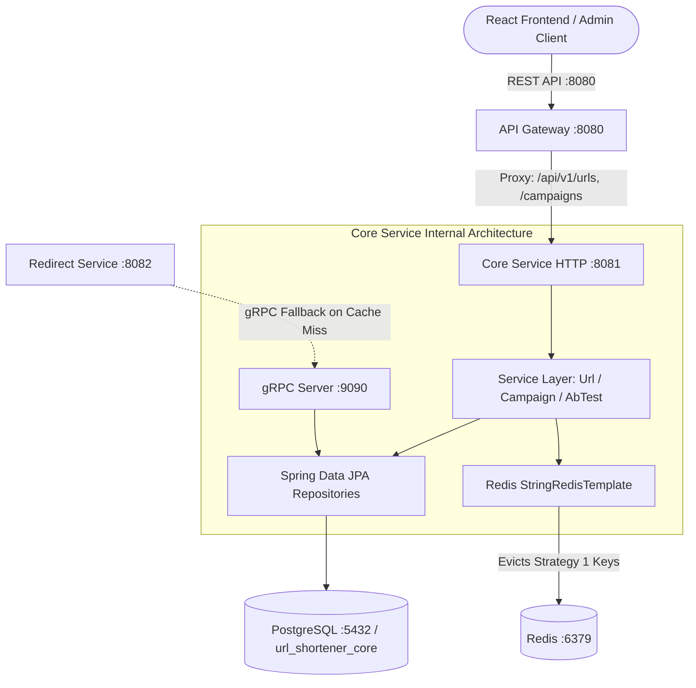
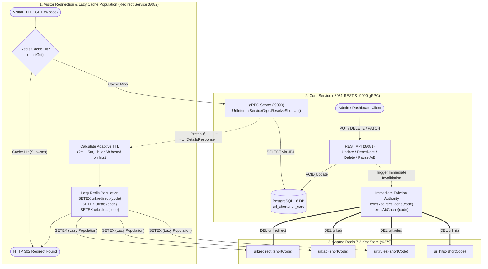

# Developer Guide: Building the Core Service (`url-core-service`)

Welcome! This is the definitive, step-by-step developer implementation guide for the **Core Microservice** (`url-core-service`).

The Core service manages URL persistence, Base62 shortcode generation, marketing campaigns, multivariate A/B/n tests, device/geo smart routing rules, and runs a high-performance **gRPC Server** on port **9090** to serve sub-5ms fallback queries from the Redirect service.

> [!IMPORTANT]
> **Write Path & Cache Invalidation Authority**:
> The Core service is the **authoritative Write Path** for the platform.
> The Redirect service resolves incoming clicks strictly from **Redis L1 memory in < 2ms** using **Strategy 1: Dedicated Dual-Keys (`MGET`)**:
> 1. `url:redirect:{shortCode}` $\rightarrow$ Base Fallback URL
> 2. `url:ab:{shortCode}` $\rightarrow$ In-memory A/B test variants JSON
> 3. `url:rules:{shortCode}` $\rightarrow$ Device / Geo targeting rules JSON
>
> **Lazy Cache-Aside Pattern with Adaptive TTL**:
> - **Population**: Handled lazily by the **Redirect Service** upon first click using dynamic `calculateAdaptiveTtl(hits)`. This ensures that cold links ($\le 10$ hits) only live in Redis for 2 minutes, preventing unclicked links from wasting Redis RAM.
> - **Eviction**: Handled immediately by the **Core Service** (`evictRedirectCache`) on update, deactivation, pause, or deletion to guarantee zero stale redirects.

---

## Table of Contents
1. [Architecture Overview & Port Mapping](#architecture-overview--port-mapping)
2. [Flyway Database Migrations (PostgreSQL)](#flyway-database-migrations-postgresql)
   - [Migration 1: Base URL Schema](#migration-1-base-url-schema)
   - [Migration 2: Drop Legacy UTM Profiles](#migration-2-drop-legacy-utm-profiles)
   - [Migration 3: Campaigns, A/B Testing & Smart Rules](#migration-3-campaigns-ab-testing--smart-rules)
   - [Migration 4: Branded Custom Vanity Alias Expansion](#migration-4-branded-custom-vanity-alias-expansion)
3. [JPA Entities & Relationships](#jpa-entities--relationships)
4. [Spring Data Repositories](#spring-data-repositories)
5. [jOOQ Dynamic Query & Multi-Table Resolution Layer](#jooq-dynamic-query--multi-table-resolution-layer)
6. [Strategy 1 Redis Cache Eviction & Synchronization](#strategy-1-redis-cache-eviction--synchronization)
7. [gRPC Server Implementation (`:9090`), Keepalive & Protobuf](#grpc-server-implementation-9090-keepalive--protobuf)
8. [DTO Records & JSR-380 Bean Validation](#dto-records--jsr-380-bean-validation)
9. [Centralized Global Exception Handling & RFC-7807 Errors](#centralized-global-exception-handling--rfc-7807-errors)
10. [Service Layer Implementations](#service-layer-implementations)
    - [UrlCoreService](#urlcoreservice)
    - [CampaignService](#campaignservice)
    - [AbTestService](#abtestservice)
11. [REST Controllers](#rest-controllers)
    - [UrlCoreController (`/api/v1/urls`)](#urlcorecontroller)
    - [CampaignController (`/api/v1/campaigns`)](#campaigncontroller)
    - [AbTestController (`/api/v1/ab-tests`)](#abtestcontroller)
12. [Step-by-Step Verification & Testing Guide](#step-by-step-verification--testing-guide)

---

## Architecture Overview & Port Mapping


```mermaid
graph TD
    Client([React Frontend / Admin Client]) -->|"REST API :8080"| Gateway[API Gateway :8080]
    Gateway -->|"Proxy: /api/v1/urls, /campaigns"| CoreHTTP[Core Service HTTP :8081]
    
    subgraph CoreInternal ["Core Service Internal Architecture"]
        CoreHTTP --> ServiceLayer[Service Layer: Url / Campaign / AbTest]
        ServiceLayer --> JPA[Spring Data JPA Repositories]
        ServiceLayer --> RedisCache[Redis StringRedisTemplate]
        
        GrpcServer[gRPC Server :9090] --> JPA
    end

    JPA --> PostgresDB[(PostgreSQL :5432 / url_shortener_core)]
    RedisCache -->|"Evicts Strategy 1 Keys"| SharedRedis[(Redis :6379)]
    RedirectService[Redirect Service :8082] -.->|"gRPC Fallback on Cache Miss"| GrpcServer
```

| Component | Technology | Port | Responsibilities |
| :--- | :--- | :--- | :--- |
| **REST API** | Spring Boot Web / Jackson | `:8081` | URL CRUD, Campaigns, A/B/n test configuration. |
| **gRPC Server** | gRPC / Protobuf 3 | `:9090` | Sub-5ms binary link resolution for Redirect service. |
| **Database** | PostgreSQL 16 + Flyway | `:5432` | DB: `url_shortener_core` (ACID persistence). |
| **Cache** | Redis 7.2 | `:6379` | Evicts Strategy 1 keys on update/delete/pause (population is lazy via Redirect). |

---

## Flyway Database Migrations (PostgreSQL)

Located in `core/src/main/resources/db/migration/`.

### Migration 1: Base URL Schema
File: `V1__init_core_schema.sql`
```sql
CREATE EXTENSION IF NOT EXISTS "pgcrypto";

CREATE TABLE IF NOT EXISTS url_mappings (
    id UUID PRIMARY KEY DEFAULT gen_random_uuid(),
    short_code VARCHAR(10) UNIQUE NOT NULL,
    destination_url TEXT NOT NULL,
    tenant_id VARCHAR(50) DEFAULT 'default' NOT NULL,
    user_id UUID NOT NULL, -- Logical FK to Auth DB users
    is_active BOOLEAN DEFAULT TRUE NOT NULL,
    expires_at TIMESTAMP WITH TIME ZONE,
    created_at TIMESTAMP WITH TIME ZONE DEFAULT CURRENT_TIMESTAMP NOT NULL,
    updated_at TIMESTAMP WITH TIME ZONE DEFAULT CURRENT_TIMESTAMP NOT NULL
);

CREATE INDEX IF NOT EXISTS idx_url_mappings_short_code ON url_mappings(short_code);
CREATE INDEX IF NOT EXISTS idx_url_mappings_user_id ON url_mappings(user_id);
```

### Migration 2: Drop Legacy UTM Profiles
File: `V2__drop_utm_profiles.sql`
```sql
-- Purge obsolete separate utm_profiles table
DROP TABLE IF EXISTS utm_profiles CASCADE;
```

### Migration 3: Campaigns, A/B Testing & Smart Rules
File: `V3__create_campaigns_and_ab_testing.sql`
```sql
-- 1. Create Campaigns Table
CREATE TABLE IF NOT EXISTS campaigns (
    id UUID PRIMARY KEY DEFAULT gen_random_uuid(),
    user_id UUID NOT NULL,
    name VARCHAR(100) NOT NULL,
    description TEXT,
    created_at TIMESTAMP WITH TIME ZONE DEFAULT CURRENT_TIMESTAMP NOT NULL,
    updated_at TIMESTAMP WITH TIME ZONE DEFAULT CURRENT_TIMESTAMP NOT NULL
);

CREATE INDEX IF NOT EXISTS idx_campaigns_user_id ON campaigns(user_id);
CREATE UNIQUE INDEX IF NOT EXISTS idx_campaigns_user_name ON campaigns(user_id, name);

-- 2. Enhance url_mappings with Campaign FK, A/B Flag, and Smart Rules JSONB
ALTER TABLE url_mappings 
    ADD COLUMN IF NOT EXISTS campaign_id UUID REFERENCES campaigns(id) ON DELETE SET NULL,
    ADD COLUMN IF NOT EXISTS is_ab_test BOOLEAN DEFAULT FALSE NOT NULL,
    ADD COLUMN IF NOT EXISTS smart_rules JSONB;

CREATE INDEX IF NOT EXISTS idx_url_mappings_campaign_id ON url_mappings(campaign_id);

-- 3. Create A/B Tests Table
CREATE TABLE IF NOT EXISTS ab_tests (
    id UUID PRIMARY KEY DEFAULT gen_random_uuid(),
    url_mapping_id UUID NOT NULL UNIQUE REFERENCES url_mappings(id) ON DELETE CASCADE,
    name VARCHAR(100) NOT NULL,
    status VARCHAR(20) DEFAULT 'ACTIVE' NOT NULL, -- 'ACTIVE', 'PAUSED', 'CONCLUDED'
    winning_variant VARCHAR(10),                 -- Set when test is CONCLUDED (e.g. 'B')
    cookie_ttl_seconds INT DEFAULT 2592000 NOT NULL, -- 30 days sticky cookie
    created_at TIMESTAMP WITH TIME ZONE DEFAULT CURRENT_TIMESTAMP NOT NULL,
    updated_at TIMESTAMP WITH TIME ZONE DEFAULT CURRENT_TIMESTAMP NOT NULL
);

CREATE INDEX IF NOT EXISTS idx_ab_tests_url_mapping ON ab_tests(url_mapping_id);

-- 4. Create A/B Variants Table
CREATE TABLE IF NOT EXISTS ab_variants (
    id UUID PRIMARY KEY DEFAULT gen_random_uuid(),
    ab_test_id UUID NOT NULL REFERENCES ab_tests(id) ON DELETE CASCADE,
    variant_key VARCHAR(10) NOT NULL,            -- 'A', 'B', 'C', 'D'
    destination_url TEXT NOT NULL,
    weight INT DEFAULT 50 NOT NULL,              -- Cumulative weight (sums to 100)
    is_control BOOLEAN DEFAULT FALSE NOT NULL,
    created_at TIMESTAMP WITH TIME ZONE DEFAULT CURRENT_TIMESTAMP NOT NULL
);

CREATE INDEX IF NOT EXISTS idx_ab_variants_test_id ON ab_variants(ab_test_id);
```

### Migration 4: Branded Custom Vanity Alias Expansion
File: `V4__increase_short_code_length.sql`
```sql
-- Increase short_code column length to 64 characters to support branded vanity custom aliases
ALTER TABLE url_mappings ALTER COLUMN short_code TYPE VARCHAR(64);
```

---

## JPA Entities & Relationships

### 1. `UrlMapping.java`
File: `core/src/main/java/com/urlshortener/core/entity/UrlMapping.java`

```java
package com.urlshortener.core.entity;

import jakarta.persistence.*;
import lombok.*;
import org.hibernate.annotations.JdbcTypeCode;
import org.hibernate.type.SqlTypes;

import java.time.Instant;
import java.util.UUID;

@Entity
@Table(name = "url_mappings", indexes = {
        @Index(name = "idx_urls_short_code", columnList = "short_code", unique = true),
        @Index(name = "idx_urls_user_id", columnList = "user_id"),
        @Index(name = "idx_urls_campaign_id", columnList = "campaign_id")
})
@Getter
@Setter
@NoArgsConstructor
@AllArgsConstructor
@Builder
public class UrlMapping {

    @Id
    @GeneratedValue(strategy = GenerationType.AUTO)
    private UUID id;

    @Column(name = "short_code", nullable = false, unique = true, length = 10)
    private String shortCode;

    @Column(name = "destination_url", nullable = false, columnDefinition = "TEXT")
    private String destinationUrl;

    @Column(name = "campaign_id")
    private UUID campaignId;

    @Column(name = "is_ab_test", nullable = false)
    @Builder.Default
    private Boolean isAbTest = false;

    @JdbcTypeCode(SqlTypes.JSON)
    @Column(name = "smart_rules", columnDefinition = "jsonb")
    private String smartRules; // Native PostgreSQL JSONB for Geo & Device deep-linking rules

    @Column(name = "tenant_id", nullable = false)
    @Builder.Default
    private String tenantId = "default";

    @Column(name = "user_id", nullable = false)
    private UUID userId;

    @Column(name = "is_active", nullable = false)
    @Builder.Default
    private Boolean isActive = true;

    @Column(name = "expires_at")
    private Instant expiresAt;

    @Column(name = "created_at", nullable = false, updatable = false)
    private Instant createdAt;

    @Column(name = "updated_at", nullable = false)
    private Instant updatedAt;

    @PrePersist
    protected void onCreate() {
        if (createdAt == null) createdAt = Instant.now();
        if (updatedAt == null) updatedAt = Instant.now();
        if (isActive == null) isActive = true;
        if (isAbTest == null) isAbTest = false;
        if (tenantId == null) tenantId = "default";
    }

    @PreUpdate
    protected void onUpdate() {
        updatedAt = Instant.now();
    }
}
```

### 2. `Campaign.java`
File: `core/src/main/java/com/urlshortener/core/entity/Campaign.java`

```java
package com.urlshortener.core.entity;

import jakarta.persistence.*;
import lombok.*;

import java.time.Instant;
import java.util.UUID;

@Entity
@Table(name = "campaigns", indexes = {
        @Index(name = "idx_campaigns_user_id", columnList = "user_id")
})
@Getter
@Setter
@NoArgsConstructor
@AllArgsConstructor
@Builder
public class Campaign {

    @Id
    @GeneratedValue(strategy = GenerationType.AUTO)
    private UUID id;

    @Column(name = "user_id", nullable = false)
    private UUID userId;

    @Column(name = "name", nullable = false, length = 100)
    private String name;

    @Column(name = "description", columnDefinition = "TEXT")
    private String description;

    @Column(name = "created_at", nullable = false, updatable = false)
    private Instant createdAt;

    @Column(name = "updated_at", nullable = false)
    private Instant updatedAt;

    @PrePersist
    protected void onCreate() {
        if (createdAt == null) createdAt = Instant.now();
        if (updatedAt == null) updatedAt = Instant.now();
    }

    @PreUpdate
    protected void onUpdate() {
        updatedAt = Instant.now();
    }
}
```

### 3. `AbTest.java`
File: `core/src/main/java/com/urlshortener/core/entity/AbTest.java`

```java
package com.urlshortener.core.entity;

import jakarta.persistence.*;
import lombok.*;

import java.time.Instant;
import java.util.UUID;

@Entity
@Table(name = "ab_tests", indexes = {
        @Index(name = "idx_ab_tests_url_mapping", columnList = "url_mapping_id", unique = true)
})
@Getter
@Setter
@NoArgsConstructor
@AllArgsConstructor
@Builder
public class AbTest {

    @Id
    @GeneratedValue(strategy = GenerationType.AUTO)
    private UUID id;

    @Column(name = "url_mapping_id", nullable = false, unique = true)
    private UUID urlMappingId;

    @Column(name = "name", nullable = false, length = 100)
    private String name;

    @Column(name = "status", nullable = false, length = 20)
    @Builder.Default
    private String status = "ACTIVE"; // 'ACTIVE', 'PAUSED', 'CONCLUDED'

    @Column(name = "winning_variant", length = 10)
    private String winningVariant;

    @Column(name = "cookie_ttl_seconds", nullable = false)
    @Builder.Default
    private Integer cookieTtlSeconds = 2592000; // 30 days

    @Column(name = "created_at", nullable = false, updatable = false)
    private Instant createdAt;

    @Column(name = "updated_at", nullable = false)
    private Instant updatedAt;

    @PrePersist
    protected void onCreate() {
        if (createdAt == null) createdAt = Instant.now();
        if (updatedAt == null) updatedAt = Instant.now();
        if (status == null) status = "ACTIVE";
        if (cookieTtlSeconds == null) cookieTtlSeconds = 2592000;
    }

    @PreUpdate
    protected void onUpdate() {
        updatedAt = Instant.now();
    }
}
```

### 4. `AbVariant.java`
File: `core/src/main/java/com/urlshortener/core/entity/AbVariant.java`

```java
package com.urlshortener.core.entity;

import jakarta.persistence.*;
import lombok.*;

import java.time.Instant;
import java.util.UUID;

@Entity
@Table(name = "ab_variants", indexes = {
        @Index(name = "idx_ab_variants_test_id", columnList = "ab_test_id")
})
@Getter
@Setter
@NoArgsConstructor
@AllArgsConstructor
@Builder
public class AbVariant {

    @Id
    @GeneratedValue(strategy = GenerationType.AUTO)
    private UUID id;

    @Column(name = "ab_test_id", nullable = false)
    private UUID abTestId;

    @Column(name = "variant_key", nullable = false, length = 10)
    private String variantKey; // 'A', 'B', 'C'

    @Column(name = "destination_url", nullable = false, columnDefinition = "TEXT")
    private String destinationUrl;

    @Column(name = "weight", nullable = false)
    @Builder.Default
    private Integer weight = 50;

    @Column(name = "is_control", nullable = false)
    @Builder.Default
    private Boolean isControl = false;

    @Column(name = "created_at", nullable = false, updatable = false)
    private Instant createdAt;

    @PrePersist
    protected void onCreate() {
        if (createdAt == null) createdAt = Instant.now();
        if (weight == null) weight = 50;
        if (isControl == null) isControl = false;
    }
}
```

---

## Spring Data Repositories

### 1. `UrlMappingRepository.java`
File: `core/src/main/java/com/urlshortener/core/repository/UrlMappingRepository.java`

```java
package com.urlshortener.core.repository;

import com.urlshortener.core.entity.UrlMapping;
import org.springframework.data.domain.Page;
import org.springframework.data.domain.Pageable;
import org.springframework.data.jpa.repository.JpaRepository;
import org.springframework.data.jpa.repository.Query;
import org.springframework.data.repository.query.Param;
import org.springframework.stereotype.Repository;

import java.util.List;
import java.util.Optional;
import java.util.UUID;

@Repository
public interface UrlMappingRepository extends JpaRepository<UrlMapping, UUID> {

    Optional<UrlMapping> findByShortCode(String shortCode);

    boolean existsByShortCode(String shortCode);

    List<UrlMapping> findByUserId(UUID userId);

    List<UrlMapping> findByCampaignId(UUID campaignId);

    long countByCampaignId(UUID campaignId);

    @Query("SELECT u FROM UrlMapping u WHERE u.userId = :userId " +
           "AND (:search IS NULL OR LOWER(u.shortCode) LIKE LOWER(CONCAT('%', :search, '%')) " +
           "     OR LOWER(u.destinationUrl) LIKE LOWER(CONCAT('%', :search, '%'))) " +
           "AND (:isActive IS NULL OR u.isActive = :isActive) " +
           "AND (:campaignId IS NULL OR u.campaignId = :campaignId)")
    Page<UrlMapping> searchUserUrls(
            @Param("userId") UUID userId,
            @Param("search") String search,
            @Param("isActive") Boolean isActive,
            @Param("campaignId") UUID campaignId,
            Pageable pageable
    );
}
```

### 2. `CampaignRepository.java`
File: `core/src/main/java/com/urlshortener/core/repository/CampaignRepository.java`

```java
package com.urlshortener.core.repository;

import com.urlshortener.core.entity.Campaign;
import org.springframework.data.jpa.repository.JpaRepository;
import org.springframework.stereotype.Repository;

import java.util.List;
import java.util.Optional;
import java.util.UUID;

@Repository
public interface CampaignRepository extends JpaRepository<Campaign, UUID> {
    List<Campaign> findByUserId(UUID userId);
    Optional<Campaign> findByIdAndUserId(UUID id, UUID userId);
    boolean existsByUserIdAndName(UUID userId, String name);
}
```

### 3. `AbTestRepository.java`
File: `core/src/main/java/com/urlshortener/core/repository/AbTestRepository.java`

```java
package com.urlshortener.core.repository;

import com.urlshortener.core.entity.AbTest;
import org.springframework.data.jpa.repository.JpaRepository;
import org.springframework.stereotype.Repository;

import java.util.Optional;
import java.util.UUID;

@Repository
public interface AbTestRepository extends JpaRepository<AbTest, UUID> {
    Optional<AbTest> findByUrlMappingId(UUID urlMappingId);
    void deleteByUrlMappingId(UUID urlMappingId);
}
```

### 4. `AbVariantRepository.java`
File: `core/src/main/java/com/urlshortener/core/repository/AbVariantRepository.java`

```java
package com.urlshortener.core.repository;

import com.urlshortener.core.entity.AbVariant;
import org.springframework.data.jpa.repository.JpaRepository;
import org.springframework.stereotype.Repository;

import java.util.List;
import java.util.UUID;

@Repository
public interface AbVariantRepository extends JpaRepository<AbVariant, UUID> {
    List<AbVariant> findByAbTestId(UUID abTestId);
    void deleteByAbTestId(UUID abTestId);
}
```

---

## 5. jOOQ Dynamic Query & Multi-Table Resolution Layer

While Spring Data JPA handles simple CRUD, the platform uses **jOOQ** for complex dynamic filtering and high-performance multi-table joins. This eliminates N+1 query latency and provides compile-time type safety.

### 5.1 `UrlResolutionRecord.java`
File: `core/src/main/java/com/urlshortener/core/repository/UrlResolutionRecord.java`

```java
package com.urlshortener.core.repository;

import java.util.UUID;

public record UrlResolutionRecord(
        String shortCode,
        String destinationUrl,
        Boolean isActive,
        Boolean isAbTest,
        String smartRules,
        UUID urlId,
        UUID campaignId,
        UUID testId,
        String testStatus,
        String winningVariant,
        Integer cookieTtlSeconds,
        String variantKey,
        String variantUrl,
        Integer variantWeight,
        Boolean variantIsControl
) implements UrlResolutionProjection {
    @Override public String getShortCode() { return shortCode; }
    @Override public String getDestinationUrl() { return destinationUrl; }
    @Override public Boolean getIsActive() { return isActive; }
    @Override public Boolean getIsAbTest() { return isAbTest; }
    @Override public String getSmartRules() { return smartRules; }
    @Override public UUID getUrlId() { return urlId; }
    @Override public UUID getCampaignId() { return campaignId; }
    @Override public UUID getTestId() { return testId; }
    @Override public String getTestStatus() { return testStatus; }
    @Override public String getWinningVariant() { return winningVariant; }
    @Override public Integer getCookieTtlSeconds() { return cookieTtlSeconds; }
    @Override public String getVariantKey() { return variantKey; }
    @Override public String getVariantUrl() { return variantUrl; }
    @Override public Integer getVariantWeight() { return variantWeight; }
    @Override public Boolean getVariantIsControl() { return variantIsControl; }
}
```

### 5.2 `UrlMappingQueryRepository.java`
File: `core/src/main/java/com/urlshortener/core/repository/UrlMappingQueryRepository.java`

Key responsibilities:
1. **Dynamic URL Searching**: Constructing dynamic SQL predicates for user links, search terms, active state, and campaign filters.
2. **Single-Query Multi-Table gRPC Resolution**: Joining `url_mappings` LEFT JOIN `ab_tests` LEFT JOIN `ab_variants` in one round-trip to resolve the target destination, active test rules, and variant weights in sub-3ms.

```java
@Repository
@RequiredArgsConstructor
public class UrlMappingQueryRepository {

    private final DSLContext dsl;

    public Page<ShortUrlResponse> searchUserUrls(
            UUID userId,
            String searchPattern,
            Boolean isActive,
            UUID campaignId,
            boolean unassignedOnly,
            Pageable pageable
    ) {
        Condition condition = URL_MAPPINGS.USER_ID.eq(userId);

        if (searchPattern != null && !searchPattern.isBlank()) {
            condition = condition.and(
                    URL_MAPPINGS.SHORT_CODE.likeIgnoreCase(searchPattern)
                            .or(URL_MAPPINGS.DESTINATION_URL.likeIgnoreCase(searchPattern))
            );
        }

        if (isActive != null) {
            condition = condition.and(URL_MAPPINGS.IS_ACTIVE.eq(isActive));
        }

        if (unassignedOnly) {
            condition = condition.and(URL_MAPPINGS.CAMPAIGN_ID.isNull());
        } else if (campaignId != null) {
            condition = condition.and(URL_MAPPINGS.CAMPAIGN_ID.eq(campaignId));
        }

        Long totalCount = dsl.selectCount()
                .from(URL_MAPPINGS)
                .where(condition)
                .fetchOne(0, Long.class);

        long total = totalCount != null ? totalCount : 0L;
        if (total == 0) return new PageImpl<>(List.of(), pageable, 0);

        List<ShortUrlResponse> results = dsl.select(
                URL_MAPPINGS.ID,
                URL_MAPPINGS.SHORT_CODE,
                URL_MAPPINGS.DESTINATION_URL,
                URL_MAPPINGS.IS_ACTIVE,
                URL_MAPPINGS.CAMPAIGN_ID,
                URL_MAPPINGS.CREATED_AT,
                URL_MAPPINGS.EXPIRES_AT
        )
        .from(URL_MAPPINGS)
        .where(condition)
        .orderBy(URL_MAPPINGS.CREATED_AT.desc())
        .offset(pageable.getOffset())
        .limit(pageable.getPageSize())
        .fetchInto(ShortUrlResponse.class);

        return new PageImpl<>(results, pageable, total);
    }
}
```

---

## 6. Strategy 1 Redis Cache Eviction & Synchronization

In our architecture, **Redis Population is Lazy**, while **Redis Eviction is Immediate**:


```mermaid
graph TB
    subgraph RedirectFlow ["1. Visitor Redirection & Lazy Cache Population (Redirect Service :8082)"]
        direction TB
        Visitor(["Visitor HTTP GET /r/{code}"])
        CheckCache{"Redis Cache Hit?<br/>(multiGet)"}
        ComputeTTL["Calculate Adaptive TTL<br/>(2m, 15m, 1h, or 6h based on hits)"]
        WriteKeys["Lazy Redis Population<br/>SETEX url:redirect:{code}<br/>SETEX url:ab:{code}<br/>SETEX url:rules:{code}"]
        Serve302(["HTTP 302 Redirect Found"])
    end

    subgraph CoreServiceArch ["2. Core Service (:8081 REST & :9090 gRPC)"]
        direction TB
        AdminClient(["Admin / Dashboard Client"])
        CoreRest["REST API (:8081)<br/>Update / Deactivate / Delete / Pause A/B"]
        CoreGrpc["gRPC Server (:9090)<br/>UrlInternalServiceGrpc.ResolveShortUrl()"]
        PostgresDB[("PostgreSQL 16 DB<br/>url_shortener_core")]
        EvictLogic["Immediate Eviction Authority<br/>evictRedirectCache(code)<br/>evictAbCache(code)"]
    end

    subgraph RedisCluster ["3. Shared Redis 7.2 Key Store (:6379)"]
        direction TB
        K_Base["url:redirect:{shortCode}"]
        K_Ab["url:ab:{shortCode}"]
        K_Rules["url:rules:{shortCode}"]
        K_Hits["url:hits:{shortCode}"]
    end

    %% Visitor Path
    Visitor --> CheckCache
    CheckCache -->|"Cache Hit (Sub-2ms)"| Serve302
    CheckCache -->|"Cache Miss"| CoreGrpc
    CoreGrpc -->|"SELECT via JPA"| PostgresDB
    CoreGrpc -.->|"Protobuf UrlDetailsResponse"| ComputeTTL
    ComputeTTL --> WriteKeys
    WriteKeys -->|"SETEX (Lazy Population)"| K_Base
    WriteKeys -->|"SETEX (Lazy Population)"| K_Ab
    WriteKeys -->|"SETEX (Lazy Population)"| K_Rules
    WriteKeys --> Serve302

    %% Admin Path
    AdminClient -->|"PUT / DELETE / PATCH"| CoreRest
    CoreRest -->|"ACID Update"| PostgresDB
    CoreRest -->|"Trigger Immediate Invalidation"| EvictLogic
    EvictLogic ==>|"DEL url:redirect"| K_Base
    EvictLogic ==>|"DEL url:ab"| K_Ab
    EvictLogic ==>|"DEL url:rules"| K_Rules
    EvictLogic ==>|"DEL url:hits"| K_Hits
```

### Why Core Does Not Pre-Warm on Creation
1. **Memory Efficiency**: If `Core` pre-warmed every newly created link, links that are never clicked would consume Redis memory unnecessarily.
2. **Adaptive TTL Harmony**: Cold links ($\le 10$ hits) belong in Redis for only **2 minutes**, while viral links stay for **up to 6 hours**. Since `RedirectService` tracks click popularity dynamically via `calculateAdaptiveTtl(hits)`, it is the sole authority on cache population.
3. **Core's Responsibility is Eviction**: Core guarantees data consistency by immediately invalidating Redis keys whenever an admin changes destinations, pauses an A/B test, or deletes a URL.

### Strategy 1 Cache Eviction Helper Methods in Core
Add these methods to `UrlCoreService.java`:

```java
/**
 * Evicts all Strategy 1 keys for a short code across Redis.
 * Called whenever a link is updated, deactivated, or deleted.
 */
public void evictRedirectCache(String shortCode) {
    try {
        redisTemplate.delete(List.of(
            "url:redirect:" + shortCode,
            "url:ab:" + shortCode,
            "url:rules:" + shortCode,
            "url:hits:" + shortCode
        ));
        log.info("Evicted all Redis Strategy 1 keys for shortCode: {}", shortCode);
    } catch (Exception e) {
        log.warn("Failed to evict Redis cache for {}: {}", shortCode, e.getMessage());
    }
}

/**
 * Specifically evicts only the A/B test configuration key.
 * Called when an A/B test is paused or concluded without modifying the base URL.
 */
public void evictAbCache(String shortCode) {
    try {
        redisTemplate.delete("url:ab:" + shortCode);
        log.info("Evicted Redis A/B test key for shortCode: {}", shortCode);
    } catch (Exception e) {
        log.warn("Failed to evict Redis A/B cache for {}: {}", shortCode, e.getMessage());
    }
}
```

---

## 7. gRPC Server Implementation (`:9090`), Keepalive & Protobuf

When the Redirect service encounters a Redis cache miss, it executes a single unary gRPC RPC to Core on port **9090**.

### 7.1 Keepalive & Channel Health Configuration
File: `core/src/main/resources/application.yml`
```yaml
grpc:
  server:
    port: 9090
    permit-keep-alive-time: 10s
    permit-keep-alive-without-calls: true
```
This configuration permits client keepalive pings without active RPC calls, ensuring that HTTP redirects never block or freeze if a microservice restarts or an idle socket times out.

### 7.2 Protobuf Definition
File: `core/src/main/proto/url_service.proto` (and identical in `redirect/src/main/proto/url_service.proto`):

```protobuf
syntax = "proto3";

package com.urlshortener.grpc;

option java_multiple_files = true;
option java_package = "com.urlshortener.grpc";

service UrlService {
  rpc GetDestinationUrl (UrlRequest) returns (UrlResponse);
  rpc CreateUrlMapping (CreateUrlRequest) returns (CreateUrlResponse);
}

message UrlRequest {
  string short_code = 1;
}

message UrlResponse {
  string destination_url = 1;
  bool is_active = 2;
  bool is_found = 3;
  string short_code = 4;
  string ab_rules_json = 5;      // Optional: A/B variant JSON configuration
  string smart_rules_json = 6;   // Optional: Device and Geo targeting rules
}

message CreateUrlRequest {
  string destination_url = 1;
  string custom_alias = 2;
  string user_id = 3;
}

message CreateUrlResponse {
  string short_code = 1;
  string destination_url = 2;
  bool success = 3;
}
```

### 2. `UrlGrpcService.java`
File: `core/src/main/java/com/urlshortener/core/grpc/UrlGrpcService.java`

```java
package com.urlshortener.core.grpc;

import com.fasterxml.jackson.databind.ObjectMapper;
import com.urlshortener.core.entity.AbTest;
import com.urlshortener.core.entity.AbVariant;
import com.urlshortener.core.entity.UrlMapping;
import com.urlshortener.core.repository.AbTestRepository;
import com.urlshortener.core.repository.AbVariantRepository;
import com.urlshortener.core.repository.UrlMappingRepository;
import com.urlshortener.grpc.UrlRequest;
import com.urlshortener.grpc.UrlResponse;
import com.urlshortener.grpc.UrlServiceGrpc;
import io.grpc.stub.StreamObserver;
import lombok.RequiredArgsConstructor;
import lombok.extern.slf4j.Slf4j;
import net.devh.boot.grpc.server.service.GrpcService;

import java.util.HashMap;
import java.util.List;
import java.util.Map;
import java.util.Optional;

@Slf4j
@GrpcService
@RequiredArgsConstructor
public class UrlGrpcService extends UrlServiceGrpc.UrlServiceImplBase {

    private final UrlMappingRepository urlMappingRepository;
    private final AbTestRepository abTestRepository;
    private final AbVariantRepository abVariantRepository;
    private final ObjectMapper objectMapper;

    @Override
    public void getDestinationUrl(UrlRequest request, StreamObserver<UrlResponse> responseObserver) {
        String shortCode = request.getShortCode();

        // Guard Clause 1: Invalid or blank short code input
        if (shortCode == null || shortCode.isBlank()) {
            sendNotFound("", responseObserver);
            return;
        }

        Optional<UrlMapping> mappingOpt = urlMappingRepository.findByShortCode(shortCode);

        // Guard Clause 2: URL not found in database
        if (mappingOpt.isEmpty()) {
            sendNotFound(shortCode, responseObserver);
            return;
        }

        UrlMapping mapping = mappingOpt.get();

        // Guard Clause 3: Link is deactivated/disabled (short-circuit without loading variants)
        if (!Boolean.TRUE.equals(mapping.getIsActive())) {
            UrlResponse inactiveResponse = UrlResponse.newBuilder()
                    .setShortCode(mapping.getShortCode())
                    .setDestinationUrl(mapping.getDestinationUrl())
                    .setIsActive(false)
                    .setIsFound(true)
                    .build();
            responseObserver.onNext(inactiveResponse);
            responseObserver.onCompleted();
            return;
        }

        // Happy Path: URL is active and found (unindented, linear flow)
        UrlResponse.Builder builder = UrlResponse.newBuilder()
                .setShortCode(mapping.getShortCode())
                .setDestinationUrl(mapping.getDestinationUrl())
                .setIsActive(true)
                .setIsFound(true);

        resolveAbRulesJson(mapping).ifPresent(builder::setAbRulesJson);
        resolveSmartRulesJson(mapping).ifPresent(builder::setSmartRulesJson);

        responseObserver.onNext(builder.build());
        responseObserver.onCompleted();
    }

    /**
     * Resolves active A/B test variant rules using guard clauses.
     */
    private Optional<String> resolveAbRulesJson(UrlMapping mapping) {
        // Guard Clause: URL mapping is not configured for A/B testing
        if (!Boolean.TRUE.equals(mapping.getIsAbTest())) {
            return Optional.empty();
        }

        Optional<AbTest> abTestOpt = abTestRepository.findByUrlMappingId(mapping.getId());

        // Guard Clause: No A/B test record associated with this mapping
        if (abTestOpt.isEmpty()) {
            return Optional.empty();
        }

        AbTest test = abTestOpt.get();

        // Guard Clause: Test is paused, draft, or completed
        if (!"ACTIVE".equalsIgnoreCase(test.getStatus())) {
            return Optional.empty();
        }

        List<AbVariant> variants = abVariantRepository.findByAbTestId(test.getId());

        // Guard Clause: No variants exist for this test
        if (variants == null || variants.isEmpty()) {
            return Optional.empty();
        }

        // Happy Path: Construct JSON configuration payload
        try {
            Map<String, Object> abPayload = new HashMap<>();
            abPayload.put("testId", test.getId().toString());
            abPayload.put("status", test.getStatus());
            abPayload.put("cookieTtlSeconds", test.getCookieTtlSeconds());
            abPayload.put("variants", variants.stream().map(v -> Map.of(
                    "key", v.getVariantKey(),
                    "url", v.getDestinationUrl(),
                    "weight", v.getWeight(),
                    "isControl", v.getIsControl()
            )).toList());
            return Optional.of(objectMapper.writeValueAsString(abPayload));
        } catch (Exception e) {
            log.error("Failed to serialize A/B rules for shortCode {}: {}", mapping.getShortCode(), e.getMessage());
            return Optional.empty();
        }
    }

    /**
     * Extracts smart routing rules using guard clauses.
     */
    private Optional<String> resolveSmartRulesJson(UrlMapping mapping) {
        if (mapping.getSmartRules() == null || mapping.getSmartRules().isBlank()) {
            return Optional.empty();
        }
        return Optional.of(mapping.getSmartRules());
    }

    /**
     * Standardized negative-space response when a URL mapping is missing or invalid.
     */
    private void sendNotFound(String shortCode, StreamObserver<UrlResponse> responseObserver) {
        UrlResponse notFoundResponse = UrlResponse.newBuilder()
                .setShortCode(shortCode != null ? shortCode : "")
                .setDestinationUrl("")
                .setIsActive(false)
                .setIsFound(false)
                .build();
        responseObserver.onNext(notFoundResponse);
        responseObserver.onCompleted();
    }
}
```

---

## 8. DTO Records & JSR-380 Bean Validation

Every external client payload is validated strictly at the controller boundary using Bean Validation (`jakarta.validation.constraints.*`).

### 8.1 URL DTOs
File: `core/src/main/java/com/urlshortener/core/dto/CreateUrlRequest.java`
```java
package com.urlshortener.core.dto;

import jakarta.validation.constraints.NotBlank;
import jakarta.validation.constraints.Pattern;
import jakarta.validation.constraints.Size;
import java.util.UUID;

public record CreateUrlRequest(
        @NotBlank(message = "Destination URL is required")
        @Size(max = 2048, message = "Destination URL cannot exceed 2048 characters")
        @Pattern(regexp = "^(https?://).+", message = "Destination URL must start with http:// or https://")
        String destinationUrl,

        @Pattern(regexp = "^$|^[a-zA-Z0-9_-]{3,64}$", message = "Custom alias must be 3 to 64 characters and contain only letters, numbers, hyphens, and underscores")
        String customAlias,

        UUID campaignId,

        @Size(max = 4096, message = "Smart rules cannot exceed 4096 characters")
        String smartRules
) {}
```

File: `core/src/main/java/com/urlshortener/core/dto/UpdateUrlRequest.java`
```java
package com.urlshortener.core.dto;

import jakarta.validation.constraints.Pattern;
import jakarta.validation.constraints.Size;
import java.time.Instant;
import java.util.UUID;

public record UpdateUrlRequest(
        @Pattern(regexp = "^$|^(https?://).+", message = "Destination URL must start with http:// or https://")
        @Size(max = 2048, message = "Destination URL cannot exceed 2048 characters")
        String destinationUrl,

        UUID campaignId,

        @Size(max = 4096, message = "Smart rules cannot exceed 4096 characters")
        String smartRules,

        Boolean isActive,
        Instant expiresAt
) {}
```

File: `PagedResponse.java`
```java
package com.urlshortener.core.dto;

import org.springframework.data.domain.Page;
import java.util.List;

public record PagedResponse<T>(
        List<T> content,
        int pageNumber,
        int pageSize,
        long totalElements,
        int totalPages,
        boolean isLast
) {
    public static <T> PagedResponse<T> from(Page<T> page) {
        return new PagedResponse<>(
                page.getContent(),
                page.getNumber(),
                page.getSize(),
                page.getTotalElements(),
                page.getTotalPages(),
                page.isLast()
        );
    }
}
```

### 2. Campaign DTOs
File: `CreateCampaignRequest.java`
```java
package com.urlshortener.core.dto;

import jakarta.validation.constraints.NotBlank;

public record CreateCampaignRequest(
        @NotBlank(message = "Campaign name is required")
        String name,
        String description
) {}
```

File: `CampaignResponse.java`
```java
package com.urlshortener.core.dto;

import com.urlshortener.core.entity.Campaign;
import java.time.Instant;
import java.util.UUID;

public record CampaignResponse(
        UUID id,
        String name,
        String description,
        long linkCount,
        Instant createdAt,
        Instant updatedAt
) {
    public static CampaignResponse from(Campaign c, long linkCount) {
        return new CampaignResponse(
                c.getId(),
                c.getName(),
                c.getDescription(),
                linkCount,
                c.getCreatedAt(),
                c.getUpdatedAt()
        );
    }
}
```

### 8.3 A/B Testing DTOs
File: `core/src/main/java/com/urlshortener/core/dto/CreateAbTestRequest.java`
```java
package com.urlshortener.core.dto;

import jakarta.validation.Valid;
import jakarta.validation.constraints.Max;
import jakarta.validation.constraints.Min;
import jakarta.validation.constraints.NotBlank;
import jakarta.validation.constraints.NotEmpty;
import jakarta.validation.constraints.Pattern;
import jakarta.validation.constraints.Size;
import java.util.List;

public record CreateAbTestRequest(
        @Size(max = 64, message = "Short code cannot exceed 64 characters")
        String shortCode,

        @NotBlank(message = "A/B test name is required")
        @Size(min = 2, max = 100, message = "A/B test name must be between 2 and 100 characters")
        String name,

        @Min(value = 60, message = "Cookie stickiness TTL must be at least 60 seconds")
        @Max(value = 31536000, message = "Cookie stickiness TTL cannot exceed 365 days")
        Integer cookieTtlSeconds,

        @NotEmpty(message = "At least two variants are required")
        @Size(min = 2, max = 10, message = "An A/B test must have between 2 and 10 variants")
        List<@Valid VariantRequest> variants
) {
    public record VariantRequest(
            @NotBlank(message = "Variant key is required")
            @Size(max = 10, message = "Variant key cannot exceed 10 characters")
            String key,

            @NotBlank(message = "Variant destination URL is required")
            @Size(max = 2048, message = "Variant destination URL cannot exceed 2048 characters")
            @Pattern(regexp = "^(https?://).+", message = "Variant destination URL must start with http:// or https://")
            String destinationUrl,

            @Min(value = 0, message = "Variant weight cannot be negative")
            @Max(value = 100, message = "Variant weight cannot exceed 100")
            int weight,

            boolean isControl
    ) {}
}
```

File: `core/src/main/java/com/urlshortener/core/dto/AbTestResponse.java`
```java
package com.urlshortener.core.dto;

import com.urlshortener.core.entity.AbTest;
import com.urlshortener.core.entity.AbVariant;
import java.time.Instant;
import java.util.List;
import java.util.UUID;

public record AbTestResponse(
        UUID id,
        UUID urlMappingId,
        String name,
        String status,
        String winningVariant,
        Integer cookieTtlSeconds,
        List<VariantDto> variants,
        Instant createdAt,
        Instant updatedAt
) {
    public record VariantDto(
            UUID id,
            String key,
            String destinationUrl,
            int weight,
            boolean isControl
    ) {
        public static VariantDto from(AbVariant v) {
            return new VariantDto(v.getId(), v.getVariantKey(), v.getDestinationUrl(), v.getWeight(), v.getIsControl());
        }
    }

    public static AbTestResponse from(AbTest test, List<AbVariant> variants) {
        return new AbTestResponse(
                test.getId(),
                test.getUrlMappingId(),
                test.getName(),
                test.getStatus(),
                test.getWinningVariant(),
                test.getCookieTtlSeconds(),
                variants.stream().map(VariantDto::from).toList(),
                test.getCreatedAt(),
                test.getUpdatedAt()
        );
    }
}
```

File: `core/src/main/java/com/urlshortener/core/dto/UpdateAbTestStatusRequest.java`
```java
package com.urlshortener.core.dto;

import jakarta.validation.constraints.NotBlank;
import jakarta.validation.constraints.Pattern;

public record UpdateAbTestStatusRequest(
        @NotBlank(message = "Status is required")
        @Pattern(regexp = "^(ACTIVE|PAUSED|CONCLUDED)$", message = "Status must be ACTIVE, PAUSED, or CONCLUDED")
        String status,

        String winningVariant
) {}
```

---

## 9. Centralized Global Exception Handling & RFC-7807 Errors

File: `core/src/main/java/com/urlshortener/core/exception/GlobalExceptionHandler.java`

Handles validation errors uniformly and returns a structured map of field errors directly consumed by the React UI:

```java
package com.urlshortener.core.exception;

import lombok.extern.slf4j.Slf4j;
import org.springframework.http.HttpStatus;
import org.springframework.http.ResponseEntity;
import org.springframework.validation.FieldError;
import org.springframework.web.bind.MethodArgumentNotValidException;
import org.springframework.web.bind.annotation.ExceptionHandler;
import org.springframework.web.bind.annotation.RestControllerAdvice;

import java.time.Instant;
import java.util.HashMap;
import java.util.Map;

@Slf4j
@RestControllerAdvice
public class GlobalExceptionHandler {

    public record ErrorResponse(int status, String error, String message, Instant timestamp) {}

    @ExceptionHandler(MethodArgumentNotValidException.class)
    public ResponseEntity<Map<String, Object>> handleValidation(MethodArgumentNotValidException ex) {
        Map<String, String> fieldErrors = new HashMap<>();
        for (FieldError error : ex.getBindingResult().getFieldErrors()) {
            fieldErrors.put(error.getField(), error.getDefaultMessage());
        }

        String firstErrorMessage = ex.getBindingResult().getFieldErrors().stream()
                .map(FieldError::getDefaultMessage)
                .findFirst()
                .orElse("Request validation failed");

        Map<String, Object> body = new HashMap<>();
        body.put("status", HttpStatus.BAD_REQUEST.value());
        body.put("error", "Validation Failed");
        body.put("message", firstErrorMessage);
        body.put("fieldErrors", fieldErrors);
        body.put("timestamp", Instant.now());

        return ResponseEntity.badRequest().body(body);
    }

    @ExceptionHandler(IllegalArgumentException.class)
    public ResponseEntity<ErrorResponse> handleIllegalArgument(IllegalArgumentException ex) {
        String msg = ex.getMessage() != null ? ex.getMessage() : "Invalid argument";
        HttpStatus status = msg.toLowerCase().contains("not found") ? HttpStatus.NOT_FOUND : HttpStatus.BAD_REQUEST;
        return ResponseEntity.status(status).body(new ErrorResponse(status.value(), status.getReasonPhrase(), msg, Instant.now()));
    }
}
```

---

## 10. Service Layer Implementations

### 1. `UrlCoreService.java`
File: `core/src/main/java/com/urlshortener/core/service/UrlCoreService.java`

```java
package com.urlshortener.core.service;

import com.fasterxml.jackson.databind.ObjectMapper;
import com.urlshortener.core.dto.CreateUrlRequest;
import com.urlshortener.core.dto.UpdateUrlRequest;
import com.urlshortener.core.entity.AbTest;
import com.urlshortener.core.entity.AbVariant;
import com.urlshortener.core.entity.UrlMapping;
import com.urlshortener.core.repository.AbTestRepository;
import com.urlshortener.core.repository.AbVariantRepository;
import com.urlshortener.core.repository.UrlMappingRepository;
import com.urlshortener.core.util.Base62;
import lombok.RequiredArgsConstructor;
import lombok.extern.slf4j.Slf4j;
import org.springframework.data.domain.Page;
import org.springframework.data.domain.Pageable;
import org.springframework.data.redis.core.StringRedisTemplate;
import org.springframework.stereotype.Service;
import org.springframework.transaction.annotation.Transactional;

import java.time.Duration;
import java.time.Instant;
import java.util.*;

@Slf4j
@Service
@RequiredArgsConstructor
public class UrlCoreService {

    private final UrlMappingRepository urlRepository;
    private final AbTestRepository abTestRepository;
    private final AbVariantRepository abVariantRepository;
    private final Base62 base62;
    private final StringRedisTemplate redisTemplate;
    private final ObjectMapper objectMapper;

    @Transactional
    public UrlMapping createShortUrl(CreateUrlRequest request, UUID userId) {
        String customAlias = request.customAlias() != null ? request.customAlias().trim() : null;

        // Guard Clause: Duplicate custom alias
        if (customAlias != null && !customAlias.isBlank() && urlRepository.existsByShortCode(customAlias)) {
            throw new IllegalArgumentException("Custom alias already in use: " + customAlias);
        }

        String shortCode = (customAlias != null && !customAlias.isBlank())
                ? customAlias
                : generateUniqueShortCode();

        UrlMapping mapping = UrlMapping.builder()
                .shortCode(shortCode)
                .destinationUrl(request.destinationUrl().trim())
                .campaignId(request.campaignId())
                .smartRules(request.smartRules())
                .userId(userId)
                .isActive(true)
                .isAbTest(false)
                .createdAt(Instant.now())
                .updatedAt(Instant.now())
                .build();

        // Note: Redis population is handled lazily by Redirect Service on first click (Cache-Aside with Adaptive TTL)
        return urlRepository.save(mapping);
    }

    @Transactional
    public UrlMapping updateShortUrl(UUID urlId, UpdateUrlRequest request, UUID userId) {
        UrlMapping mapping = urlRepository.findById(urlId)
                .orElseThrow(() -> new IllegalArgumentException("URL mapping not found"));

        if (!mapping.getUserId().equals(userId)) {
            throw new IllegalStateException("Unauthorized to modify this URL");
        }

        if (request.destinationUrl() != null && !request.destinationUrl().isBlank()) {
            mapping.setDestinationUrl(request.destinationUrl().trim());
        }
        if (request.campaignId() != null) {
            mapping.setCampaignId(request.campaignId());
        }
        if (request.smartRules() != null) {
            mapping.setSmartRules(request.smartRules());
        }
        if (request.isActive() != null) {
            mapping.setIsActive(request.isActive());
        }
        if (request.expiresAt() != null) {
            mapping.setExpiresAt(request.expiresAt());
        }
        mapping.setUpdatedAt(Instant.now());

        UrlMapping updated = urlRepository.save(mapping);
        // Evict all Strategy 1 keys so subsequent clicks immediately re-fetch updated mapping
        evictRedirectCache(updated.getShortCode());
        return updated;
    }

    @Transactional
    public void deleteShortUrl(UUID urlId, UUID userId) {
        UrlMapping mapping = urlRepository.findById(urlId)
                .orElseThrow(() -> new IllegalArgumentException("URL mapping not found"));

        if (!mapping.getUserId().equals(userId)) {
            throw new IllegalStateException("Unauthorized to delete this URL");
        }

        urlRepository.delete(mapping);
        evictRedirectCache(mapping.getShortCode());
    }

    public List<UrlMapping> getUserUrls(UUID userId) {
        return urlRepository.findByUserId(userId);
    }

    public Page<UrlMapping> getUserUrlsPaged(UUID userId, String search, Boolean isActive, UUID campaignId, Pageable pageable) {
        return urlRepository.searchUserUrls(userId, search, isActive, campaignId, pageable);
    }

    public UrlMapping getUrl(UUID urlId, UUID userId) {
        UrlMapping mapping = urlRepository.findById(urlId)
                .orElseThrow(() -> new IllegalArgumentException("URL mapping not found"));

        if (!mapping.getUserId().equals(userId)) {
            throw new IllegalStateException("Unauthorized to access this URL");
        }
        return mapping;
    }

    public Optional<UrlMapping> getUrlFromShortCode(String shortCode) {
        return urlRepository.findByShortCode(shortCode);
    }

    /**
     * Evicts all Strategy 1 keys for a short code across Redis.
     * Called whenever a link is updated, deactivated, or deleted.
     */
    public void evictRedirectCache(String shortCode) {
        try {
            redisTemplate.delete(List.of(
                "url:redirect:" + shortCode,
                "url:ab:" + shortCode,
                "url:rules:" + shortCode,
                "url:hits:" + shortCode
            ));
            log.info("Evicted all Redis Strategy 1 keys for shortCode: {}", shortCode);
        } catch (Exception e) {
            log.warn("Failed to evict Redis cache for {}: {}", shortCode, e.getMessage());
        }
    }

    /**
     * Specifically evicts the A/B test configuration key.
     * Called when an A/B test is paused, concluded, or deleted.
     */
    public void evictAbCache(String shortCode) {
        try {
            redisTemplate.delete("url:ab:" + shortCode);
            log.info("Evicted Redis A/B test key for shortCode: {}", shortCode);
        } catch (Exception e) {
            log.warn("Failed to evict Redis A/B cache for {}: {}", shortCode, e.getMessage());
        }
    }

    private String serializeAbRules(AbTest test, List<AbVariant> variants) {
        try {
            Map<String, Object> abPayload = new HashMap<>();
            abPayload.put("testId", test.getId().toString());
            abPayload.put("status", test.getStatus());
            abPayload.put("cookieTtlSeconds", test.getCookieTtlSeconds());
            abPayload.put("variants", variants.stream().map(v -> Map.of(
                    "key", v.getVariantKey(),
                    "url", v.getDestinationUrl(),
                    "weight", v.getWeight(),
                    "isControl", v.getIsControl()
            )).toList());
            return objectMapper.writeValueAsString(abPayload);
        } catch (Exception e) {
            log.error("Failed to serialize A/B rules: {}", e.getMessage());
            return "{}";
        }
    }

    private String generateUniqueShortCode() {
        String shortCode;
        do {
            shortCode = base62.generateRandomShortCode(7);
        } while (urlRepository.existsByShortCode(shortCode));
        return shortCode;
    }
}
```

### 2. `CampaignService.java`
File: `core/src/main/java/com/urlshortener/core/service/CampaignService.java`

```java
package com.urlshortener.core.service;

import com.urlshortener.core.dto.CampaignResponse;
import com.urlshortener.core.dto.CreateCampaignRequest;
import com.urlshortener.core.entity.Campaign;
import com.urlshortener.core.entity.UrlMapping;
import com.urlshortener.core.repository.CampaignRepository;
import com.urlshortener.core.repository.UrlMappingRepository;
import lombok.RequiredArgsConstructor;
import org.springframework.stereotype.Service;
import org.springframework.transaction.annotation.Transactional;

import java.time.Instant;
import java.util.List;
import java.util.UUID;

@Service
@RequiredArgsConstructor
public class CampaignService {

    private final CampaignRepository campaignRepository;
    private final UrlMappingRepository urlRepository;

    @Transactional
    public CampaignResponse createCampaign(CreateCampaignRequest request, UUID userId) {
        if (campaignRepository.existsByUserIdAndName(userId, request.name().trim())) {
            throw new IllegalArgumentException("Campaign with name '" + request.name() + "' already exists");
        }

        Campaign campaign = Campaign.builder()
                .userId(userId)
                .name(request.name().trim())
                .description(request.description())
                .createdAt(Instant.now())
                .updatedAt(Instant.now())
                .build();

        Campaign saved = campaignRepository.save(campaign);
        return CampaignResponse.from(saved, 0);
    }

    public List<CampaignResponse> getUserCampaigns(UUID userId) {
        return campaignRepository.findByUserId(userId).stream()
                .map(c -> CampaignResponse.from(c, urlRepository.countByCampaignId(c.getId())))
                .toList();
    }

    public CampaignResponse getCampaign(UUID id, UUID userId) {
        Campaign campaign = campaignRepository.findByIdAndUserId(id, userId)
                .orElseThrow(() -> new IllegalArgumentException("Campaign not found: " + id));
        long count = urlRepository.countByCampaignId(id);
        return CampaignResponse.from(campaign, count);
    }

    public List<UrlMapping> getCampaignUrls(UUID campaignId, UUID userId) {
        campaignRepository.findByIdAndUserId(campaignId, userId)
                .orElseThrow(() -> new IllegalArgumentException("Campaign not found: " + campaignId));
        return urlRepository.findByCampaignId(campaignId);
    }

    @Transactional
    public void deleteCampaign(UUID id, UUID userId) {
        Campaign campaign = campaignRepository.findByIdAndUserId(id, userId)
                .orElseThrow(() -> new IllegalArgumentException("Campaign not found: " + id));

        // Unlink associated URLs (nullify campaignId)
        List<UrlMapping> linkedUrls = urlRepository.findByCampaignId(id);
        for (UrlMapping url : linkedUrls) {
            url.setCampaignId(null);
        }
        urlRepository.saveAll(linkedUrls);

        campaignRepository.delete(campaign);
    }
}
```

### 3. `AbTestService.java`
File: `core/src/main/java/com/urlshortener/core/service/AbTestService.java`

```java
package com.urlshortener.core.service;

import com.urlshortener.core.dto.AbTestResponse;
import com.urlshortener.core.dto.CreateAbTestRequest;
import com.urlshortener.core.dto.UpdateAbTestStatusRequest;
import com.urlshortener.core.entity.AbTest;
import com.urlshortener.core.entity.AbVariant;
import com.urlshortener.core.entity.UrlMapping;
import com.urlshortener.core.repository.AbTestRepository;
import com.urlshortener.core.repository.AbVariantRepository;
import com.urlshortener.core.repository.UrlMappingRepository;
import lombok.RequiredArgsConstructor;
import lombok.extern.slf4j.Slf4j;
import org.springframework.stereotype.Service;
import org.springframework.transaction.annotation.Transactional;

import java.time.Instant;
import java.util.List;
import java.util.UUID;

@Slf4j
@Service
@RequiredArgsConstructor
public class AbTestService {

    private final AbTestRepository abTestRepository;
    private final AbVariantRepository abVariantRepository;
    private final UrlMappingRepository urlRepository;
    private final UrlCoreService urlCoreService;

    @Transactional
    public AbTestResponse configureAbTest(String shortCode, CreateAbTestRequest request, UUID userId) {
        UrlMapping mapping = urlRepository.findByShortCode(shortCode)
                .orElseThrow(() -> new IllegalArgumentException("Short code not found: " + shortCode));

        if (!mapping.getUserId().equals(userId)) {
            throw new IllegalStateException("Unauthorized to configure A/B test for this URL");
        }

        // Validate weights sum to 100
        int totalWeight = request.variants().stream().mapToInt(CreateAbTestRequest.VariantRequest::weight).sum();
        if (totalWeight != 100) {
            throw new IllegalArgumentException("Variant weights must sum to exactly 100 (current sum: " + totalWeight + ")");
        }

        // Clean any existing test for this mapping
        abTestRepository.findByUrlMappingId(mapping.getId()).ifPresent(existing -> {
            abVariantRepository.deleteByAbTestId(existing.getId());
            abTestRepository.delete(existing);
        });

        // 1. Create AbTest
        AbTest abTest = AbTest.builder()
                .urlMappingId(mapping.getId())
                .name(request.name().trim())
                .status("ACTIVE")
                .cookieTtlSeconds(request.cookieTtlSeconds() != null ? request.cookieTtlSeconds() : 2592000)
                .createdAt(Instant.now())
                .updatedAt(Instant.now())
                .build();
        AbTest savedTest = abTestRepository.save(abTest);

        // 2. Create AbVariants
        List<AbVariant> variants = request.variants().stream().map(v -> AbVariant.builder()
                .abTestId(savedTest.getId())
                .variantKey(v.key().toUpperCase())
                .destinationUrl(v.destinationUrl().trim())
                .weight(v.weight())
                .isControl(v.isControl())
                .createdAt(Instant.now())
                .build()).toList();
        List<AbVariant> savedVariants = abVariantRepository.saveAll(variants);

        // 3. Mark UrlMapping as A/B Test enabled
        mapping.setIsAbTest(true);
        mapping.setUpdatedAt(Instant.now());
        urlRepository.save(mapping);

        // 4. Invalidate Redis cache so next click pulls new A/B configuration
        urlCoreService.evictRedirectCache(shortCode);

        return AbTestResponse.from(savedTest, savedVariants);
    }

    public AbTestResponse getAbTest(String shortCode, UUID userId) {
        UrlMapping mapping = urlRepository.findByShortCode(shortCode)
                .orElseThrow(() -> new IllegalArgumentException("Short code not found: " + shortCode));

        if (!mapping.getUserId().equals(userId)) {
            throw new IllegalStateException("Unauthorized to view this A/B test");
        }

        AbTest test = abTestRepository.findByUrlMappingId(mapping.getId())
                .orElseThrow(() -> new IllegalArgumentException("No A/B test configured for " + shortCode));
        List<AbVariant> variants = abVariantRepository.findByAbTestId(test.getId());

        return AbTestResponse.from(test, variants);
    }

    @Transactional
    public AbTestResponse updateStatus(String shortCode, UpdateAbTestStatusRequest request, UUID userId) {
        UrlMapping mapping = urlRepository.findByShortCode(shortCode)
                .orElseThrow(() -> new IllegalArgumentException("Short code not found: " + shortCode));

        if (!mapping.getUserId().equals(userId)) {
            throw new IllegalStateException("Unauthorized to update this A/B test");
        }

        AbTest test = abTestRepository.findByUrlMappingId(mapping.getId())
                .orElseThrow(() -> new IllegalArgumentException("No A/B test configured for " + shortCode));

        String newStatus = request.status().toUpperCase();
        test.setStatus(newStatus);
        test.setUpdatedAt(Instant.now());

        if ("CONCLUDED".equalsIgnoreCase(newStatus)) {
            if (request.winningVariant() == null || request.winningVariant().isBlank()) {
                throw new IllegalArgumentException("A winning variant (e.g. 'B') is required to conclude the test");
            }
            test.setWinningVariant(request.winningVariant().toUpperCase());

            // Set the winning variant as the base destination URL
            List<AbVariant> variants = abVariantRepository.findByAbTestId(test.getId());
            variants.stream()
                    .filter(v -> v.getVariantKey().equalsIgnoreCase(request.winningVariant()))
                    .findFirst()
                    .ifPresent(winner -> mapping.setDestinationUrl(winner.getDestinationUrl()));

            // Disable A/B testing flag
            mapping.setIsAbTest(false);
            urlRepository.save(mapping);
            // Evict all Strategy 1 keys since base destination URL changed
            urlCoreService.evictRedirectCache(shortCode);
        } else {
            // Evict A/B test key (e.g. paused)
            urlCoreService.evictAbCache(shortCode);
        }

        AbTest savedTest = abTestRepository.save(test);
        List<AbVariant> variants = abVariantRepository.findByAbTestId(savedTest.getId());

        return AbTestResponse.from(savedTest, variants);
    }

    @Transactional
    public void deleteAbTest(String shortCode, UUID userId) {
        UrlMapping mapping = urlRepository.findByShortCode(shortCode)
                .orElseThrow(() -> new IllegalArgumentException("Short code not found: " + shortCode));

        if (!mapping.getUserId().equals(userId)) {
            throw new IllegalStateException("Unauthorized to delete this A/B test");
        }

        abTestRepository.findByUrlMappingId(mapping.getId()).ifPresent(test -> {
            abVariantRepository.deleteByAbTestId(test.getId());
            abTestRepository.delete(test);
        });

        mapping.setIsAbTest(false);
        urlRepository.save(mapping);

        // Evict A/B cache key so visitors fall back cleanly to the base URL
        urlCoreService.evictAbCache(shortCode);
    }
}
```

---

## 11. REST Controllers

### 1. `UrlCoreController.java`
File: `core/src/main/java/com/urlshortener/core/controller/UrlCoreController.java`

```java
package com.urlshortener.core.controller;

import com.urlshortener.core.dto.CreateUrlRequest;
import com.urlshortener.core.dto.PagedResponse;
import com.urlshortener.core.dto.UpdateUrlRequest;
import com.urlshortener.core.entity.UrlMapping;
import com.urlshortener.core.service.UrlCoreService;
import jakarta.validation.Valid;
import lombok.RequiredArgsConstructor;
import org.springframework.data.domain.Page;
import org.springframework.data.domain.PageRequest;
import org.springframework.data.domain.Pageable;
import org.springframework.data.domain.Sort;
import org.springframework.http.ResponseEntity;
import org.springframework.web.bind.annotation.*;

import java.util.List;
import java.util.UUID;

@RestController
@RequestMapping("/api/v1/urls")
@RequiredArgsConstructor
public class UrlCoreController {

    private final UrlCoreService urlCoreService;

    @PostMapping
    public ResponseEntity<UrlMapping> createShortUrl(
            @Valid @RequestBody CreateUrlRequest request,
            @RequestHeader(value = "X-User-Id", defaultValue = "00000000-0000-0000-0000-000000000001") UUID userId) {
        return ResponseEntity.ok(urlCoreService.createShortUrl(request, userId));
    }

    @GetMapping
    public ResponseEntity<?> getUserUrls(
            @RequestParam(value = "page", required = false) Integer page,
            @RequestParam(value = "size", required = false) Integer size,
            @RequestParam(value = "search", required = false) String search,
            @RequestParam(value = "status", required = false) String status,
            @RequestParam(value = "campaignId", required = false) UUID campaignId,
            @RequestParam(value = "sortBy", defaultValue = "createdAt") String sortBy,
            @RequestParam(value = "direction", defaultValue = "DESC") String direction,
            @RequestHeader(value = "X-User-Id", defaultValue = "00000000-0000-0000-0000-000000000001") UUID userId) {

        if (page == null) {
            return ResponseEntity.ok(urlCoreService.getUserUrls(userId));
        }

        Boolean isActive = null;
        if ("active".equalsIgnoreCase(status)) isActive = true;
        else if ("inactive".equalsIgnoreCase(status)) isActive = false;

        Sort.Direction sortDirection = "ASC".equalsIgnoreCase(direction) ? Sort.Direction.ASC : Sort.Direction.DESC;
        String sortField = "shortCode".equalsIgnoreCase(sortBy) ? "shortCode" : "createdAt";
        Pageable pageable = PageRequest.of(page, size != null ? size : 10, Sort.by(sortDirection, sortField));

        Page<UrlMapping> pagedResult = urlCoreService.getUserUrlsPaged(userId, search, isActive, campaignId, pageable);
        return ResponseEntity.ok(PagedResponse.from(pagedResult));
    }

    @GetMapping("/{urlId}")
    public ResponseEntity<UrlMapping> getUrl(
            @PathVariable UUID urlId,
            @RequestHeader(value = "X-User-Id", defaultValue = "00000000-0000-0000-0000-000000000001") UUID userId) {
        return ResponseEntity.ok(urlCoreService.getUrl(urlId, userId));
    }

    @GetMapping("/code/{shortCode}")
    public ResponseEntity<UrlMapping> getUrlByCode(
            @PathVariable String shortCode,
            @RequestHeader(value = "X-User-Id", defaultValue = "00000000-0000-0000-0000-000000000001") UUID userId) {
        UrlMapping mapping = urlCoreService.getUrlFromShortCode(shortCode)
                .orElseThrow(() -> new IllegalArgumentException("Short code not found: " + shortCode));
        return ResponseEntity.ok(mapping);
    }

    @PutMapping("/{urlId}")
    public ResponseEntity<UrlMapping> updateShortUrl(
            @PathVariable UUID urlId,
            @Valid @RequestBody UpdateUrlRequest request,
            @RequestHeader(value = "X-User-Id", defaultValue = "00000000-0000-0000-0000-000000000001") UUID userId) {
        return ResponseEntity.ok(urlCoreService.updateShortUrl(urlId, request, userId));
    }

    @DeleteMapping("/{urlId}")
    public ResponseEntity<Void> deleteShortUrl(
            @PathVariable UUID urlId,
            @RequestHeader(value = "X-User-Id", defaultValue = "00000000-0000-0000-0000-000000000001") UUID userId) {
        urlCoreService.deleteShortUrl(urlId, userId);
        return ResponseEntity.noContent().build();
    }
}
```

### 2. `CampaignController.java`
File: `core/src/main/java/com/urlshortener/core/controller/CampaignController.java`

```java
package com.urlshortener.core.controller;

import com.urlshortener.core.dto.CampaignResponse;
import com.urlshortener.core.dto.CreateCampaignRequest;
import com.urlshortener.core.entity.UrlMapping;
import com.urlshortener.core.service.CampaignService;
import jakarta.validation.Valid;
import lombok.RequiredArgsConstructor;
import org.springframework.http.ResponseEntity;
import org.springframework.web.bind.annotation.*;

import java.util.List;
import java.util.UUID;

@RestController
@RequestMapping("/api/v1/campaigns")
@RequiredArgsConstructor
public class CampaignController {

    private final CampaignService campaignService;

    @PostMapping
    public ResponseEntity<CampaignResponse> createCampaign(
            @Valid @RequestBody CreateCampaignRequest request,
            @RequestHeader(value = "X-User-Id", defaultValue = "00000000-0000-0000-0000-000000000001") UUID userId) {
        return ResponseEntity.ok(campaignService.createCampaign(request, userId));
    }

    @GetMapping
    public ResponseEntity<List<CampaignResponse>> getUserCampaigns(
            @RequestHeader(value = "X-User-Id", defaultValue = "00000000-0000-0000-0000-000000000001") UUID userId) {
        return ResponseEntity.ok(campaignService.getUserCampaigns(userId));
    }

    @GetMapping("/{id}")
    public ResponseEntity<CampaignResponse> getCampaign(
            @PathVariable UUID id,
            @RequestHeader(value = "X-User-Id", defaultValue = "00000000-0000-0000-0000-000000000001") UUID userId) {
        return ResponseEntity.ok(campaignService.getCampaign(id, userId));
    }

    @GetMapping("/{id}/urls")
    public ResponseEntity<List<UrlMapping>> getCampaignUrls(
            @PathVariable UUID id,
            @RequestHeader(value = "X-User-Id", defaultValue = "00000000-0000-0000-0000-000000000001") UUID userId) {
        return ResponseEntity.ok(campaignService.getCampaignUrls(id, userId));
    }

    @DeleteMapping("/{id}")
    public ResponseEntity<Void> deleteCampaign(
            @PathVariable UUID id,
            @RequestHeader(value = "X-User-Id", defaultValue = "00000000-0000-0000-0000-000000000001") UUID userId) {
        campaignService.deleteCampaign(id, userId);
        return ResponseEntity.noContent().build();
    }
}
```

### 3. `AbTestController.java`
File: `core/src/main/java/com/urlshortener/core/controller/AbTestController.java`

```java
package com.urlshortener.core.controller;

import com.urlshortener.core.dto.AbTestResponse;
import com.urlshortener.core.dto.CreateAbTestRequest;
import com.urlshortener.core.dto.UpdateAbTestStatusRequest;
import com.urlshortener.core.service.AbTestService;
import jakarta.validation.Valid;
import lombok.RequiredArgsConstructor;
import org.springframework.http.ResponseEntity;
import org.springframework.web.bind.annotation.*;

import java.util.UUID;

@RestController
@RequestMapping("/api/v1/urls/{shortCode}/ab-test")
@RequiredArgsConstructor
public class AbTestController {

    private final AbTestService abTestService;

    @PostMapping
    public ResponseEntity<AbTestResponse> configureAbTest(
            @PathVariable String shortCode,
            @Valid @RequestBody CreateAbTestRequest request,
            @RequestHeader(value = "X-User-Id", defaultValue = "00000000-0000-0000-0000-000000000001") UUID userId) {
        return ResponseEntity.ok(abTestService.configureAbTest(shortCode, request, userId));
    }

    @GetMapping
    public ResponseEntity<AbTestResponse> getAbTest(
            @PathVariable String shortCode,
            @RequestHeader(value = "X-User-Id", defaultValue = "00000000-0000-0000-0000-000000000001") UUID userId) {
        return ResponseEntity.ok(abTestService.getAbTest(shortCode, userId));
    }

    @PutMapping("/status")
    public ResponseEntity<AbTestResponse> updateStatus(
            @PathVariable String shortCode,
            @Valid @RequestBody UpdateAbTestStatusRequest request,
            @RequestHeader(value = "X-User-Id", defaultValue = "00000000-0000-0000-0000-000000000001") UUID userId) {
        return ResponseEntity.ok(abTestService.updateStatus(shortCode, request, userId));
    }

    @DeleteMapping
    public ResponseEntity<Void> deleteAbTest(
            @PathVariable String shortCode,
            @RequestHeader(value = "X-User-Id", defaultValue = "00000000-0000-0000-0000-000000000001") UUID userId) {
        abTestService.deleteAbTest(shortCode, userId);
        return ResponseEntity.noContent().build();
    }
}
```

---

## 12. Step-by-Step Verification & Testing Guide

### 1. Build and Compile the Core Module
Run in your terminal from the `core` directory:
```bash
mvn clean compile
```
Ensure `BUILD SUCCESS` with zero compilation errors.

### 2. Verify Database Migrations
Start the Core service:
```bash
mvn spring-boot:run
```
Inspect PostgreSQL:
```bash
docker exec -it url-shortener-postgres psql -U postgres -d url_shortener_core -c "\dt"
```
You should see:
- `url_mappings`
- `campaigns`
- `ab_tests`
- `ab_variants`
- `flyway_schema_history`

### 3. Test Campaign Creation
```bash
curl -X POST http://localhost:8080/api/v1/campaigns \
  -H "Content-Type: application/json" \
  -H "X-User-Id: 00000000-0000-0000-0000-000000000001" \
  -d '{
    "name": "Summer Launch 2026",
    "description": "Cross-channel promotional launch"
  }'
```

### 4. Test URL Creation with Campaign
```bash
curl -X POST http://localhost:8080/api/v1/urls \
  -H "Content-Type: application/json" \
  -H "X-User-Id: 00000000-0000-0000-0000-000000000001" \
  -d '{
    "destinationUrl": "https://mysite.com/launch?utm_source=twitter&utm_medium=social&utm_campaign=summer_launch_2026",
    "customAlias": "launch-tw"
  }'
```
Inspect Redis to verify lazy caching (should return nil on creation):
```bash
docker exec -it url-shortener-redis redis-cli GET url:redirect:launch-tw
# (nil) -> Redis is populated lazily on first visitor click via Redirect Service
```

### 5. Test A/B Test Configuration & Redis Warming
```bash
curl -X POST http://localhost:8080/api/v1/urls/launch-tw/ab-test \
  -H "Content-Type: application/json" \
  -H "X-User-Id: 00000000-0000-0000-0000-000000000001" \
  -d '{
    "name": "Headline Variation Test",
    "cookieTtlSeconds": 2592000,
    "variants": [
      { "key": "A", "destinationUrl": "https://mysite.com/v1", "weight": 50, "isControl": true },
      { "key": "B", "destinationUrl": "https://mysite.com/v2", "weight": 50, "isControl": false }
    ]
  }'
```
Inspect Redis Strategy 1 Dual Keys:
```bash
docker exec -it url-shortener-redis redis-cli MGET url:redirect:launch-tw url:ab:launch-tw
```
Output:
1. `https://mysite.com/launch?...`
2. `{"testId":"...","status":"ACTIVE","cookieTtlSeconds":2592000,"variants":[{"key":"A",...},{"key":"B",...}]}`

### 6. Test gRPC Fallback Resolution (:9090)
Using `grpcurl`:
```bash
grpcurl -plaintext -d '{"short_code": "launch-tw"}' localhost:9090 com.urlshortener.grpc.UrlService/GetDestinationUrl
```
Expected Output:
```json
{
  "destinationUrl": "https://mysite.com/launch?utm_source=twitter&utm_medium=social&utm_campaign=summer_launch_2026",
  "isActive": true,
  "isFound": true,
  "shortCode": "launch-tw",
  "abRulesJson": "{\"testId\":\"...\",\"status\":\"ACTIVE\",\"variants\":[...]}"
}
```
Core is now fully armed for production!
