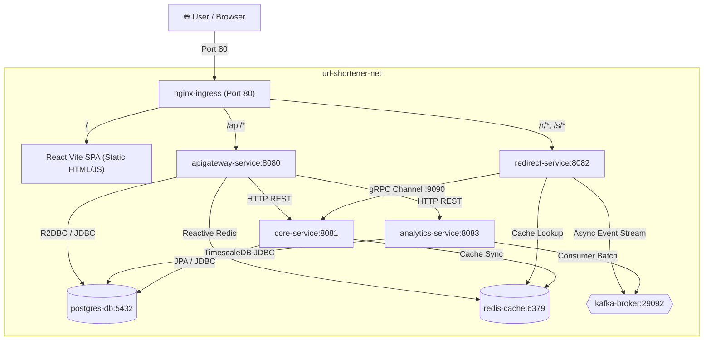

# Docker Orchestration Guide

Complete guide to the multi-container Docker Compose architecture, Spring profiles integration, container networking, and deployment lifecycle.

---

## 1. System Topology & Architecture

The entire platform runs as an isolated microservices mesh inside a single user-defined bridge network (`url-shortener-net`). Only the **Nginx Ingress** exposes a public port (`80:80`). All databases, message brokers, and backend microservices communicate strictly over private container DNS names.



---

## 2. Container Service Matrix

| Service | Container Name | Image / Base | Internal Port | Exposed Port | Purpose |
| :--- | :--- | :--- | :--- | :--- | :--- |
| **nginx** | `nginx-ingress` | `nginx:alpine` | `80` | `80:80` | Unified reverse proxy & SPA static web server |
| **apigateway** | `apigateway-service` | Temurin 17 JRE | `8080` | *None* | JWT Auth, OAuth2 callbacks, rate limiting |
| **redirect** | `redirect-service` | Temurin 17 JRE | `8082` | *None* | Sub-10ms URL redirection & Kafka event emitter |
| **core** | `core-service` | Temurin 17 JRE | `8081`, `9090` | *None* | URL shortener CRUD & gRPC server (port 9090) |
| **analytics** | `analytics-service` | Temurin 17 JRE | `8083`, `9091` | *None* | Kafka batch consumer & aggregations |
| **postgres** | `postgres-db` | `postgres:16-alpine` | `5432` | *None* | Relational database (Auth, Core, Analytics) |
| **redis** | `redis-cache` | `redis:7.2-alpine` | `6379` | *None* | Redirection cache & token-bucket rate limiter |
| **kafka** | `kafka-broker` | `cp-kafka:7.6.0` | `29092` | *None* | KRaft mode message broker (ClickEvents) |

---

## 3. Spring Profiles Architecture (`default` vs `docker`)

All Spring Boot microservices utilize **multi-document YAML configuration** with two operational profiles:

1. **`default` Profile (Host Machine / Local IDE)**:
   - Activated automatically during `mvn spring-boot:run` or local IDE execution.
   - Connects to services on `localhost` (`localhost:5432`, `localhost:6379`, `localhost:9092`).
   - Uses local OAuth callbacks: `http://localhost:8080/api/v1/auth/oauth2/{provider}/callback`.
   - Uses local frontend origin: `http://localhost:5173`.

2. **`docker` Profile (Container Mesh)**:
   - Activated automatically by `docker-compose.yml` via `SPRING_PROFILES_ACTIVE: docker`.
   - Hardcodes container DNS names (`postgres`, `redis`, `kafka:29092`, `core`).
   - Uses production OAuth callbacks: `http://localhost/api/v1/auth/oauth2/{provider}/callback`.
   - Uses production frontend origin: `http://localhost`.

### Why This Architecture Eliminates Configuration Drift
Because networking targets and callback URIs are baked into their respective profile declarations:
- You **never** need to change or comment/uncomment variables in `.env` when moving between local dev and Docker.
- `.env` files contain **strictly secrets and credentials** (`DB_PASSWORD`, `JWT_SECRET`, `CLIENT_ID`, `CLIENT_SECRET`).

---

## 4. Multi-Stage Dockerfile Strategy (gRPC & Protoc Compatibility)

All microservices utilizing gRPC (`core`, `redirect`, `analytics`, `apigateway`) use a dual-stage Docker build:

```dockerfile
# Stage 1: Build stage with Debian glibc for protobuf-maven-plugin
FROM maven:3.9-eclipse-temurin-17 AS builder
WORKDIR /app
COPY pom.xml ./
RUN mvn dependency:go-offline -B
COPY src ./src
RUN mvn clean package -DskipTests

# Stage 2: Minimal runtime image
FROM eclipse-temurin:17-jre-alpine
RUN addgroup -S appgroup && adduser -S appuser -G appgroup
WORKDIR /app
COPY --from=builder /app/target/*.jar app.jar
USER appuser
EXPOSE 8080
ENTRYPOINT ["java", "-XX:+UseG1GC", "-jar", "app.jar"]
```

> [!NOTE]
> **Why Debian for builder?**
> The precompiled `protoc` compiler binary downloaded by Maven requires `glibc`. Building on Alpine (`musl libc`) causes `protoc did not exit cleanly (exit code 1)`. Debian provides the necessary `glibc` build environment, while the final runtime stage remains lightweight Alpine.

---

## 5. Startup Dependency Tree & Healthchecks

Docker Compose orchestrates container startup based on healthchecks:

```text
postgres (healthy) ──┐
                    ├──► core (service_started) ───────┐
redis (healthy) ────┤                                  ├──► redirect (service_started) ──┐
                    ├──► apigateway (service_started) ─┤                                 ├──► nginx (Port 80)
kafka (healthy) ────┴──► analytics (service_started) ──┘                                 │
                                                                                         │
React SPA (compiled into nginx image) ───────────────────────────────────────────────────┘
```

1. **`postgres`**, **`redis`**, and **`kafka`** start first and report healthy via native probes (`pg_isready`, `redis-cli ping`, `kafka-broker-api-versions`).
2. **`core`**, **`analytics`**, **`redirect`**, and **`apigateway`** launch once their dependencies are healthy.
3. **`nginx`** launches once `apigateway` and `redirect` are started, immediately serving traffic.

---

## 6. Database Initialization

On initial container creation, [scripts/init.sql](../scripts/init.sql) runs automatically inside `postgres-db`:

```sql
CREATE DATABASE url_shortener_auth;
CREATE DATABASE url_shortener_core;
CREATE DATABASE url_shortener_analytics;
```

Each microservice then runs its own Flyway database migrations upon startup to create schemas and tables.

---

## 7. Persistent Volumes

Data persists across container restarts and rebuilds via three managed Docker volumes:

| Volume Name | Target Container Path | Content |
| :--- | :--- | :--- |
| `pg_data` | `/var/lib/postgresql/data` | PostgreSQL databases & tables |
| `redis_data` | `/data` | Redis in-memory cache dumps (RDB/AOF) |
| `kafka_data` | `/var/lib/kafka/data` | Kafka partition logs & cluster state |

---

## 8. CLI Command Cheat Sheet

### Start the Stack
```bash
# Build and start all 8 services in the background
docker compose up --build -d

# Start without rebuilding images (fast restart)
docker compose up -d
```

### Monitor Services
```bash
# Check status and health of all containers
docker compose ps

# Follow logs across all microservices
docker compose logs -f

# Follow logs of a specific service
docker compose logs -f apigateway
docker compose logs -f redirect
```

### Stop and Cleanup
```bash
# Stop all running containers (preserves volume data)
docker compose down

# Stop and wipe persistent volume data (fresh database start)
docker compose down -v
```
