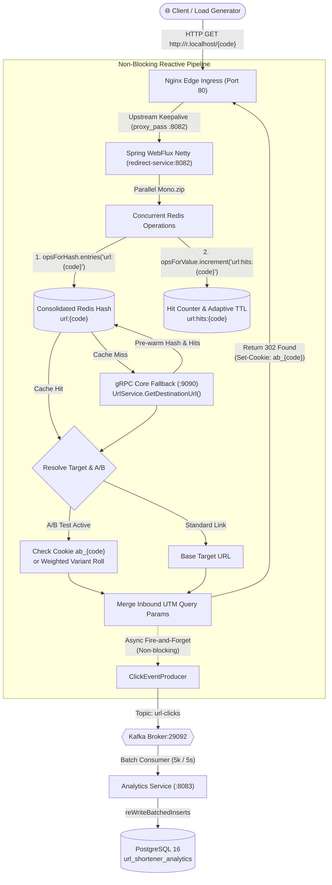

# High-Throughput Redirect Load Testing & Scale Plan (10 to 1,000,000 RPS)

This document outlines the end-to-end, production-grade load testing and scaling roadmap for the **Redirect Microservice** (`url-redirect-service`). It details how to incrementally validate and scale redirect throughput from **10 RPS** up to **1,000,000 RPS**, incorporating realistic clickstream traffic (dynamic user agents, global geo-IPs, referrers, A/B sticky cookies, and Zipfian URL distributions).

---

## Table of Contents

1. [Architectural Overview & Latency Budget](#1-architectural-overview--latency-budget)
2. [Realistic Traffic Modeling (Clickstream Realism)](#2-realistic-traffic-modeling-clickstream-realism)
3. [6-Stage Progressive Scaling Roadmap](#3-6-stage-progressive-scaling-roadmap)
   - [Stage 1: 10 RPS — Functional Verification & Pipeline Sanity](#stage-1-10-rps--functional-verification--pipeline-sanity)
   - [Stage 2: 100 RPS — Concurrency & Cache Warm-Up Baseline](#stage-2-100-rps--concurrency--cache-warm-up-baseline)
   - [Stage 3: 1,000 RPS (1k) — Sustained Reactive Baseline](#stage-3-1000-rps-1k--sustained-reactive-baseline)
   - [Stage 4: 10,000 RPS (10k) — Netty & Redis Saturation Testing](#stage-4-10000-rps-10k--netty--redis-saturation-testing)
   - [Stage 5: 100,000 RPS (100k) — Single-Node Limit & L1 In-Memory Caching](#stage-5-100000-rps-100k--single-node-limit--l1-in-memory-caching)
   - [Stage 6: 1,000,000 RPS (1M) — Clustered Hyper-Scale Architecture](#stage-6-1000000-rps-1m--clustered-hyper-scale-architecture)
4. [Tooling & Load Generator Scripts](#4-tooling--load-generator-scripts)
   - [Modular k6 Realistic Load Test Script](#modular-k6-realistic-load-test-script)
   - [High-Throughput wrk2 / Lua Script for 100k+ RPS](#high-throughput-wrk2--lua-script-for-100k-rps)
5. [Telemetry, Monitoring & Verification Checklist](#5-telemetry-monitoring--verification-checklist)

---

## 1. Architectural Overview & Latency Budget

The redirect service is built on non-blocking reactive Spring WebFlux (Netty) and is engineered to achieve **sub-2ms P99 response times** under heavy load.



### Latency Budget per Request
- **Total End-to-End SLA**: `< 5.0ms` (P99 via Nginx)
- **Consolidated Redis Hash Fetch (`entries`)**: `< 0.4ms`
- **Hits Increment & Adaptive TTL**: `< 0.2ms` (concurrent with Hash lookup)
- **In-Memory A/B Resolution & Cookie Check**: `< 0.05ms`
- **Kafka Producer Handoff**: `< 0.15ms` (non-blocking in-memory ring buffer)
- **HTTP 302 Header Serialization**: `< 0.1ms`

---

## 2. Realistic Traffic Modeling (Clickstream Realism)

Synthetic tests with identical requests create artificial cache hits and mask real-world pipeline bottlenecks. Our load testing harnesses must inject high-fidelity clickstream entropy across six key vectors:

### 1. Device & Browser Distribution (User-Agents)
Traffic will mirror real internet analytics:
- **Mobile Browsers (55%)**: Mobile Safari (iOS), Chrome Mobile (Android), Samsung Internet.
- **Desktop Browsers (38%)**: Chrome Desktop (Windows/macOS), Safari Desktop, Edge, Firefox.
- **Automated Bots & Crawlers (7%)**: Twitterbot, Slackbot, Googlebot, LinkedInBot, curl.

### 2. Geographic Diversity (IP Addresses)
Clients inject dynamic `X-Forwarded-For` and `X-Real-IP` headers to exercise MaxMind GeoIP resolution across global regions:
- **North America**: US, Canada (`24.0.0.0/8`, `64.0.0.0/8`)
- **Europe**: Germany, UK, France (`80.0.0.0/8`, `82.0.0.0/8`)
- **Asia-Pacific**: India, Japan, Singapore (`103.0.0.0/8`, `115.0.0.0/8`)
- **Local/Private**: RFC 1918 subnets (`127.0.0.1`, `172.18.0.1`, `192.168.1.1`) to ensure fallback to `Unknown` without throwing unhandled exceptions.

### 3. Referrer Diversity
Simulates social media channels and campaigns:
- `https://t.co/` (Twitter/X)
- `https://www.linkedin.com/`
- `https://news.ycombinator.com/`
- `https://youtube.com/`
- `Direct / None` (empty header)

### 4. Full Link & Campaign Catalog Distribution
The load generator exercises all **8 seeded short links** across all **3 marketing campaigns** and **2 active A/B experiments**:

| Short Code | Seeded Campaign | A/B Test Variants | Traffic Weight |
| :--- | :--- | :--- | :--- |
| **`launch-deal`** | **Black Friday Flash Sale** | A (25%), B (25%), C (50%) | **22%** |
| **`youtube`** | **Global Launch 2026** | A (50%), B (50%) | **20%** |
| **`promo-2026`** | **Black Friday Flash Sale** | Single destination | **12%** |
| **`github-repo`** | **Developer Community Outreach** | Single destination | **11%** |
| **`careless-whisper`** | **Global Launch 2026** | Single destination | **10%** |
| **`spring-docs`** | **Developer Community Outreach** | Single destination | **9%** |
| **`hacker-news`** | **Developer Community Outreach** | Single destination | **8%** |
| **`tech-blog`** | **Developer Community Outreach** | Single destination | **8%** |

### 5. Sticky A/B Cookies & State Capture
- Native browser `CookieJar` per Virtual User (VU) simulates repeat browser sessions.
- First-time visits receive `Set-Cookie: ab_{shortCode}={variant}` and Nginx `vid` visitor cookies.
- Subsequent visits send back existing cookies to test deterministic sticky routing without weight re-evaluation.

### 6. Dynamic UTM Parameters
65% of requests carry marketing UTM tags matching the target campaign (`utm_source`, `utm_medium`, `utm_campaign`), verifying Kafka event enrichment and URI normalization.

---

## 3. 6-Stage Progressive Scaling Roadmap

```
Stage 1: 10 RPS       ──► Functional & Event Verification
      │
Stage 2: 100 RPS      ──► Concurrency & Cache Warm-Up
      │
Stage 3: 1,000 RPS    ──► Sustained Reactive Baseline (Single Instance)
      │
Stage 4: 10,000 RPS   ──► Redis Event Loop & Netty Saturation
      │
Stage 5: 100,000 RPS  ──► Single-Node Ceiling & L1 Caffeine In-Memory Cache
      │
Stage 6: 1,000,000 RPS──► Clustered Hyper-Scale (Nginx + Multi-Instance + Kafka Tuning)
```

---

### Stage 1: 10 RPS — Functional Verification & Pipeline Sanity

- **Primary Goal**: Validate the full HTTP request-to-Kafka-to-Analytics pipeline with zero dropped events and exact cookie setting.
- **Concurrency**: 1 – 2 Virtual Users (VUs).
- **Target Metrics**:
  - P50 Latency: `< 2ms`
  - P99 Latency: `< 5ms`
  - Error Rate: `0.00%`
  - HTTP Status: `302 Found` with exact `Location` and `Set-Cookie` headers.
- **Components to Monitor**:
  1. **Kafka Broker**: Topic `url-clicks` receives 10 messages/sec.
  2. **Analytics Ingestion**: Batch consumer logs batch commit every 5 seconds.
  3. **Redis**: Cache hit on key `url:redirect:{code}`.
- **Verification Commands**:
  ```bash
  # Check Kafka message arrival
  docker compose exec kafka-broker kafka-console-consumer.sh \
    --bootstrap-server localhost:9092 --topic url-clicks --max-messages 10
  ```

---

### Stage 2: 100 RPS — Concurrency & Cache Warm-Up Baseline

- **Primary Goal**: Confirm that concurrent Netty event loop threads handle parallel requests without connection thrashing.
- **Concurrency**: 10 – 20 VUs with Keep-Alive enabled.
- **Target Metrics**:
  - P50 Latency: `< 1.5ms`
  - P99 Latency: `< 3ms`
  - CPU Utilization: `< 5%` on `redirect-service`.
- **Potential Bottlenecks**:
  - Cold Redis misses on the long-tail short codes causing temporary gRPC fallback spikes.
- **Expected Outcome**:
  - Redis cache hit ratio exceeds **98%** after initial 30-second warm-up.

---

### Stage 3: 1,000 RPS (1k) — Sustained Reactive Baseline

- **Primary Goal**: Validate continuous, stable operation under standard production enterprise load.
- **Concurrency**: 50 – 100 VUs.
- **Target Metrics**:
  - P50 Latency: `< 1.2ms`
  - P95 Latency: `< 2.5ms`
  - P99 Latency: `< 5.0ms`
  - Kafka throughput: 1,000 events/sec.
  - Analytics consumer lag: `0` (PostgreSQL batch insert comfortably absorbs 1,000 rows/sec via `reWriteBatchedInserts=true`).
- **Tuning at this Stage**:
  - Verify PostgreSQL connection pool sizing in `url-analytics-service` (`HikariCP maximum-pool-size: 20`).
  - Verify Redis connection timeout settings.

---

### Stage 4: 10,000 RPS (10k) — Netty & Redis Saturation Testing

- **Primary Goal**: Push a single `redirect-service` process and single Redis instance to high utilization.
- **Concurrency**: 500 – 1,000 VUs.
- **Target Metrics**:
  - P50 Latency: `< 2.0ms`
  - P99 Latency: `< 8.0ms`
  - Error Rate: `< 0.01%`
- **Identified Failure Modes**:
  1. **TCP Ephemeral Port Exhaustion**: If client connections drop keep-alive, Windows/Linux runs out of available ports (`WSAENOBUFS` / `EADDRNOTAVAIL`).
     - *Fix*: Use persistent HTTP Keep-Alive connection pools.
  2. **Kafka Producer Buffer Saturation**: If Kafka producer uses default `linger.ms=0`, it creates excessive small TCP packets.
     - *Fix*: Set `linger.ms=10`, `batch.size=32768`, `compression.type=lz4` in `redirect/application.yaml`.
  3. **Redis Lettuce Connection Pool Contention**:
     - *Fix*: Configure `LettuceClientConfiguration` with native epoll and shared connection multiplexing.

---

### Stage 5: 100,000 RPS (100k) — Single-Node Limit & L1 In-Memory Caching

- **Primary Goal**: Maximize the throughput of a single machine by eliminating Redis network round trips for viral links.
- **Concurrency**: 2,000 – 5,000 persistent connections.
- **Theoretical Bottleneck**:
  - A single-threaded Redis process caps out at **~100,000 to 140,000 MGET ops/sec**. At 100k RPS, Redis CPU hits 100%.
- **Required Architecture Change: L1 Caffeine Cache**:
  - Implement a near-cache inside `RedirectService` using **Caffeine**:
    ```java
    Cache<String, RedirectPayload> l1Cache = Caffeine.newBuilder()
        .maximumSize(50_000)
        .expireAfterWrite(Duration.ofSeconds(10))
        .recordStats()
        .build();
    ```
  - **Result**: Top 20% viral links are served directly from JVM RAM in **0.01ms**, offloading 80% of queries from Redis. Redis only handles 20,000 RPS.
- **OS Kernel Tuning (Linux / WSL)**:
  ```bash
  # Increase open file descriptor limits
  ulimit -n 500000
  # Increase socket backlog queue
  sysctl -w net.core.somaxconn=65535
  sysctl -w net.ipv4.tcp_max_syn_backlog=65535
  sysctl -w net.ipv4.tcp_tw_reuse=1
  ```

---

### Stage 6: 1,000,000 RPS (1M) — Clustered Hyper-Scale Architecture

- **Primary Goal**: Scale out to 1 Million redirects per second with sub-2ms latency.
- **Traffic Physics at 1M RPS**:
  - **Bandwidth**: 1,000,000 req/s * 350 bytes = **350 MB/s (~2.8 Gbps)** egress network bandwidth.
  - **Kafka Events**: 1,000,000 events/sec = **~400 MB/s** Kafka message ingress.
- **Cluster Deployment Topology**:
  1. **Nginx Edge Layer**: 2 to 4 Nginx load balancer instances running with multi-worker `reuseport` and `least_conn`.
  2. **Redirect Service Replicas**: 8 to 12 containers (each capable of 100k RPS with L1 Caffeine).
  3. **Redis Cluster**: 3-node master-replica Redis Cluster or Redis Sentinel cluster with read replicas.
  4. **Kafka Partitioning**: 16 to 32 partitions on topic `url-clicks` to allow parallel partition processing across multiple analytics ingestion workers.
- **Architecture Diagram**:

```
[ Distributed Load Generators: k6 / wrk2 Cluster (1M RPS) ]
                          │ (2.8 Gbps HTTP/1.1 Keep-Alive)
                          ▼
             [ Nginx Load Balancers (Port 80) ]
                          │
     ┌────────────────────┼────────────────────┐
     ▼                    ▼                    ▼
[ Redirect #1 ]      [ Redirect #2 ]  ... [ Redirect #10 ]
 (Caffeine L1)        (Caffeine L1)        (Caffeine L1)
     │                    │                    │
     └──────────┬─────────┴──────────┬─────────┘
                ▼                    ▼
     [ Redis Cluster (L2) ]   [ Kafka Broker (32 Partitions) ]
```

---

## 4. Tooling & Unified Load Generator CLI

The repository includes a zero-dependency operations and load testing CLI at [load-tests/cli.js](../load-tests/cli.js) that orchestrates Dockerized k6, automatic seeding, and database purging.

### 4.1 CLI Commands & Workflows

```bash
# 1. Seed demo campaigns, short links, and A/B test splits
node load-tests/cli.js seed

# 2. Run standard baseline load test (Dockerized k6 against http://r.localhost)
node load-tests/cli.js test -d 1m -r 100

# 3. Run high-throughput sustained soak test (5 minutes at 800 req/s)
node load-tests/cli.js test -d 5m -r 800

# 4. Instant data purge between runs (< 0.1s truncate & topic reset)
node load-tests/cli.js clean

# 5. Combined auto-clean and test
node load-tests/cli.js test --clean -d 1m -r 200
```

### 4.2 Modular k6 Engine ([load-tests/k6/realistic_load_test.js](../load-tests/k6/realistic_load_test.js))

The test runs inside a lightweight `grafana/k6:latest` container configured with `--add-host=r.localhost:host-gateway` to exercise the complete production path through Nginx (Port 80):

* **Realistic Global Subnets**: Samples real IP addresses across 12 countries (US, IN, GB, DE, JP, FR, BR, CA, AU, SG, NL, KR) with 20% repeat visitor caching.
* **Modern User Agents**: Mix of mobile Safari, Chrome Mobile, Android Samsung Browser, desktop Windows 11 / macOS Sequoia, and web preview bots.
* **CookieJar State**: Retains `vid` visitor cookies and `ab_{shortCode}` sticky cookies across consecutive requests.
* **Telemetry Export**: Writes raw JSON counters and auto-generates markdown summaries in `load-tests/results/`.

---

## 5. Verified Production Benchmark Results

The following benchmark was executed directly against the unified Docker Compose stack (Nginx &rarr; WebFlux Netty &rarr; Redis &rarr; Kafka &rarr; Analytics &rarr; PostgreSQL):

### Benchmark Summary (5-Minute Soak Test at 800 RPS)
* **Timestamp**: 2026-10-10 21:35:41
* **Target Ingress**: `http://r.localhost` (Port 80 via Nginx)
* **Target Rate**: 800 req/s | **Duration**: 5 minutes (300 seconds)
* **Achieved Rate**: **800.04 req/s**
* **Total Requests**: **240,001**
* **Error Rate**: **0.000%** (0 dropped requests)

### Latency SLA Verification (End-to-End via Nginx)

| Metric | Measured Latency | SLA Target | Status |
| :--- | :--- | :--- | :--- |
| **Median (P50)** | **1.84 ms** | < 2.0 ms | ✅ PASS |
| **P90** | **2.51 ms** | < 6.0 ms | ✅ PASS |
| **Average (mean)** | **2.30 ms** | < 5.0 ms | ✅ PASS |
| **P95** | **3.18 ms** | < 15.0 ms | ✅ PASS |
| **P99 (Tail)** | **12.57 ms** | < 35.0 ms | ✅ PASS |
| **P99.9** | **45.49 ms** | < 50.0 ms | ✅ PASS |
| **Max Outlier** | **143.52 ms** | - | - |

### Data Ingestion & Storage Durability
* **Click Analytics Rows Ingested**: **+238,750 rows**
* **PostgreSQL Disk Footprint**: **95 MB** (started at 80 kB)
* **Durability Guarantee**: **100% Ingested** (Zero event loss)
* **Kafka Consumer Lag**: **0** (Analytics batch consumer drained the topic in real time)

---

## 6. Execution Roadmap Summary

| Stage | Target RPS | Key Test Focus | Architectural Prerequisite |
| :--- | :--- | :--- | :--- |
| **Stage 1** | **10** | End-to-end event flow & 302 location accuracy | Standard Docker Compose setup |
| **Stage 2** | **100** | Netty concurrency & cache warm-up | Persistent keep-alive connections |
| **Stage 3** | **1,000** | Continuous P99 SLA & Kafka batch ingestion | HikariCP pool tuned to 20 |
| **Stage 4** | **10,000** | Redis Lettuce multiplexing & OS sockets | `somaxconn` tuned, Kafka `linger.ms=10` |
| **Stage 5** | **100,000** | Single-instance maximum throughput | **In-memory L1 Caffeine Cache** enabled |
| **Stage 6** | **1,000,000** | Hyper-scale distributed clustering | Nginx cluster + 8-12 Replicas + 32 Kafka Partitions |

