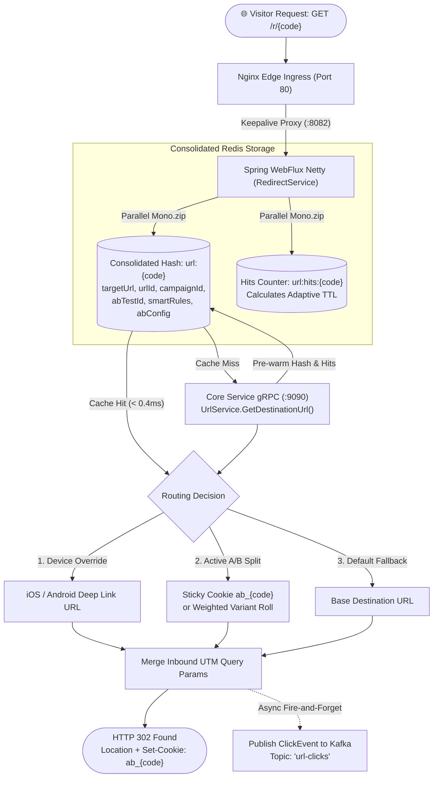

# Hands-On Guide: Building the Redirect Service (`url-redirect-service`)

Welcome! This document is a complete, step-by-step hands-on guide for building the high-throughput **Redirect Microservice** (`url-redirect-service`).

The Redirect service handles sub-2ms HTTP `302 Found` redirects for short URLs (`GET /r/{shortCode}` or clean vanity URLs via `http://r.localhost/{shortCode}`) on port **8082**. It uses **Reactive WebFlux (Netty)**, **Consolidated Redis Hash Caching** (`url:{shortCode}` and `url:hits:{shortCode}`), **In-Memory A/B/n Traffic Splitting**, **Device OS Smart Routing**, a **Single-Query gRPC Client** fallback to Core Service (port 9090), and an **Apache Kafka Producer** for asynchronous click tracking.

---

## Table of Contents
1. [Key Concepts & Architecture](#1-key-concepts--architecture)
2. [Module 1: Redis Reactive Cache & Kafka Configuration](#module-1-redis-reactive-cache--kafka-configuration)
3. [Module 2: gRPC Client Integration (Fallback to Core :9090)](#module-2-grpc-client-integration-fallback-to-core-9090)
4. [Module 3: Kafka Producer for Enriched Click Tracking](#module-3-kafka-producer-for-enriched-click-tracking)
5. [Module 4: High-Throughput Smart Redirection Service](#module-4-high-throughput-smart-redirection-service)
6. [Module 5: Step-by-Step Testing & Verification Guide](#module-5-step-by-step-testing--verification-guide)

---

## 1. Key Concepts & Architecture



* **Reactive WebFlux (Netty):** Handles 50,000+ concurrent redirect requests with minimal thread and memory overhead.
* **Consolidated Single Redis Hash (`url:{code}`):** Eliminates multi-key fragmentation and network round-trips by bundling the base target URL, IDs, device rules, and A/B configurations into a single Hash entry.
* **Adaptive TTL Retention:** Dynamically scales Redis retention based on link popularity:
  - Cold ($\le 10$ hits): **2 minutes** (minimizes idle Redis RAM usage).
  - Warm ($\le 100$ hits): **30 minutes**.
  - Hot ($\le 1,000$ hits): **2 hours**.
  - Viral ($> 1,000$ hits): **6 hours**.
* **Zero Downtime Fallback:** If an A/B test is paused or removed in Core, the next cache reload or eviction falls back to the base destination URL with zero downtime.
* **Async Kafka Event Emission:** Fire-and-forget click log publishing so analytics ingestion **never delays the HTTP 302 redirect**.

---

## Module 1: Redis Reactive Cache & Kafka Configuration

File: `redirect/src/main/resources/application.yaml`

```yaml
server:
  port: 8082

spring:
  application:
    name: redirect-service
  data:
    redis:
      host: ${REDIS_HOST:localhost}
      port: ${REDIS_PORT:6379}
  kafka:
    bootstrap-servers: ${KAFKA_BOOTSTRAP_SERVERS:localhost:9092}
    producer:
      key-serializer: org.apache.kafka.common.serialization.StringSerializer
      value-serializer: org.springframework.kafka.support.serializer.JsonSerializer

grpc:
  client:
    core-service:
      address: 'static://${CORE_GRPC_HOST:localhost}:${CORE_GRPC_PORT:9090}'
      negotiation-type: plaintext
      enable-keep-alive: true
      keep-alive-without-calls: true
      keep-alive-time: 30s
      keep-alive-timeout: 10s
```

---

## Module 2: gRPC Client Integration (Fallback to Core :9090)

### 1. Protobuf Schema (`url_service.proto`)
File: `redirect/src/main/proto/url_service.proto`

```protobuf
syntax = "proto3";

package com.urlshortener.grpc;

option java_multiple_files = true;
option java_package = "com.urlshortener.grpc";

service UrlService {
  rpc GetDestinationUrl (UrlRequest) returns (UrlResponse);
}

message UrlRequest {
  string short_code = 1;
}

message UrlResponse {
  string destination_url = 1;
  bool is_active = 2;
  bool is_found = 3;
  string short_code = 4;
  string ab_rules_json = 5;      // Optional: A/B variant JSON configuration
  string smart_rules_json = 6;   // Optional: Device and Geo targeting rules
}
```

---

### 2. gRPC Client Implementation (`CoreGrpcClient.java`)
File: `redirect/src/main/java/com/urlshortener/redirect/grpc/CoreGrpcClient.java`

Configured with a **5-second deadline** and offloaded to `Schedulers.boundedElastic()` so that slow network hops or downstream Core restarts fail fast and never block Netty event loops:

```java
package com.urlshortener.redirect.grpc;

import com.urlshortener.grpc.UrlRequest;
import com.urlshortener.grpc.UrlResponse;
import com.urlshortener.grpc.UrlServiceGrpc;
import net.devh.boot.grpc.client.inject.GrpcClient;
import org.springframework.stereotype.Component;
import reactor.core.publisher.Mono;
import reactor.core.scheduler.Schedulers;

import java.util.concurrent.TimeUnit;

@Component
public class CoreGrpcClient {

    @GrpcClient("core-service")
    private UrlServiceGrpc.UrlServiceBlockingStub urlServiceBlockingStub;

    public Mono<UrlResponse> getDestinationUrl(String shortCode) {
        return Mono.fromCallable(() -> {
            UrlRequest request = UrlRequest.newBuilder()
                    .setShortCode(shortCode)
                    .build();

            return urlServiceBlockingStub
                    .withDeadlineAfter(5, TimeUnit.SECONDS)
                    .getDestinationUrl(request);
        }).subscribeOn(Schedulers.boundedElastic());
    }
}
```

---

## Module 3: Kafka Producer for Enriched Click Tracking

### 1. `ClickEvent.java` DTO
File: `redirect/src/main/java/com/urlshortener/redirect/dto/ClickEvent.java`

```java
package com.urlshortener.redirect.dto;

import java.time.Instant;

public record ClickEvent(
        String shortCode,
        Instant timestamp,
        String ipAddress,
        String userAgent,
        String referrer,
        String variant,         // e.g. "A", "B" (null if normal link)
        String utmSource,       // e.g. "twitter"
        String utmMedium,       // e.g. "social"
        String utmCampaign      // e.g. "summer_launch"
) {}
```

---

### 2. `ClickEventProducer.java`
File: `redirect/src/main/java/com/urlshortener/redirect/kafka/ClickEventProducer.java`

```java
package com.urlshortener.redirect.kafka;

import com.urlshortener.redirect.dto.ClickEvent;
import lombok.RequiredArgsConstructor;
import org.springframework.kafka.core.KafkaTemplate;
import org.springframework.stereotype.Component;

@Component
@RequiredArgsConstructor
public class ClickEventProducer {

    private static final String TOPIC = "url-clicks";
    private final KafkaTemplate<String, ClickEvent> kafkaTemplate;

    public void publishClickEvent(ClickEvent event) {
        kafkaTemplate.send(TOPIC, event.shortCode(), event);
    }
}
```

---

## Module 4: High-Throughput Smart Redirection Service

### 1. `RedirectService.java`
File: `redirect/src/main/java/com/urlshortener/redirect/service/RedirectService.java`

```java
package com.urlshortener.redirect.service;

import com.fasterxml.jackson.databind.DeserializationFeature;
import com.fasterxml.jackson.databind.ObjectMapper;
import com.urlshortener.redirect.dto.ClickEvent;
import com.urlshortener.redirect.dto.ShortCodePayloadDto;
import com.urlshortener.redirect.dto.ShortCodePayloadDto.AbConfig;
import com.urlshortener.redirect.dto.ShortCodePayloadDto.SmartRules;
import com.urlshortener.redirect.dto.ShortCodePayloadDto.Variant;
import com.urlshortener.redirect.dto.ShortCodePayloadDto.VariantResolution;
import com.urlshortener.redirect.grpc.CoreGrpcClient;
import com.urlshortener.redirect.kafka.ClickEventProducer;
import lombok.RequiredArgsConstructor;
import lombok.extern.slf4j.Slf4j;
import org.springframework.data.redis.core.ReactiveStringRedisTemplate;
import org.springframework.http.HttpCookie;
import org.springframework.http.server.reactive.ServerHttpRequest;
import org.springframework.http.server.reactive.ServerHttpResponse;
import org.springframework.stereotype.Service;
import org.springframework.util.MultiValueMap;
import org.springframework.web.util.UriComponentsBuilder;
import reactor.core.publisher.Mono;

import java.time.Duration;
import java.time.Instant;
import java.util.List;
import java.util.Map;
import java.util.concurrent.ThreadLocalRandom;

@Slf4j
@Service
@RequiredArgsConstructor
public class RedirectService {

    private final ReactiveStringRedisTemplate redisTemplate;
    private final CoreGrpcClient coreGrpcClient;
    private final ClickEventProducer clickEventProducer;
    private final ObjectMapper objectMapper = new ObjectMapper()
            .configure(DeserializationFeature.FAIL_ON_UNKNOWN_PROPERTIES, false);

    public Mono<String> resolveAndTrackUrl(String shortCode, ServerHttpRequest request, ServerHttpResponse response) {
        String hitsKey = "url:hits:" + shortCode;
        String routeKey = "url:" + shortCode;

        // Concurrently increment dedicated hits counter and fetch consolidated metadata Hash
        Mono<Long> hitCountMono = redisTemplate.opsForValue().increment(hitsKey).defaultIfEmpty(1L);
        Mono<Map<String, String>> hashMono = redisTemplate.opsForHash().entries(routeKey)
                .collectMap(e -> (String) e.getKey(), e -> (String) e.getValue());

        return Mono.zip(hitCountMono, hashMono)
                .flatMap(tuple -> {
                    long hits = tuple.getT1();
                    Duration adaptiveTtl = calculateAdaptiveTtl(hits);

                    ShortCodePayloadDto payload = ShortCodePayloadDto.fromHash(shortCode, tuple.getT2(), hits, objectMapper);

                    // Cache Miss -> Fallback to Core Service single-query gRPC
                    if (payload.isEmpty()) {
                        return resolveFromGrpc(shortCode, routeKey, hitsKey, adaptiveTtl, hits, request, response);
                    }

                    // Cache Hit: Resolve routing from structured DTO
                    String destinationUrl = null;
                    String selectedVariant = null;

                    // Priority 1: Device OS Override (iOS/Android deep linking)
                    if (payload.hasSmartRules()) {
                        destinationUrl = checkDeviceOverride(payload.getSmartRules(), request);
                    }

                    // Priority 2: Active A/B Test Variant
                    if (destinationUrl == null && payload.hasAbConfig()) {
                        VariantResolution resolution = resolveAbVariant(shortCode, payload.getAbConfig(), request, response);
                        if (resolution != null) {
                            destinationUrl = resolution.url();
                            selectedVariant = resolution.variantKey();
                        }
                    }

                    // Priority 3: Fallback to Base Destination URL
                    if (destinationUrl == null) {
                        destinationUrl = payload.getTargetUrl();
                    }

                    // Cache Hit: Extend adaptive TTL on single consolidated key
                    redisTemplate.expire(routeKey, adaptiveTtl).subscribe();

                    // Merge visitor's inbound query parameters
                    String finalUrl = mergeQueryParams(destinationUrl, request.getQueryParams());

                    // Async fire-and-forget Kafka telemetry
                    emitTelemetry(shortCode, selectedVariant, payload, request);

                    return Mono.just(finalUrl);
                });
    }

    private Duration calculateAdaptiveTtl(long hits) {
        if (hits <= 10) return Duration.ofMinutes(2);
        if (hits <= 100) return Duration.ofMinutes(30);
        if (hits <= 1000) return Duration.ofHours(2);
        return Duration.ofHours(6);
    }

    private VariantResolution resolveAbVariant(String shortCode, AbConfig config, ServerHttpRequest request, ServerHttpResponse response) {
        try {
            if (!"ACTIVE".equalsIgnoreCase(config.status())) return null;

            // 1. Sticky session cookie check
            HttpCookie cookie = request.getCookies().getFirst("ab_" + shortCode);
            if (cookie != null) {
                for (Variant v : config.variants()) {
                    if (v.key().equalsIgnoreCase(cookie.getValue())) {
                        return new VariantResolution(v.url(), v.key());
                    }
                }
            }

            // 2. Cumulative Weighted Random Selection
            Variant chosen = selectWeightedVariant(config.variants());
            if (chosen != null) {
                response.getHeaders().add("Set-Cookie", "ab_" + shortCode + "=" + chosen.key() + "; Path=/; Max-Age=2592000; SameSite=Lax");
                return new VariantResolution(chosen.url(), chosen.key());
            }
        } catch (Exception e) {
            log.error("Failed to resolve A/B variant for [{}]: {}", shortCode, e.getMessage());
        }
        return null;
    }

    private Variant selectWeightedVariant(List<Variant> variants) {
        int totalWeight = variants.stream().mapToInt(Variant::weight).sum();
        if (totalWeight <= 0) return variants.get(0);

        int roll = ThreadLocalRandom.current().nextInt(1, totalWeight + 1);
        int cumulative = 0;
        for (Variant v : variants) {
            cumulative += v.weight();
            if (roll <= cumulative) return v;
        }
        return variants.get(0);
    }

    private String checkDeviceOverride(SmartRules rules, ServerHttpRequest request) {
        String ua = request.getHeaders().getFirst("User-Agent");
        if (ua == null || rules.devices() == null) return null;
        String uaLower = ua.toLowerCase();

        if ((uaLower.contains("iphone") || uaLower.contains("ipad")) && rules.devices().containsKey("iOS")) {
            return rules.devices().get("iOS");
        }
        if (uaLower.contains("android") && rules.devices().containsKey("Android")) {
            return rules.devices().get("Android");
        }
        return null;
    }

    private Mono<String> resolveFromGrpc(String shortCode, String routeKey, String hitsKey,
                                         Duration adaptiveTtl, long hits,
                                         ServerHttpRequest request, ServerHttpResponse response) {
        return coreGrpcClient.getDestinationUrl(shortCode)
                .flatMap(grpcResponse -> {
                    if (!grpcResponse.getIsFound() || !grpcResponse.getIsActive()) {
                        return Mono.empty();
                    }

                    ShortCodePayloadDto payload = ShortCodePayloadDto.fromGrpc(shortCode, grpcResponse, hits, objectMapper);

                    // Pre-warm consolidated Redis Hash in one operation
                    Map<String, String> hash = payload.toHash(objectMapper);
                    if (!hash.isEmpty()) {
                        redisTemplate.opsForHash().putAll(routeKey, hash)
                                .then(redisTemplate.expire(routeKey, adaptiveTtl))
                                .subscribe();
                    }

                    // Keep hits counter alive for 24h
                    redisTemplate.expire(hitsKey, Duration.ofDays(1)).subscribe();

                    String dest = null;
                    String selectedVariant = null;

                    if (payload.hasSmartRules()) {
                        dest = checkDeviceOverride(payload.getSmartRules(), request);
                    }
                    if (dest == null && payload.hasAbConfig()) {
                        VariantResolution res = resolveAbVariant(shortCode, payload.getAbConfig(), request, response);
                        if (res != null) {
                            dest = res.url();
                            selectedVariant = res.variantKey();
                        }
                    }
                    if (dest == null) {
                        dest = payload.getTargetUrl();
                    }

                    emitTelemetry(shortCode, selectedVariant, payload, request);
                    return Mono.just(mergeQueryParams(dest, request.getQueryParams()));
                })
                .onErrorResume(e -> {
                    log.error("Failed to resolve URL via gRPC for shortCode [{}]: {}", shortCode, e.getMessage());
                    return Mono.empty();
                });
    }

    private String mergeQueryParams(String url, MultiValueMap<String, String> queryParams) {
        if (queryParams == null || queryParams.isEmpty() || url == null) return url != null ? url : "";
        UriComponentsBuilder builder = UriComponentsBuilder.fromUriString(url);
        queryParams.forEach((key, values) -> {
            for (String val : values) builder.replaceQueryParam(key, val);
        });
        return builder.build().toUriString();
    }

    private void emitTelemetry(String shortCode, String variant, ShortCodePayloadDto payload, ServerHttpRequest request) {
        String ip = request.getHeaders().getFirst("X-Forwarded-For");
        if (ip != null && ip.contains(",")) ip = ip.split(",")[0].trim();
        if (ip == null || ip.isBlank()) ip = request.getHeaders().getFirst("X-Real-IP");
        if ((ip == null || ip.isBlank()) && request.getRemoteAddress() != null) {
            ip = request.getRemoteAddress().getAddress().getHostAddress();
        }
        String ua = request.getHeaders().getFirst("User-Agent");
        String referrer = request.getHeaders().getFirst("Referer");
        MultiValueMap<String, String> params = request.getQueryParams();

        ClickEvent event = new ClickEvent(
                shortCode,
                Instant.now(),
                ip != null && !ip.isBlank() ? ip : "127.0.0.1",
                ua != null ? ua : "",
                referrer != null ? referrer : "Direct",
                variant,
                params.getFirst("utm_source"),
                params.getFirst("utm_medium"),
                params.getFirst("utm_campaign"),
                payload != null ? payload.getUrlId() : null,
                payload != null ? payload.getCampaignId() : null,
                payload != null ? payload.getAbTestId() : null
        );
        clickEventProducer.publishClickEvent(event);
    }
}
```

---

### 2. `RedirectController.java`
File: `redirect/src/main/java/com/urlshortener/redirect/controller/RedirectController.java`

```java
package com.urlshortener.redirect.controller;

import com.urlshortener.redirect.service.RedirectService;
import lombok.RequiredArgsConstructor;
import org.springframework.http.HttpStatus;
import org.springframework.http.ResponseEntity;
import org.springframework.http.server.reactive.ServerHttpRequest;
import org.springframework.http.server.reactive.ServerHttpResponse;
import org.springframework.web.bind.annotation.GetMapping;
import org.springframework.web.bind.annotation.PathVariable;
import org.springframework.web.bind.annotation.RestController;
import reactor.core.publisher.Mono;

import java.net.URI;

@RestController
@RequiredArgsConstructor
public class RedirectController {

    private final RedirectService redirectService;

    @GetMapping({"/r/{shortCode}", "/{shortCode:[a-zA-Z0-9_-]{3,15}}"})
    public Mono<ResponseEntity<Void>> redirect(
            @PathVariable String shortCode,
            ServerHttpRequest request,
            ServerHttpResponse response
    ) {
        return redirectService.resolveAndTrackUrl(shortCode, request, response)
                .map(destinationUrl -> ResponseEntity.status(HttpStatus.FOUND)
                        .location(URI.create(destinationUrl))
                        .build())
                .defaultIfEmpty(ResponseEntity.notFound().build());
    }
}
```

---

## Module 5: Step-by-Step Testing & Verification Guide

### 1. Testing Standard Redirect
```bash
curl -i -X GET http://localhost:8082/r/test-slug
```
* **Expected Result:** HTTP `302 Found` with `Location: https://...` in `< 2ms`.

### 2. Testing A/B Testing & Sticky Cookies
```bash
# First request (No cookie): gets assigned variant and Set-Cookie header
curl -i -X GET http://localhost:8082/r/ab-slug
# Expected: Set-Cookie: ab_ab-slug=A; Path=/; ...

# Second request (With cookie): consistently routed to Variant A
curl -i -H "Cookie: ab_ab-slug=A" -X GET http://localhost:8082/r/ab-slug
# Expected: Location: https://.../variant-a
```

### 3. Testing Device Deep-Linking
```bash
# iPhone request
curl -i -H "User-Agent: Mozilla/5.0 (iPhone; CPU iPhone OS 17_0 like Mac OS X)" http://localhost:8082/r/app-link
# Expected: Location: https://apps.apple.com/...
```
