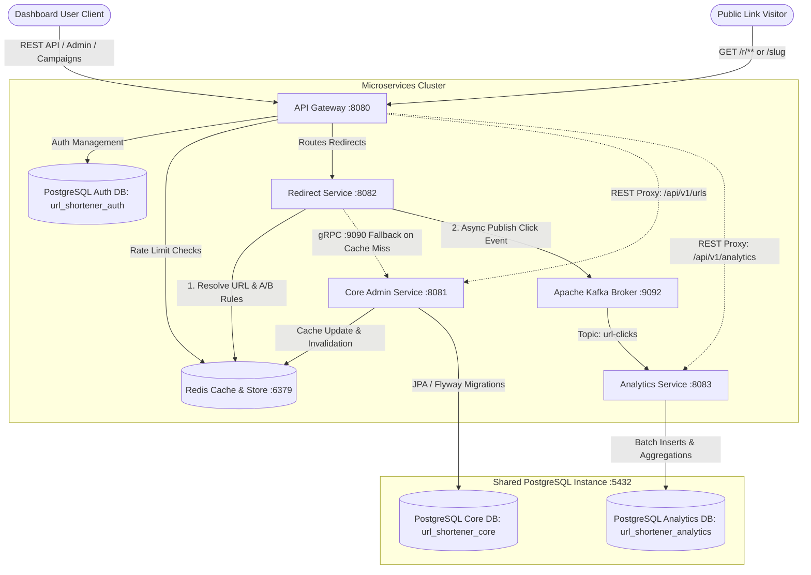
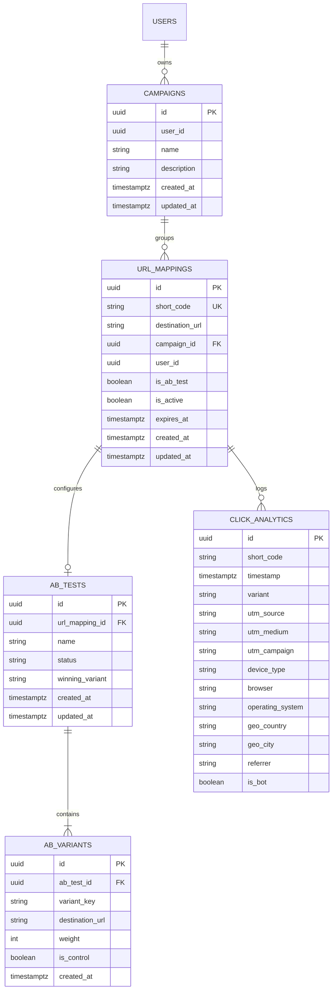
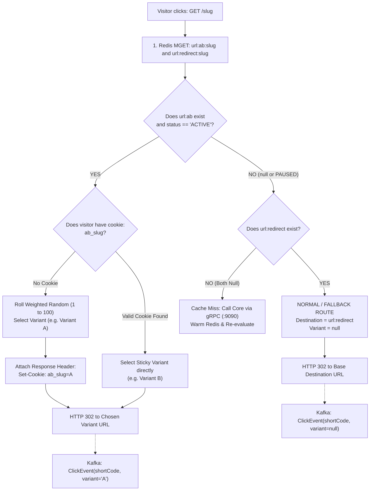

# Enterprise URL Shortener: Smart Routing, Campaigns, and A/B/n Testing Master Guide

This guide specifies the complete end-to-end architecture, data models, Redis caching strategy, traffic routing algorithms, and streaming analytics pipelines for **Campaign Tracking**, **UTM Attribution**, and **A/B/n Multivariate Testing** across the entire microservice ecosystem.

---

## Table of Contents
1. [System Topology & High-Level Architecture](#1-system-topology--high-level-architecture)
2. [Database Schema & Migrations (PostgreSQL)](#2-database-schema--migrations-postgresql)
3. [Redis L1 Caching & Cache Synchronization](#3-redis-l1-caching--cache-synchronization)
4. [Redirect Engine: High-Throughput Smart Routing](#4-redirect-engine-high-throughput-smart-routing)
   - [A/B/n Cumulative Weighted Random Algorithm](#abn-cumulative-weighted-random-algorithm)
   - [Sticky Session & Cookie Management](#sticky-session--cookie-management)
   - [Inbound UTM Query Parameter Merging](#inbound-utm-query-parameter-merging)
   - [Geo-Targeting & Device Deep-Linking](#geo-targeting--device-deep-linking)
5. [UTM Builder & Marketing Taxonomy](#5-utm-builder--marketing-taxonomy)
6. [Campaign Management & Cross-Link Rollups](#6-campaign-management--cross-link-rollups)
7. [Analytics Service: Kafka Streaming & Attribution Ingestion](#7-analytics-service-kafka-streaming--attribution-ingestion)
8. [End-to-End Operational Scenarios](#8-end-to-end-operational-scenarios)
9. [Developer Step-by-Step Implementation Checklist](#9-developer-step-by-step-implementation-checklist)

---

## 1. System Topology & High-Level Architecture

The platform separates the **Management and Admin Path** (writes, configuration, analytics dashboards) from the **Critical Redirect Path** (sub-2ms reads).

The system runs on a decoupled microservices architecture with a shared PostgreSQL 16 instance hosting three logically isolated databases, a shared Redis 7.2 instance for distributed caching and edge rate limiting, and an Apache Kafka broker for asynchronous click ingestion.



### Key Performance Axioms
1. **Zero Database Queries on Redirect**: The redirect path (`:8082`) resolves traffic strictly in Redis. It never issues SQL queries or joins across Postgres tables.
2. **Asynchronous Telemetry**: Click tracking and variant logging are published to Kafka in a non-blocking, fire-and-forget fashion (`Mono.doOnNext`).
3. **Sub-2ms SLA**: Redirect decisions, whether 1-to-1, A/B/n split, or Geo-targeted, execute within 2 milliseconds.

---

## 2. Database Schema & Migrations (PostgreSQL)

The relational model uses normalized tables for campaign organization and multivariate tests, with cascade semantics and indexes for query efficiency.

### ER Diagram



---

### Migration 1: `core` Service
File: `core/src/main/resources/db/migration/V3__create_campaigns_and_ab_testing.sql`

```sql
-- 1. Create Campaigns Table
CREATE TABLE IF NOT EXISTS campaigns (
    id UUID PRIMARY KEY DEFAULT gen_random_uuid(),
    user_id UUID NOT NULL,
    name VARCHAR(100) NOT NULL,
    description TEXT,
    created_at TIMESTAMP WITH TIME ZONE DEFAULT CURRENT_TIMESTAMP NOT NULL,
    updated_at TIMESTAMP WITH TIME ZONE DEFAULT CURRENT_TIMESTAMP NOT NULL
);

CREATE INDEX IF NOT EXISTS idx_campaigns_user_id ON campaigns(user_id);
CREATE UNIQUE INDEX IF NOT EXISTS idx_campaigns_user_name ON campaigns(user_id, name);

-- 2. Enhance url_mappings with Campaign FK and A/B Flag
ALTER TABLE url_mappings 
    ADD COLUMN campaign_id UUID REFERENCES campaigns(id) ON DELETE SET NULL,
    ADD COLUMN is_ab_test BOOLEAN DEFAULT FALSE NOT NULL;

CREATE INDEX IF NOT EXISTS idx_url_mappings_campaign_id ON url_mappings(campaign_id);

-- 3. Create A/B Tests Table
CREATE TABLE IF NOT EXISTS ab_tests (
    id UUID PRIMARY KEY DEFAULT gen_random_uuid(),
    url_mapping_id UUID NOT NULL UNIQUE REFERENCES url_mappings(id) ON DELETE CASCADE,
    name VARCHAR(100) NOT NULL,
    status VARCHAR(20) DEFAULT 'ACTIVE' NOT NULL, -- 'ACTIVE', 'PAUSED', 'CONCLUDED'
    winning_variant VARCHAR(10),                 -- Set upon test conclusion (e.g. 'B')
    created_at TIMESTAMP WITH TIME ZONE DEFAULT CURRENT_TIMESTAMP NOT NULL,
    updated_at TIMESTAMP WITH TIME ZONE DEFAULT CURRENT_TIMESTAMP NOT NULL
);

CREATE INDEX IF NOT EXISTS idx_ab_tests_url_mapping ON ab_tests(url_mapping_id);

-- 4. Create A/B Variants Table (Multivariate Split Targets)
CREATE TABLE IF NOT EXISTS ab_variants (
    id UUID PRIMARY KEY DEFAULT gen_random_uuid(),
    ab_test_id UUID NOT NULL REFERENCES ab_tests(id) ON DELETE CASCADE,
    variant_key VARCHAR(10) NOT NULL,            -- 'A', 'B', 'C', 'D'
    destination_url TEXT NOT NULL,
    weight INT DEFAULT 50 NOT NULL,              -- Probability weight (e.g., 50, 33, 20)
    is_control BOOLEAN DEFAULT FALSE NOT NULL,
    created_at TIMESTAMP WITH TIME ZONE DEFAULT CURRENT_TIMESTAMP NOT NULL
);

CREATE INDEX IF NOT EXISTS idx_ab_variants_test_id ON ab_variants(ab_test_id);
```

---

### Migration 2: `analytics` Service
File: `analytics/src/main/resources/db/migration/V2__add_variant_and_utm.sql`

```sql
-- Enhance ClickAnalytics with Variant and Inbound UTM Attribution
ALTER TABLE click_analytics
    ADD COLUMN variant VARCHAR(50) DEFAULT NULL,
    ADD COLUMN utm_source VARCHAR(100) DEFAULT NULL,
    ADD COLUMN utm_medium VARCHAR(100) DEFAULT NULL,
    ADD COLUMN utm_campaign VARCHAR(100) DEFAULT NULL;

-- High-performance composite indexes for real-time dashboards
CREATE INDEX IF NOT EXISTS idx_click_analytics_short_code_variant ON click_analytics(short_code, variant);
CREATE INDEX IF NOT EXISTS idx_click_analytics_utm_campaign ON click_analytics(short_code, utm_campaign);
CREATE INDEX IF NOT EXISTS idx_click_analytics_utm_source ON click_analytics(short_code, utm_source);
```

---

## 3. Redis L1 Caching & Cache Synchronization (Strategy 1: Dual-Key Architecture)

The `redirect` service employs **Strategy 1: Dedicated Dual-Key Architecture**. This separates the **Base Destination URL** from the **Active A/B Testing Configuration**, enabling instant test pausing and zero-downtime fallbacks.

### Redis Key Schema

| Key Pattern | Redis Type | Value Content | Purpose | TTL |
| :--- | :--- | :--- | :--- | :--- |
| `url:redirect:{shortCode}` | `String` | `https://mysite.com/pricing` | **Base / Fallback Destination URL**. Guaranteed to exist for every valid link. | Adaptive (2m - 6h) |
| `url:ab:{shortCode}` | `String` (JSON) | Array of variants, weights, status | **Active A/B Test Rules**. Only exists when an A/B test is active. | Adaptive (2m - 6h) |
| `url:hits:{shortCode}` | `Integer` | Rolling hit counter | Used to compute adaptive popularity TTL | 24 Hours |

### JSON Format for `url:ab:{shortCode}`
```json
{
  "status": "ACTIVE",
  "winningVariant": null,
  "variants": [
    { "key": "A", "url": "https://mysite.com/landing-v1", "weight": 50, "isControl": true },
    { "key": "B", "url": "https://mysite.com/landing-v2", "weight": 25, "isControl": false },
    { "key": "C", "url": "https://mysite.com/landing-v3", "weight": 25, "isControl": false }
  ]
}
```

### Why Strategy 1 is Superior: The MGET Single Round-Trip Pattern
Instead of issuing two sequential Redis calls, the redirect service issues a single **`MGET` (Multi-Get)** command:
```redis
MGET url:ab:promo url:redirect:promo
```
In a single **0.3ms** network round-trip, Redis returns both keys:
1. `results[0]` &rarr; The A/B test configuration (or `null` if it's a normal URL).
2. `results[1]` &rarr; The Base / Fallback destination URL.

#### Key Architectural Benefits:
* **Instant Pause Without Mutation**: To pause an A/B test, `core` simply deletes `url:ab:promo`. Traffic **immediately and seamlessly falls back** to `url:redirect:promo` with zero downtime.
* **Winner Finalization**: When an A/B test concludes with a winner, `core` updates `url:redirect:promo` to the winner's destination and deletes `url:ab:promo`.
* **Zero Database Hits**: The redirect service never touches PostgreSQL.

### Cache Synchronization & Invalidation
When an A/B test or link is updated in `core`:
1. **Starting a Test**: `UrlCoreService` writes the base URL to `url:redirect:{shortCode}` and the variants JSON to `url:ab:{shortCode}`.
2. **Pausing a Test**: `core` deletes `url:ab:{shortCode}`. The base URL remains untouched.
3. **Deleting a Link**: `core` deletes both keys atomically:
   ```java
   redisTemplate.delete(List.of("url:redirect:" + shortCode, "url:ab:" + shortCode));
   ```
4. **gRPC Fallback on Miss**: If both keys return `null`, `redirect` queries `UrlLookupService.GetUrlDestination` via gRPC, which queries PostgreSQL, builds both keys, and warms Redis.

---

## 4. Redirect Engine: High-Throughput Smart Routing

### Request Execution Flow (Strategy 1 with MGET)



### Complete Reactive Implementation in `RedirectService.java`

```java
public Mono<RedirectResolution> resolveDestination(String shortCode, ServerHttpRequest request) {
    String abKey = "url:ab:" + shortCode;
    String redirectKey = "url:redirect:" + shortCode;

    // Single network round-trip (< 0.5ms)
    return redisTemplate.opsForValue().multiGet(List.of(abKey, redirectKey))
        .flatMap(results -> {
            String abJson = results.size() > 0 ? results.get(0) : null;
            String fallbackUrl = results.size() > 1 ? results.get(1) : null;

            // 1. Check if an active A/B test is present
            if (abJson != null) {
                AbTestConfig config = parseJson(abJson);
                if ("ACTIVE".equalsIgnoreCase(config.status())) {
                    return Mono.just(resolveAbVariant(shortCode, config, request));
                } else if ("CONCLUDED".equalsIgnoreCase(config.status()) && config.winningVariant() != null) {
                    Variant winner = config.getVariant(config.winningVariant());
                    return Mono.just(new RedirectResolution(winner.url(), winner.key(), null));
                }
            }

            // 2. Normal URL or Paused A/B Test -> Use base fallback
            if (fallbackUrl != null) {
                return Mono.just(new RedirectResolution(fallbackUrl, null, null));
            }

            // 3. Cache Miss -> Fallback to Core Service over gRPC
            return coreGrpcClient.getDestinationUrl(shortCode)
                .flatMap(grpcResponse -> {
                    if (!grpcResponse.getIsFound() || !grpcResponse.getIsActive()) {
                        return Mono.empty();
                    }
                    // Warm Redis and return destination
                    return redisTemplate.opsForValue().set(redirectKey, grpcResponse.getDestinationUrl(), Duration.ofMinutes(30))
                        .thenReturn(new RedirectResolution(grpcResponse.getDestinationUrl(), null, null));
                });
        });
}
```

### A/B/n Cumulative Weighted Random Algorithm
When a first-time visitor arrives at an active A/B test without an existing cookie, the engine selects a variant using **Cumulative Weighted Random**:

```java
public Variant selectVariant(List<Variant> variants) {
    int totalWeight = variants.stream().mapToInt(Variant::getWeight).sum();
    if (totalWeight <= 0) {
        return variants.get(0); // Fallback to control
    }

    int roll = ThreadLocalRandom.current().nextInt(1, totalWeight + 1);
    int cumulative = 0;

    for (Variant variant : variants) {
        cumulative += variant.getWeight();
        if (roll <= cumulative) {
            return variant;
        }
    }
    return variants.get(0);
}
```

### Sticky Session & Cookie Management
To prevent user experience degradation (e.g., a visitor seeing Variant A on first visit, then Variant B after refreshing):
1. The redirect engine checks the inbound request for a cookie: `ab_{shortCode}`.
2. If the cookie exists (e.g., `ab_promo=B`) and corresponds to an active variant in the list, that variant is selected directly (bypassing the random roll).
3. If no cookie exists, the engine rolls the variant and attaches a cookie to the HTTP 302 response:
   ```http
   HTTP/1.1 302 Found
   Location: https://mysite.com/landing-v2
   Set-Cookie: ab_promo=B; Path=/; Max-Age=2592000; SameSite=Lax; HttpOnly
   ```

### Inbound UTM Query Parameter Merging
If a visitor clicks `https://sho.rt/promo?utm_source=twitter&utm_medium=social&ref=partner`, the redirect engine preserves and forwards those query parameters to the destination URL.

```java
public String buildDestinationUrl(String baseDestinationUrl, MultiValueMap<String, String> inboundQueryParams) {
    if (inboundQueryParams.isEmpty()) {
        return baseDestinationUrl;
    }
    
    UriComponentsBuilder builder = UriComponentsBuilder.fromUriString(baseDestinationUrl);
    inboundQueryParams.forEach((key, values) -> {
        for (String value : values) {
            builder.replaceQueryParam(key, value);
        }
    });
    return builder.build().toUriString();
}
```

### Geo-Targeting & Device Deep-Linking

The smart routing engine supports device and country dimensions stored in the `routing_rules` JSON (`url:rules:{shortCode}`):

```json
{
  "devices": {
    "iOS": "https://apps.apple.com/app/id12345",
    "Android": "https://play.google.com/store/apps/details?id=com.app"
  },
  "countries": {
    "IN": "https://in.store.com/item",
    "US": "https://us.store.com/item",
    "GB": "https://uk.store.com/item"
  },
  "fallback": "https://store.com/item"
}
```

#### Performance & Memory Optimization: Lazy Geo Evaluation
To preserve maximum throughput and prevent memory bloat in `redirect`:
1. **Zero Overhead for Standard Links (Lazy Evaluation)**:
   The redirect engine **never resolves IP or geo** unless the link specifically has country rules configured:
   ```java
   // Only execute Geo resolution if this specific shortcode has country rules!
   if (rules.countries() != null && !rules.countries().isEmpty()) {
       String country = resolveCountryFast(request);
       if (rules.countries().containsKey(country)) {
           return rules.countries().get(country);
       }
   }
   ```
   For 95%+ of regular links, geo resolution is completely skipped (0.000 ms overhead).

2. **Lean Country Binary (`GeoLite2-Country.mmdb`)**:
   * Instead of the heavy 70MB+ City database, `redirect` uses `GeoLite2-Country.mmdb` (only **~4 MB**).
   * It loads once via memory-mapped I/O (`READ_ONLY`) and resolves in ~40 microseconds.

3. **Edge Header Check First**:
   If deployed behind a CDN or Nginx, the engine checks `CF-IPCountry` or `X-Country-Code` first (**0.001 ms**), bypassing the local file lookup entirely.

* **Evaluation Priority**: `Device Deep-Link` (Instant UA match) &rarr; `Geo-Location` (Lazy match) &rarr; `A/B Variant` &rarr; `Fallback Destination`.

---

## 5. UTM Builder & Marketing Taxonomy

To avoid corrupted analytics (e.g., `twitter` vs `Twitter` vs `t.co`), the platform enforces a standard UTM taxonomy.

### Taxonomy Standards
* `utm_source`: Identifies the referrer platform (`google`, `twitter`, `linkedin`, `newsletter`, `reddit`).
* `utm_medium`: Identifies marketing channel medium (`cpc`, `social`, `email`, `organic`, `affiliate`).
* `utm_campaign`: Campaign slug (`summer_launch_2026`, `black_friday`).
* `utm_term`: Search keyword for paid search (`url_shortener`, `analytics_api`).
* `utm_content`: Specific ad creative or button (`header_cta`, `sidebar_banner`).

### Frontend UTM Builder Architecture
The frontend provides a URL Builder component ([utm-builder-view.jsx](file:///d:/Java%20save%20files/url-shortener/client/src/components/dashboard/utm-builder-view.jsx)) with standard presets:

```javascript
export const UTM_PRESETS = [
  { name: "Google Search Ads", source: "google", medium: "cpc", campaign: "search_brand" },
  { name: "Weekly Newsletter", source: "newsletter", medium: "email", campaign: "weekly_digest" },
  { name: "Twitter / X Post", source: "twitter", medium: "social", campaign: "feature_release" },
  { name: "LinkedIn Article", source: "linkedin", medium: "social", campaign: "thought_leadership" }
];
```

The resulting URL has parameters baked in at short link creation time, ensuring zero runtime query parameter lookups.

---

## 6. Campaign Management & Cross-Link Rollups

A **Campaign** is a collection of short links grouped under a single marketing initiative.

### Link Bundle Pattern
For a single campaign (e.g., `summer_launch`), multiple channel-specific links can be created:

| Short Code | Channel / Source | Pre-Baked Destination URL |
| :--- | :--- | :--- |
| `sho.rt/sl-tw` | Twitter / X | `https://site.com/product?utm_source=twitter&utm_medium=social&utm_campaign=summer_launch` |
| `sho.rt/sl-li` | LinkedIn | `https://site.com/product?utm_source=linkedin&utm_medium=social&utm_campaign=summer_launch` |
| `sho.rt/sl-em` | Email Newsletter | `https://site.com/product?utm_source=newsletter&utm_medium=email&utm_campaign=summer_launch` |

### Aggregated Campaign View
In [Campaigns.jsx](file:///d:/Java%20save%20files/url-shortener/client/src/pages/Campaigns.jsx), the frontend groups links by `campaign_id` (or `utm_campaign` parameter) and computes:
* **Aggregate Click Volume**: Total clicks across all channel links in the campaign.
* **Channel Performance Breakdown**: Traffic comparison between Twitter, LinkedIn, and Email.
* **Cost Per Click (CPC) / Conversion Attribution**: Integration with conversion events.

---

## 7. Analytics Service: Kafka Streaming & Attribution Ingestion

### Kafka Event Contract (`ClickEvent`)
The event definition shared between `redirect` and `analytics`:

```java
public record ClickEvent(
    String shortCode,
    Instant timestamp,
    String ipAddress,
    String userAgent,
    String referrer,
    String variant,         // e.g. "A", "B", "C" (null if not an A/B test)
    String utmSource,       // e.g. "twitter"
    String utmMedium,       // e.g. "social"
    String utmCampaign      // e.g. "summer_launch"
) {}
```

### Processing Pipeline in `ClickEventConsumer.java`
1. **Device & OS Parsing**: Classifies `Desktop`, `Mobile`, or `Tablet` and detects OS (`macOS`, `Windows`, `iOS`, `Android`, `Linux`).
2. **Bot Detection**: Detects automated scrapers (`Googlebot`, `bingbot`, `python`, `curl`, `wget`) and flags `is_bot = true`.
3. **GeoIP Resolution**: Resolves Country and City using local MaxMind GeoIP2 databases in < 0.1ms.
4. **Clean Domain Normalization**: Cleans referrers (e.g., `https://l.instagram.com/` &rarr; `Instagram`).
5. **Persistence**: Batches or writes the row into `click_analytics`.

### Analytical REST Endpoints (`AnalyticsController`)

#### 1. A/B Test Results (`GET /api/v1/analytics/{shortCode}/ab-test`)
Returns the real-time click volume and percentage distribution for each variant:
```json
{
  "shortCode": "hero-split",
  "totalClicks": 12450,
  "status": "ACTIVE",
  "variants": [
    { "variant": "A", "clicks": 6240, "percentage": 50.12, "destinationUrl": "https://site.com/v1", "isControl": true },
    { "variant": "B", "clicks": 3105, "percentage": 24.94, "destinationUrl": "https://site.com/v2", "isControl": false },
    { "variant": "C", "clicks": 3105, "percentage": 24.94, "destinationUrl": "https://site.com/v3", "isControl": false }
  ]
}
```

#### 2. UTM Attribution (`GET /api/v1/analytics/{shortCode}/utm-sources`)
Returns the distribution of clicks by traffic source:
```json
[
  { "source": "twitter", "clicks": 5420, "percentage": 43.5 },
  { "source": "linkedin", "clicks": 3810, "percentage": 30.6 },
  { "source": "newsletter", "clicks": 2100, "percentage": 16.9 },
  { "source": "direct", "clicks": 1120, "percentage": 9.0 }
]
```

---

## 8. End-to-End Operational Scenarios

### Scenario 1: Creating a 3-Way A/B/C Test Link
1. The user creates a new link with shortcode `launch` in the UI.
2. In the A/B testing settings, the user enables "A/B Testing" and adds 3 variants:
   - Variant A (Control): `https://site.com/page-a` (Weight: 50)
   - Variant B: `https://site.com/page-b` (Weight: 25)
   - Variant C: `https://site.com/page-c` (Weight: 25)
3. `core` saves the rows to `ab_tests` and `ab_variants` and writes the configuration to Redis at `url:ab:launch`.
4. Visitor 1 visits `sho.rt/launch` &rarr; `redirect` rolls `32` (Variant A), sets cookie `ab_launch=A`, and returns HTTP 302 to `page-a`.
5. Visitor 1 refreshes &rarr; Cookie `ab_launch=A` is recognized; Visitor 1 is served `page-a` without re-rolling.
6. `analytics` logs both events tagged with `variant="A"`.

### Scenario 2: Concluding an A/B Test
1. After 50,000 visitors, the analytics report shows Variant B had a 12% higher conversion rate.
2. The user clicks **"Declare Winner: Variant B"** in the dashboard.
3. `core` updates `ab_tests.status = 'CONCLUDED'` and `ab_tests.winning_variant = 'B'`.
4. `core` updates Redis key `url:ab:launch` to mark `status: CONCLUDED` and `winningVariant: B`.
5. All subsequent visitors (regardless of cookies or rolls) are routed directly to Variant B (`page-b`) in < 1ms.

---

## 9. Developer Step-by-Step Implementation Checklist

### Phase 1: Database Migrations
- [ ] Run `V3__create_campaigns_and_ab_testing.sql` in `core` service.
- [ ] Run `V2__add_variant_and_utm.sql` in `analytics` service.

### Phase 2: `core` Service Updates
- [ ] Create JPA Entities: `Campaign.java`, `AbTest.java`, `AbVariant.java`.
- [ ] Add Repositories: `CampaignRepository.java`, `AbTestRepository.java`.
- [ ] In `UrlCoreService.java`, add methods:
  - `createCampaign(CreateCampaignRequest request)`
  - `createAbTest(String shortCode, CreateAbTestRequest request)`
  - `concludeAbTest(String shortCode, String winningVariant)`
- [ ] In `UrlCoreController.java`, expose `/api/v1/campaigns` and `/api/v1/urls/{shortCode}/ab-test` endpoints.
- [ ] Push JSON payload to Redis upon A/B test creation or status change.

### Phase 3: `redirect` Service Updates
- [ ] Update `ClickEvent.java` record with `variant`, `utmSource`, `utmMedium`, `utmCampaign`.
- [ ] In `RedirectService.java`:
  - Check for `url:ab:{shortCode}` key in Redis.
  - Implement cookie check (`ab_{shortCode}`) and cumulative weighted random selector.
  - Set `Set-Cookie` header on HTTP 302 response for first-time visitors.
  - Pass the selected variant and inbound UTM parameters to `ClickEvent`.

### Phase 4: `analytics` Service Updates
- [ ] Update `ClickEvent.java` record to match `redirect` service.
- [ ] Update `ClickAnalytics.java` entity with `variant`, `utmSource`, `utmMedium`, `utmCampaign`.
- [ ] In `ClickEventConsumer.java`, map these fields from the event to the entity.
- [ ] In `AnalyticsRepository.java` and `AnalyticsService.java`, add queries:
  - `findVariantStats(shortCode)`
  - `findUtmSourceStats(shortCode)`
- [ ] In `AnalyticsController.java`, expose `GET /{shortCode}/ab-test` and `GET /{shortCode}/utm-sources`.

### Phase 5: Frontend (`client`) Updates
- [ ] In `client/src/api/url.js` and `client/src/api/analytics.js`, add corresponding API client functions.
- [ ] In [Campaigns.jsx](file:///d:/Java%20save%20files/url-shortener/client/src/pages/Campaigns.jsx), wire real campaign creation and link grouping.
- [ ] In [create-link-modal.jsx](file:///d:/Java%20save%20files/url-shortener/client/src/components/dashboard/create-link-modal.jsx), add the "A/B Testing" toggle with dynamic variant rows and weight sliders.
- [ ] In [analytics-overview.jsx](file:///d:/Java%20save%20files/url-shortener/client/src/components/dashboard/analytics-overview.jsx), add the A/B Split Distribution card.
