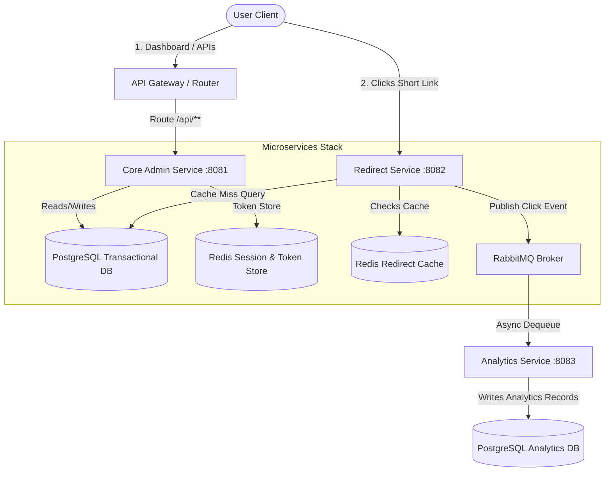
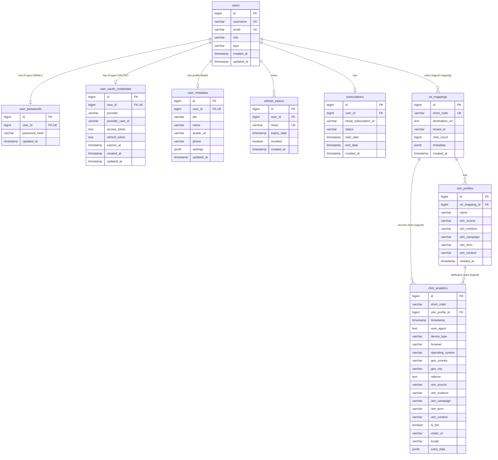

# Project Design Document: HiClickMe (Java Spring Boot Microservices, PostgreSQL, Redis & RabbitMQ)

## 1. Project Overview
**Project Name:** HiClickMe (Multi-Tenant URL Shortener & Analytics SaaS)  
**Purpose:** Provide a highly scalable, multi-tenant URL shortening platform featuring custom subdomains, dynamic QR code generation, UTM tracking profiles, rate limiting, and premium subscription tiers. The platform is designed from the ground up using a **decoupled Microservices Architecture** to support massive redirect throughput, independent service scalability, and high resilience.

### Core Architecture Goals
*   **High Performance Redirections:** Under `< 10ms` response times for cached short URLs using a reactive Redirect Microservice backed by Redis.
*   **Write-Isolated Analytics Ingestion:** decouple click tracking database writes from the redirection flow using RabbitMQ and a dedicated Analytics Ingestion Microservice.
*   **Decoupled Service Scalability:** Independently scale the Redirect service (network/CPU-bound) from the Core admin service (API-bound) and Analytics consumer (I/O-bound).
*   **Stateful Security & RBAC:** Stateless JWT tokens, HTTP-Only Cookie Refresh Token Rotation (RTR) with database replicas, and role gating (USER and ADMIN).

---

## 2. Microservices Architecture

### 2.1 High-Level Architecture Diagram



### 2.2 Component Directory & Ports

| Service / Component | Port | Technology | Purpose |
| :--- | :--- | :--- | :--- |
| **Frontend Dashboard** | `3000` | Next.js, React, TailwindCSS, shadcn/ui | User portal for URL configuration, UTM profiles, and viewing analytics. |
| **Core Admin Service** | `8081` | Spring Boot 3.x, Spring Data JPA, Hibernate | Manages user registrations, subscriptions, Mock billing checkout, link CRUD operations, and JWT token rotation. |
| **Redirect Service** | `8082` | Spring WebFlux / Java 21 Virtual Threads, Redis | Intercepts short code requests, resolves target URLs from cache, and publishes clicks. |
| **Analytics Service** | `8083` | Spring Boot 3.x, Spring AMQP, MaxMind GeoIP | Consumes click messages from RabbitMQ, handles bot detection, parses user-agent metadata, and bulk-inserts logs. |
| **Transactional Database**| `5432` | PostgreSQL 16+ (Schema: `hiclickme_core`) | Relational database containing users, passwords, profiles, mappings, and subscriptions. |
| **Analytics Database** | `5433` | PostgreSQL 16+ (Schema: `hiclickme_analytics`)| Write-intensive relational database holding only click event logs. |
| **Message Queue Broker** | `5672` | RabbitMQ 3.12+ | Decouples HTTP redirection traffic from analytical database writes. |
| **In-Memory Store** | `6379` | Redis 7+ | Handles fast redirect mappings, rate-limiting, and stateless sessions. |

---

## 3. Database Schema & Data Models

### 3.1 Core Transactional Database (PostgreSQL - Port `5432`)

```sql
-- 1. Users Table (Core Identity)
CREATE TABLE users (
    id BIGSERIAL PRIMARY KEY,
    username VARCHAR(255) UNIQUE NOT NULL,
    email VARCHAR(255) UNIQUE NOT NULL,
    role VARCHAR(50) DEFAULT 'USER' NOT NULL, -- USER, ADMIN
    type VARCHAR(50) NOT NULL, -- EMAIL, GOOGLE, GITHUB
    created_at TIMESTAMP WITH TIME ZONE DEFAULT CURRENT_TIMESTAMP NOT NULL,
    updated_at TIMESTAMP WITH TIME ZONE DEFAULT CURRENT_TIMESTAMP NOT NULL
);
CREATE INDEX idx_users_username ON users(username);
CREATE INDEX idx_users_email ON users(email);

-- 2. User Passwords Table (One-to-One, populated if type = 'EMAIL')
CREATE TABLE user_passwords (
    id BIGSERIAL PRIMARY KEY,
    user_id BIGINT UNIQUE NOT NULL REFERENCES users(id) ON DELETE CASCADE,
    password_hash VARCHAR(255) NOT NULL,
    updated_at TIMESTAMP WITH TIME ZONE DEFAULT CURRENT_TIMESTAMP NOT NULL
);

-- 3. User OAuth Credentials Table (One-to-One/Many, populated if type = OAuth provider)
CREATE TABLE user_oauth_credentials (
    id BIGSERIAL PRIMARY KEY,
    user_id BIGINT UNIQUE NOT NULL REFERENCES users(id) ON DELETE CASCADE,
    provider VARCHAR(100) NOT NULL, -- GOOGLE, GITHUB
    provider_user_id VARCHAR(255) NOT NULL,
    access_token TEXT,
    refresh_token TEXT,
    expires_at TIMESTAMP WITH TIME ZONE,
    created_at TIMESTAMP WITH TIME ZONE DEFAULT CURRENT_TIMESTAMP NOT NULL,
    updated_at TIMESTAMP WITH TIME ZONE DEFAULT CURRENT_TIMESTAMP NOT NULL,
    CONSTRAINT uq_provider_user_id UNIQUE (provider, provider_user_id)
);

-- 4. User Metadata Table (One-to-One profile metadata and subscription tier details)
CREATE TABLE user_metadata (
    id BIGSERIAL PRIMARY KEY,
    user_id BIGINT UNIQUE NOT NULL REFERENCES users(id) ON DELETE CASCADE,
    tier VARCHAR(50) DEFAULT 'FREE' NOT NULL, -- FREE, PREMIUM, ENTERPRISE
    name VARCHAR(255),
    avatar_url VARCHAR(512),
    phone VARCHAR(50),
    settings JSONB, -- Custom dashboard configuration flags
    updated_at TIMESTAMP WITH TIME ZONE DEFAULT CURRENT_TIMESTAMP NOT NULL
);
CREATE INDEX idx_user_metadata_tier ON user_metadata(tier);

-- 5. Subscriptions Table
CREATE TABLE subscriptions (
    id BIGSERIAL PRIMARY KEY,
    user_id BIGINT NOT NULL REFERENCES users(id) ON DELETE CASCADE,
    stripe_subscription_id VARCHAR(255),
    status VARCHAR(50) NOT NULL, -- ACTIVE, PAST_DUE, CANCELED
    start_date TIMESTAMP WITH TIME ZONE,
    end_date TIMESTAMP WITH TIME ZONE,
    created_at TIMESTAMP WITH TIME ZONE DEFAULT CURRENT_TIMESTAMP NOT NULL
);

-- 6. URL Mappings Table
CREATE TABLE url_mappings (
    id BIGSERIAL PRIMARY KEY,
    short_code VARCHAR(10) UNIQUE NOT NULL,
    destination_url TEXT NOT NULL,
    tenant_id VARCHAR(50) NOT NULL,
    click_count BIGINT DEFAULT 0 NOT NULL,
    metadata JSONB,
    created_at TIMESTAMP WITH TIME ZONE DEFAULT CURRENT_TIMESTAMP NOT NULL
);
CREATE INDEX idx_url_mappings_short_code ON url_mappings(short_code);
CREATE INDEX idx_url_mappings_tenant ON url_mappings(tenant_id);

-- 7. UTM Profiles Table
CREATE TABLE utm_profiles (
    id BIGSERIAL PRIMARY KEY,
    url_mapping_id BIGINT NOT NULL REFERENCES url_mappings(id) ON DELETE CASCADE,
    name VARCHAR(100) NOT NULL,
    utm_source VARCHAR(100),
    utm_medium VARCHAR(100),
    utm_campaign VARCHAR(100),
    utm_term VARCHAR(100),
    utm_content VARCHAR(100),
    created_at TIMESTAMP WITH TIME ZONE DEFAULT CURRENT_TIMESTAMP NOT NULL
);
CREATE INDEX idx_utm_profiles_url_mapping ON utm_profiles(url_mapping_id);

-- 8. Refresh Tokens Table (Database copies for rotation & replay detection)
CREATE TABLE refresh_tokens (
    id BIGSERIAL PRIMARY KEY,
    user_id BIGINT NOT NULL REFERENCES users(id) ON DELETE CASCADE,
    token VARCHAR(255) UNIQUE NOT NULL,
    expiry_date TIMESTAMP WITH TIME ZONE NOT NULL,
    revoked BOOLEAN DEFAULT FALSE NOT NULL,
    created_at TIMESTAMP WITH TIME ZONE DEFAULT CURRENT_TIMESTAMP NOT NULL
);
CREATE INDEX idx_refresh_tokens_token ON refresh_tokens(token);
```

### 3.2 Analytics Database (PostgreSQL - Port `5433`)

```sql
-- 1. Click Analytics Table
CREATE TABLE click_analytics (
    id BIGSERIAL PRIMARY KEY,
    short_code VARCHAR(10) NOT NULL,
    utm_profile_id BIGINT, -- Logical reference to utm_profiles(id) in Core DB
    timestamp TIMESTAMP WITH TIME ZONE DEFAULT CURRENT_TIMESTAMP NOT NULL,
    user_agent TEXT,
    device_type VARCHAR(50),
    browser VARCHAR(50),
    operating_system VARCHAR(50),
    geo_country VARCHAR(100),
    geo_city VARCHAR(100),
    referrer TEXT,
    utm_source VARCHAR(100),
    utm_medium VARCHAR(100),
    utm_campaign VARCHAR(100),
    utm_term VARCHAR(100),
    utm_content VARCHAR(100),
    is_bot BOOLEAN DEFAULT FALSE NOT NULL,
    visitor_id VARCHAR(36),
    locale VARCHAR(10),
    extra_data JSONB -- Custom parameters, client IP, system routing latencies
);
CREATE INDEX idx_click_analytics_short_code ON click_analytics(short_code);
CREATE INDEX idx_click_analytics_timestamp ON click_analytics(timestamp);
CREATE INDEX idx_click_analytics_visitor ON click_analytics(visitor_id);
```

### 3.3 Database Entity Relationship Diagram (ERD)



### 3.4 Redis Key Schema Design

| Key Pattern | Data Type | TTL | Purpose |
| :--- | :--- | :--- | :--- |
| `url:redirect:{shortCode}` | String | Dynamic (2m - 6h) | Caches destination URLs for high-speed routing. |
| `url:hits:{shortCode}` | String Counter | 24 hours | Tracks daily click popularity to compute Adaptive cache TTLs. |
| `rate:limit:{tenantId}:{ip}` | String / Long | 1 minute | Tracks API invocation limits for rate-limiting. |
| `session:{sessionToken}` | String / Hash | 2 hours | User dashboard state. |

---

## 4. Microservice Implementation Specifications

### 4.1 Redirect Service (`url-redirect-service` - Port `8082`)

The Redirect Service handles traffic routing. It does not write to databases and is implemented using constructor injection and adaptive caching.

```java
// RedirectController.java
@RestController
@RequestMapping("/r")
public class RedirectController {

    private final UrlMappingService urlMappingService;
    private final AnalyticsPublisher analyticsPublisher;

    public RedirectController(UrlMappingService urlMappingService, AnalyticsPublisher analyticsPublisher) {
        this.urlMappingService = urlMappingService;
        this.analyticsPublisher = analyticsPublisher;
    }

    @GetMapping("/{shortCode}")
    public ResponseEntity<Void> redirect(
            @PathVariable String shortCode,
            @RequestParam(required = false) Long profileId,
            HttpServletRequest request,
            HttpServletResponse response) {
        
        // Resolve cache-aside redirection URL
        String destinationUrl = urlMappingService.getDestinationUrl(shortCode);
        
        if (destinationUrl == null) {
            return ResponseEntity.notFound().build();
        }

        // Apply UTM Profile parameters if profileId is passed
        String redirectUrl = destinationUrl;
        if (profileId != null) {
            redirectUrl = urlMappingService.appendUtmProfile(destinationUrl, profileId);
        }

        // Retrieve or initialize unique visitor cookie
        String visitorId = getOrCreateVisitorId(request, response);

        // Asynchronously publish click statistics to RabbitMQ
        analyticsPublisher.publishClick(shortCode, profileId, visitorId, request);

        return ResponseEntity.status(HttpStatus.FOUND)
                .location(URI.create(redirectUrl))
                .build();
    }

    private String getOrCreateVisitorId(HttpServletRequest request, HttpServletResponse response) {
        String visitorId = null;
        if (request.getCookies() != null) {
            for (Cookie cookie : request.getCookies()) {
                if ("hcm_uid".equals(cookie.getName())) {
                     visitorId = cookie.getValue();
                     break;
                }
            }
        }
        if (visitorId == null) {
            visitorId = UUID.randomUUID().toString();
            ResponseCookie cookie = ResponseCookie.from("hcm_uid", visitorId)
                    .maxAge(Duration.ofDays(365))
                    .path("/")
                    .secure(true)
                    .httpOnly(true)
                    .sameSite("Lax")
                    .build();
            response.addHeader(HttpHeaders.SET_COOKIE, cookie.toString());
        }
        return visitorId;
    }
}
```

```java
// AnalyticsPublisher.java
@Component
public class AnalyticsPublisher {
    
    private final RabbitTemplate rabbitTemplate;

    public AnalyticsPublisher(RabbitTemplate rabbitTemplate) {
        this.rabbitTemplate = rabbitTemplate;
    }

    public void publishClick(String shortCode, Long utmProfileId, String visitorId, HttpServletRequest request) {
        ClickEventPayload payload = new ClickEventPayload(
            shortCode,
            utmProfileId,
            visitorId,
            request.getHeader("User-Agent"),
            request.getHeader("Referer"),
            request.getRemoteAddr(),
            request.getHeader("Accept-Language"),
            System.currentTimeMillis(),
            request.getParameter("utm_source"),
            request.getParameter("utm_medium"),
            request.getParameter("utm_campaign"),
            request.getParameter("utm_term"),
            request.getParameter("utm_content")
        );
        
        // Non-blocking AMQP publish to RabbitMQ Broker
        rabbitTemplate.convertAndSend(
            "analytics.exchange", 
            "analytics.click", 
            payload
        );
    }
}
```

### 4.2 Analytics Ingestion Service (`url-analytics-service` - Port `8083`)

Processes click events asynchronously from RabbitMQ, resolves client geolocations, detects bots, and inserts metrics into the dedicated Analytics database.

```java
// ClickEventPayload.java
public record ClickEventPayload(
    String shortCode,
    Long utmProfileId,
    String visitorId,
    String userAgent,
    String referrer,
    String ipAddress,
    String locale,
    long timestamp,
    String utmSource,
    String utmMedium,
    String utmCampaign,
    String utmTerm,
    String utmContent
) {}
```

```java
// AnalyticsConsumer.java
@Component
public class AnalyticsConsumer {

    private final ClickAnalyticsRepository analyticsRepository;

    public AnalyticsConsumer(ClickAnalyticsRepository analyticsRepository) {
        this.analyticsRepository = analyticsRepository;
    }

    @RabbitListener(queues = "analytics.click.queue", concurrency = "3-5")
    public void consumeClickEvent(ClickEventPayload payload) {
        ClickAnalytics record = new ClickAnalytics();
        record.setShortCode(payload.shortCode());
        record.setUtmProfileId(payload.utmProfileId());
        record.setVisitorId(payload.visitorId());
        record.setUserAgent(payload.userAgent());
        record.setReferrer(payload.referrer());
        record.setLocale(payload.locale());
        record.setUtmSource(payload.utmSource());
        record.setUtmMedium(payload.utmMedium());
        record.setUtmCampaign(payload.utmCampaign());
        record.setUtmTerm(payload.utmTerm());
        record.setUtmContent(payload.utmContent());
        
        // Detect bot / crawler traffic
        boolean isBot = detectBot(payload.userAgent());
        record.setBot(isBot);
        
        // GeoIP parsing lookup (e.g. MaxMind) goes here
        record.setGeoCountry("US"); // Resolved from payload.ipAddress()
        record.setGeoCity("San Francisco");
        
        // Store dynamic unstructured properties in JSONB field
        Map<String, Object> extra = new HashMap<>();
        extra.put("ipAddress", payload.ipAddress());
        extra.put("ingestTimestamp", System.currentTimeMillis());
        record.setExtraData(extra);
        
        // Save record to hclikme_analytics database
        analyticsRepository.save(record);
    }

    private boolean detectBot(String userAgent) {
        if (userAgent == null) return false;
        String ua = userAgent.toLowerCase();
        return ua.contains("bot") || ua.contains("crawler") || ua.contains("spider") 
               || ua.contains("slack") || ua.contains("discord") || ua.contains("embed");
    }
}
```

### 4.3 Core Admin Service (`url-core-service` - Port `8081`)
Manages accounts, OAuth identity setups, subscriptions, URL creations, and dynamic local payments checks.

#### 1. Simulated Billing API (Mock Payments)
```java
// MockPaymentController.java
@RestController
@RequestMapping("/api/payment")
public class MockPaymentController {

    private final RedisTemplate<String, Object> redisTemplate;
    private final UserRepository userRepository;
    private final UserMetadataRepository userMetadataRepository;
    private final SubscriptionRepository subscriptionRepository;

    public MockPaymentController(
            RedisTemplate<String, Object> redisTemplate,
            UserRepository userRepository,
            UserMetadataRepository userMetadataRepository,
            SubscriptionRepository subscriptionRepository) {
        this.redisTemplate = redisTemplate;
        this.userRepository = userRepository;
        this.userMetadataRepository = userMetadataRepository;
        this.subscriptionRepository = subscriptionRepository;
    }

    @PostMapping("/checkout")
    public ResponseEntity<Map<String, String>> createCheckoutSession(@RequestBody CheckoutRequest request) {
        String sessionId = "sess_mock_" + UUID.randomUUID();
        
        // Store session metadata in Redis with a 15-minute TTL
        redisTemplate.opsForValue().set("payment:session:" + sessionId, request, Duration.ofMinutes(15));
        
        // Redirect to local mockup
        String mockCheckoutUrl = "/payment/mock-checkout.html?sessionId=" + sessionId;
        return ResponseEntity.ok(Map.of("checkoutUrl", mockCheckoutUrl));
    }

    @PostMapping("/mock-webhook")
    public ResponseEntity<Void> handleMockWebhook(@RequestBody MockWebhookRequest request) {
        String sessionKey = "payment:session:" + request.sessionId();
        CheckoutRequest sessionData = (CheckoutRequest) redisTemplate.opsForValue().get(sessionKey);
        
        if (sessionData == null) {
            return ResponseEntity.badRequest().build();
        }

        if (request.success()) {
            User user = userRepository.findById(sessionData.userId())
                    .orElseThrow(() -> new RuntimeException("User not found"));

            // Update plan tier in UserMetadata
            UserMetadata metadata = userMetadataRepository.findByUserId(user.getId())
                    .orElse(new UserMetadata(user));
            metadata.setTier(sessionData.plan());
            userMetadataRepository.save(metadata);

            // Record Active Subscription
            Subscription sub = new Subscription();
            sub.setUser(user);
            sub.setStripeSubscriptionId(request.sessionId());
            sub.setStatus("ACTIVE");
            sub.setStartDate(Instant.now());
            sub.setEndDate(Instant.now().plus(30, ChronoUnit.DAYS));
            subscriptionRepository.save(sub);
        }

        redisTemplate.delete(sessionKey);
        return ResponseEntity.ok().build();
    }
}
```

#### 2. Dynamic QR Code Generator (ZXing Engine)
Generates vector or PNG QR codes for mapped short links dynamically.
```java
// QRCodeService.java
@Service
public class QRCodeService {

    public byte[] generateQRCode(String text, int width, int height) throws Exception {
        QRCodeWriter qrCodeWriter = new QRCodeWriter();
        BitMatrix bitMatrix = qrCodeWriter.encode(text, BarcodeFormat.QR_CODE, width, height);

        ByteArrayOutputStream pngOutputStream = new ByteArrayOutputStream();
        MatrixToImageWriter.writeToStream(bitMatrix, "PNG", pngOutputStream);
        return pngOutputStream.toByteArray();
    }
}
```

#### 3. Multi-Tenant Subdomain Interceptor
A custom HandlerInterceptor dynamically resolving tenant domains (e.g. `tenant1.hiclickme.com`) and injecting them into the Request Context.
```java
// TenantInterceptor.java
@Component
public class TenantInterceptor implements HandlerInterceptor {

    private final TenantContext tenantContext;

    public TenantInterceptor(TenantContext tenantContext) {
        this.tenantContext = tenantContext;
    }

    @Override
    public boolean preHandle(HttpServletRequest request, HttpServletResponse response, Object handler) {
        String serverName = request.getServerName(); // e.g. client1.hiclickme.com
        if (serverName != null && serverName.endsWith(".hiclickme.com")) {
            String subdomain = serverName.substring(0, serverName.indexOf("."));
            if (!"www".equalsIgnoreCase(subdomain) && !"api".equalsIgnoreCase(subdomain)) {
                request.setAttribute("tenantId", subdomain);
                tenantContext.setCurrentTenantId(subdomain); // Set ThreadLocal tenant context
            }
        }
        return true;
    }

    @Override
    public void afterCompletion(HttpServletRequest request, HttpServletResponse response, Object handler, Exception ex) {
        tenantContext.clear(); // Evict ThreadLocal key to prevent memory leaks
    }
}
```

---

## 5. Performance & Caching Configuration

### 5.1 Dynamic Cache TTL (Adaptive Popularity Eviction)
Implemented in the `url-redirect-service` to optimize Redis memory space:

```java
// UrlMappingService.java
@Service
public class UrlMappingService {

    private final UrlMappingRepository urlRepository;
    private final StringRedisTemplate redisTemplate;

    public UrlMappingService(UrlMappingRepository urlRepository, StringRedisTemplate redisTemplate) {
        this.urlRepository = urlRepository;
        this.redisTemplate = redisTemplate;
    }

    public String getDestinationUrl(String shortCode) {
        String cacheKey = "url:redirect:" + shortCode;
        String counterKey = "url:hits:" + shortCode;

        // 1. Increment call popularity counter
        Long hits = redisTemplate.opsForValue().increment(counterKey);
        if (hits != null && hits == 1) {
            redisTemplate.expire(counterKey, Duration.ofDays(1)); // 24h rolling count window
        }

        // 2. Resolve cache
        String cachedUrl = redisTemplate.opsForValue().get(cacheKey);
        if (cachedUrl != null) {
            // Extend cache life dynamically based on call traffic volume
            Duration adaptiveTtl = calculateAdaptiveTtl(hits != null ? hits : 0L);
            redisTemplate.expire(cacheKey, adaptiveTtl);
            return cachedUrl;
        }

        // 3. Database fallback on Cache Miss
        Optional<UrlMapping> mapping = urlRepository.findByShortCode(shortCode);
        if (mapping.isEmpty()) {
            return null;
        }

        String destinationUrl = mapping.get().getDestinationUrl();
        Duration adaptiveTtl = calculateAdaptiveTtl(hits != null ? hits : 0L);
        redisTemplate.opsForValue().set(cacheKey, destinationUrl, adaptiveTtl);

        return destinationUrl;
    }

    private Duration calculateAdaptiveTtl(long hits) {
        if (hits <= 10) {
            return Duration.ofMinutes(2);      // Cold Key: Keep Redis footprint tiny
        } else if (hits <= 100) {
            return Duration.ofMinutes(30);     // Warm Key
        } else if (hits <= 1000) {
            return Duration.ofHours(2);        // Hot Key
        } else {
            return Duration.ofHours(6);        // Viral Key: Longest TTL
        }
    }
}
```

### 5.2 Rate Limiting (Redis Token Bucket Filter)
To protect Redirect endpoints and REST APIs from DDoS attacks and scraping, a custom Spring filter rate-limits clients based on IP and tenant ID using a Redis Lua script.

```java
// RateLimitingFilter.java
@Component
public class RateLimitingFilter extends OncePerRequestFilter {

    private final StringRedisTemplate redisTemplate;
    private final RedisScript<Long> rateLimitScript;

    public RateLimitingFilter(StringRedisTemplate redisTemplate, RedisScript<Long> rateLimitScript) {
        this.redisTemplate = redisTemplate;
        this.rateLimitScript = rateLimitScript;
    }

    @Override
    protected void doFilterInternal(HttpServletRequest request, HttpServletResponse response, FilterChain filterChain)
            throws ServletException, IOException {
        
        String ip = request.getRemoteAddr();
        String tenantId = (String) request.getAttribute("tenantId");
        String key = "rate:limit:" + (tenantId != null ? tenantId : "global") + ":" + ip;

        // Execute atomic Token Bucket script (Keys: [key], Args: [max_limit (60), time_window (60s)])
        Long allowed = redisTemplate.execute(rateLimitScript, Collections.singletonList(key), "60", "60");

        if (allowed != null && allowed == 0) {
            response.setStatus(HttpStatus.TOO_MANY_REQUESTS.value());
            response.setContentType("application/json");
            response.getWriter().write("{\"error\": \"Too many requests. Rate limit exceeded.\"}");
            return;
        }

        filterChain.doFilter(request, response);
    }
}
```

---

## 6. Security, Authorization & Token Rotation

### 6.1 Double-Token Stateless JWT + RTR
To enforce secure authorization, `url-core-service` handles JWT lifecycle authentication:
*   **Access Token (JWT):** Statelesly holds roles. Sent in response body and kept in-memory by client to prevent XSS.
*   **Refresh Token:** Housed in database (`refresh_tokens`), cookie-passed as `HttpOnly`, `Secure`, `SameSite=Strict`.
*   **Rotation (RTR) on `/refresh`**:
    1. Client presents refresh token cookie.
    2. Server verifies token status in DB. If valid, generates a new Access Token and a new Refresh Token, revoking the old one.
    3. **Replay Theft Prevention**: If the presented token has `revoked = true`, the system assumes a replay attack. It immediately revokes all refresh tokens linked to that user, forcing a logout.

```java
// AuthController.java
@RestController
@RequestMapping("/api/auth")
public class AuthController {

    private final TokenService tokenService;

    public AuthController(TokenService tokenService) {
        this.tokenService = tokenService;
    }

    @PostMapping("/refresh")
    public ResponseEntity<JwtResponse> rotateTokens(HttpServletRequest request, HttpServletResponse response) {
        String oldRefreshToken = tokenService.extractRefreshTokenFromCookie(request);
        if (oldRefreshToken == null) {
            return ResponseEntity.status(HttpStatus.UNAUTHORIZED).build();
        }

        TokenRotationResult result = tokenService.rotateRefreshToken(oldRefreshToken);

        ResponseCookie cookie = ResponseCookie.from("refreshToken", result.newRefreshToken())
                .httpOnly(true)
                .secure(true)
                .path("/api/auth")
                .sameSite("Strict")
                .maxAge(7 * 24 * 60 * 60)
                .build();
        response.addHeader(HttpHeaders.SET_COOKIE, cookie.toString());

        return ResponseEntity.ok(new JwtResponse(result.newAccessToken()));
    }
}
```

### 6.2 Role Gating & Admin Bypass
*   `USER` roles can view and mutate records matching their `tenant_id`.
*   `ADMIN` roles bypass method constraints and can read and modify all tenant databases, metadata, and subscriptions.

---

## 7. Deployment Configuration & Verification

### 7.1 Multi-Container Stack (`docker-compose.yml`)

Spins up Postgres instances, Redis cache, RabbitMQ broker, and the microservices stack:

```yaml
version: '3.8'
services:
  # 1. Transactional PostgreSQL (Port 5432)
  postgres-core:
    image: postgres:16-alpine
    environment:
      POSTGRES_DB: hiclickme_core
      POSTGRES_USER: core_user
      POSTGRES_PASSWORD: core_password
    ports:
      - "5432:5432"
    volumes:
      - pg_core_data:/var/lib/postgresql/data

  # 2. Analytics PostgreSQL (Port 5433)
  postgres-analytics:
    image: postgres:16-alpine
    environment:
      POSTGRES_DB: hiclickme_analytics
      POSTGRES_USER: analytics_user
      POSTGRES_PASSWORD: analytics_password
    ports:
      - "5433:5432" # Maps container 5432 port to host 5433
    volumes:
      - pg_analytics_data:/var/lib/postgresql/data

  # 3. Redis In-Memory Store
  redis:
    image: redis:7-alpine
    ports:
      - "6379:6379"

  # 4. RabbitMQ Broker
  rabbitmq:
    image: rabbitmq:3.12-management-alpine
    ports:
      - "5672:5672"
      - "15672:15672"
    environment:
      RABBITMQ_DEFAULT_USER: guest
      RABBITMQ_DEFAULT_PASS: guest

volumes:
  pg_core_data:
  pg_analytics_data:
```

### 7.2 Verification Testing
1.  **High-Speed Concurrency Redirection Check**: Use Apache Benchmark (`ab`) to run load tests against the Redirect microservice:
    ```bash
    ab -n 10000 -c 100 http://localhost:8082/r/testCode
    ```
    Goal: Redirections resolve with average response latency `<10ms` under concurrent traffic load.
2.  **RabbitMQ Ingestion Proof**: Turn off `url-analytics-service`, generate clicks, and verify messages pile up in the RabbitMQ queue (`analytics.click.queue`). Restart the service and verify that the logs are flushed successfully to PostgreSQL with zero loss of analytics data.
3.  **JWT Replay Attack Verification**: Send a request to `/api/auth/refresh` using an expired or already rotated refresh token to verify the system immediately invalidates the entire token lineage for that user.

### 7.3 Cloud Deployment Strategy (AWS Topology)
For production deployments, the services are orchestrated serverlessly using AWS managed solutions:
*   **AWS ECS on Fargate**: Hosts Docker container tasks for `url-core-service` (port 8081), `url-redirect-service` (port 8082), and `url-analytics-service` (port 8083).
*   **Application Load Balancer (ALB)**: Acts as the entrypoint routing traffic based on path rules:
    *   `/r/**` is routed to the Redirect Service target group.
    *   `/api/**` and static pages are routed to the Core Service target group.
*   **Amazon RDS PostgreSQL (Multi-AZ)**: Separate database instances hosting `hiclickme_core` and `hiclickme_analytics` databases to prevent analytical write operations from competing with core user transaction I/O locks.
*   **Amazon ElastiCache for Redis**: Multi-node replication cluster handling cache resolutions and sliding-window rate limit scripts.
*   **Amazon MQ (RabbitMQ)**: Fully managed message broker acting as the shock-absorber for high ingestion clicks.
*   **Amazon S3 & CloudFront CDN**: Delivers static asset files (React/Next.js dashboard) and custom branded QR images.

### 7.4 Operational Security & Reliability
*   **HTTPS Enforcement**: TLS is termination at the ALB layer using ACM certificates.
*   **Database Backups**: Automated daily snapshots for both RDS PostgreSQL instances, replicated across regions.
*   **Operational Monitoring**: Spring Boot Actuator exposes health indicators scraped by Prometheus for Grafana visualizations. Sentry is hooked into the global exception handler for real-time error logging.

---

## 9. Optional Advanced Features

### 9.1 Bulk Link Import & Export
*   Exposes endpoints `/api/links/import` and `/api/links/export` supporting bulk CSV/JSON mappings, parsing files in-memory and saving them to the PostgreSQL database in batched transactions.

### 9.2 UTM Parameter Builder
*   Interactive panel in the React dashboard which validates raw URLs and dynamically constructs target URLs using UTM parameters.

### 9.3 Global Admin Metrics Panel
*   Administrators (users with `ROLE_ADMIN`) have access to a global Grafana dashboard detailing system-wide metrics (total links created, redirection cache hit ratio, RabbitMQ processing rate, and active database connection pool stats).

### 9.4 Cron Jobs for Cache Pre-Warming
*   A Spring `@Scheduled` task executes every 60 minutes in the Redirect service, selecting the top 500 most popular links from the analytics database and pre-loading them into the Redis Cache-Aside store to guarantee consistent sub-10ms latency.
