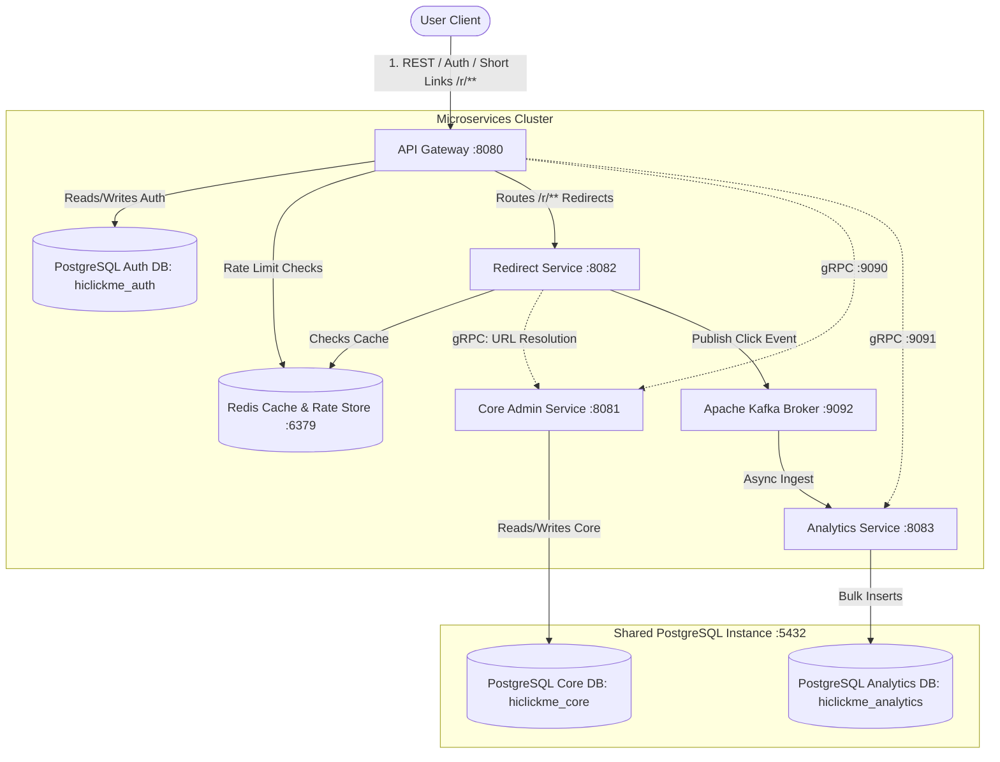
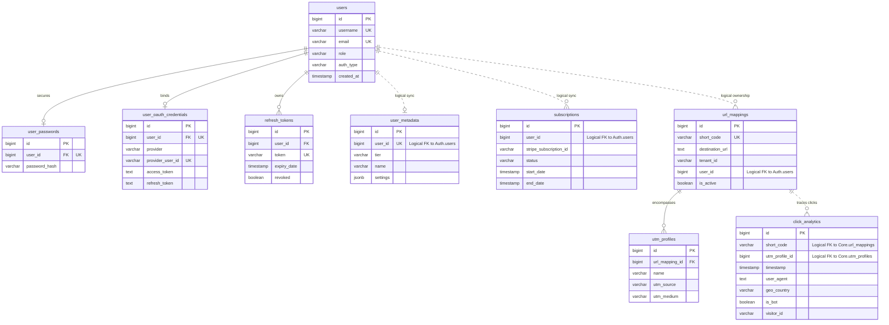
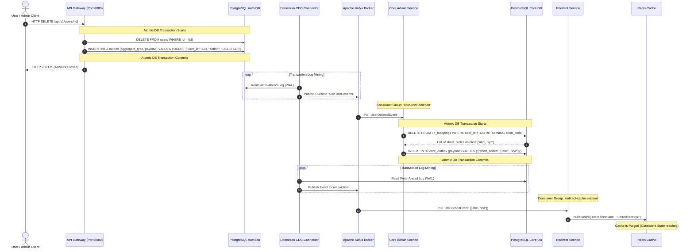

# Project Design Document: HiClickMe (Java Spring Boot Microservices, gRPC, PostgreSQL, Redis & Apache Kafka)

## 1. Project Overview
<<<<<<< Updated upstream
**Project Name:** HiClickMe (Multi-Tenant URL Shortener & Analytics SaaS)  
**Purpose:** Provide a highly scalable, multi-tenant URL shortening platform featuring custom subdomains, dynamic QR code generation, UTM tracking profiles, rate limiting, and premium subscription tiers. The platform is designed using a decoupled Microservices Architecture to support massive redirect throughput, independent service scalability, and high resilience.

### Core Architecture Goals
*   **High Performance Redirections:** Under `< 10ms` response times for cached short URLs using a reactive Redirect Microservice backed by Redis.
*   **Decoupled Database Isolation:** Zero cross-database queries. Each microservice completely owns its database schema / logical database. For development, a single PostgreSQL server instance (port `5432`) hosts 3 logically isolated databases (`hiclickme_auth`, `hiclickme_core`, `hiclickme_analytics`). Downstream services resolve transactional fallbacks over gRPC.
*   **Unified Edge Security & Auth:** Centralized authentication, OAuth2 login coordination, and token rotation managed by a dedicated API Gateway microservice with its own database.
*   **Low Latency Inter-Service RPC:** High-efficiency, strongly-typed internal communication using gRPC (HTTP/2 multiplexing, Protocol Buffers binary serialization).
*   **Write-Isolated Analytics Ingestion:** Decouple click tracking database writes from the redirection flow using Apache Kafka and a dedicated Analytics Ingestion Microservice.
*   **Independent Scalability:** Separately scale the network-bound Redirect Service, the I/O-bound Analytics Ingestion, and the CPU/API-bound Gateway and Core Admin services.
=======

**Project Name:** URL Shortener (Multi-Tenant URL Shortener & Analytics SaaS)  
**Purpose:** Provide a highly scalable, multi-tenant URL shortening platform featuring custom subdomains, dynamic QR code generation, UTM tracking profiles, rate limiting, and premium subscription tiers. The platform is designed using a decoupled Microservices Architecture to support massive redirect throughput, independent service scalability, and high resilience.

### Core Architecture Goals

- **High Performance Redirections:** Under `< 10ms` response times for cached short URLs using a reactive Redirect Microservice backed by Redis.
- **Decoupled Database Isolation:** Zero cross-database queries. Each microservice completely owns its database schema / logical database. For development, a single PostgreSQL server instance (port `5432`) hosts 3 logically isolated databases (`url_shortener_auth`, `url_shortener_core`, `url_shortener_analytics`). Downstream services resolve transactional fallbacks over gRPC.
- **Unified Edge Security & Auth:** Centralized authentication, OAuth2 login coordination, and token rotation managed by a dedicated API Gateway microservice with its own database.
- **Low Latency Inter-Service RPC:** High-efficiency, strongly-typed internal communication using gRPC (HTTP/2 multiplexing, Protocol Buffers binary serialization).
- **Write-Isolated Analytics Ingestion:** Decouple click tracking database writes from the redirection flow using Apache Kafka and a dedicated Analytics Ingestion Microservice.
- **Independent Scalability:** Separately scale the network-bound Redirect Service, the I/O-bound Analytics Ingestion, and the CPU/API-bound Gateway and Core Admin services.
>>>>>>> Stashed changes

---

## 2. The Role of an API Gateway

An **API Gateway** acts as the single entrypoint for all external client requests. Instead of clients talking to multiple microservices directly, they hit the API Gateway, which coordinates, secures, and routes requests down to the backend services.

### Core Responsibilities of the API Gateway

1. **Reverse Proxying & Request Routing:**
   Insulates internal microservices by hiding their IP addresses and ports behind a single public URL (e.g., `https://api.hiclickme.com`). It performs path-based, host-based, or header-based routing to forward HTTP requests to the appropriate downstream service.
2. **Security & Identity Gating (AuthN & AuthZ):**
   Handles all authentication and authorization concerns at the perimeter. It integrates local email/password registration and OAuth2 authentication (Google, GitHub), issues stateless JSON Web Tokens (JWT), manages secure `HttpOnly` refresh token cookies, and performs Refresh Token Rotation (RTR). It blocks unauthorized traffic before it penetrates the internal network.

3. **Distributed Rate Limiting:**
   Protects downstream backend applications from Denial of Service (DoS) attacks, scraping, and client abuse. By executing high-performance checks against Redis at the edge, it rejects requests exceeding rate limits (HTTP `429 Too Many Requests`) before consuming backend database or processing power.

4. **Protocol Translation & Orchestration:**
   Translates external client-facing protocols (HTTP REST / JSON) into high-performance internal protocols (gRPC / Protocol Buffers). It orchestrates complex client requests by querying multiple gRPC microservices in parallel, aggregating their responses, and returning a unified JSON payload to the client.

5. **Load Balancing & Service Discovery:**
   Integrates with service registries (e.g., Consul, Eureka, or Kubernetes DNS) to dynamically resolve healthy instances of downstream services and distribute traffic evenly across them.

6. **Observability & Cross-Cutting Concerns:**
   Injects distributed tracing headers (e.g., W3C Trace Context, Zipkin B3) and request correlation IDs. This ensures that every transaction can be monitored end-to-end as it traverses downstream services. It also aggregates metrics (request counts, latency distributions) and logs anomalies at the entrypoint.

7. **Resilience & Circuit Breaking:**
   Defines fallback responses, connection timeouts, and circuit breakers (e.g., Resilience4j, Envoy). If a downstream microservice experiences high latency or outages, the Gateway fast-fails and returns cached or graceful default responses to the client, preventing cascade failures.

---

## 3. Microservices Architecture

### 3.1 High-Level Architecture Diagram



### 3.2 Component Directory & Ports

<<<<<<< Updated upstream
| Service / Component | Public Port | gRPC Port | Technology | Purpose |
| :--- | :--- | :--- | :--- | :--- |
| **API Gateway** | `8080` | N/A | Spring Cloud Gateway, Reactive Security | Central entrypoint, routing, rate limiting, OAuth2 Client, token rotation, and REST-to-gRPC translation. |
| **Core Admin Service** | N/A | `9090` | Spring Boot, gRPC Server, JPA / Hibernate | Manages user metadata configurations, billing/subscriptions, URL mapping databases, and UTM profiles. |
| **Redirect Service** | `8082` | N/A | Spring WebFlux, Redis Reactive, gRPC Client | Resolves short URLs via Redis (or gRPC Core Service fallback) and publishes click events to Apache Kafka. |
| **Analytics Service** | N/A | `9091` | Spring Boot, Spring Kafka, MaxMind GeoIP | Consumes Kafka click streams, resolves geographic locations, detects bots, bulk-writes logs, and serves gRPC reports. |
| **PostgreSQL Shared Instance** | `5432` | N/A | PostgreSQL 16 | Single database container hosting 3 logically isolated databases: `hiclickme_auth`, `hiclickme_core`, and `hiclickme_analytics`. |
| **Redis Cache & Rate Store**| `6379` | N/A | Redis 7.2 | Shares rate limit statistics, redirect caches, and session contexts. |
| **Apache Kafka Broker** | `9092` | N/A | Confluent Kafka / KRaft Mode | High-throughput streaming buffer decoupling redirection handling from analytics logging. |
=======
| Service / Component            | Public Port | gRPC Port | Technology                                  | Purpose                                                                                                                                      |
| :----------------------------- | :---------- | :-------- | :------------------------------------------ | :------------------------------------------------------------------------------------------------------------------------------------------- |
| **API Gateway**                | `8080`      | N/A       | Spring Cloud Gateway, Reactive Security     | Central entrypoint, routing, rate limiting, OAuth2 Client, token rotation, and REST-to-gRPC translation.                                     |
| **Core Admin Service**         | N/A         | `9090`    | Spring Boot, gRPC Server, JPA / Hibernate   | Manages user metadata configurations, billing/subscriptions, URL mapping databases, and UTM profiles.                                        |
| **Redirect Service**           | `8082`      | N/A       | Spring WebFlux, Redis Reactive, gRPC Client | Resolves short URLs via Redis (or gRPC Core Service fallback) and publishes click events to Apache Kafka.                                    |
| **Analytics Service**          | N/A         | `9091`    | Spring Boot, Spring Kafka, MaxMind GeoIP    | Consumes Kafka click streams, resolves geographic locations, detects bots, bulk-writes logs, and serves gRPC reports.                        |
| **PostgreSQL Shared Instance** | `5432`      | N/A       | PostgreSQL 16                               | Single database container hosting 3 logically isolated databases: `url_shortener_auth`, `url_shortener_core`, and `url_shortener_analytics`. |
| **Redis Cache & Rate Store**   | `6379`      | N/A       | Redis 7.2                                   | Shares rate limit statistics, redirect caches, and session contexts.                                                                         |
| **Apache Kafka Broker**        | `9092`      | N/A       | Confluent Kafka / KRaft Mode                | High-throughput streaming buffer decoupling redirection handling from analytics logging.                                                     |
>>>>>>> Stashed changes

---

## 4. Database Schema & Data Models

<<<<<<< Updated upstream
### 4.1 PostgreSQL Auth Database (Database: `hiclickme_auth` on Port `5432`)
=======
### 4.1 PostgreSQL Auth Database (Database: `url_shortener_auth` on Port `5432`)

>>>>>>> Stashed changes
Stores strictly credential, token, and identity mapping tables owned and managed exclusively by the `api-gateway-service`.

```sql
-- 1. Users Table (Core Identity Reference)
CREATE TABLE users (
    id BIGSERIAL PRIMARY KEY,
    username VARCHAR(255) UNIQUE NOT NULL,
    email VARCHAR(255) UNIQUE NOT NULL,
    role VARCHAR(50) DEFAULT 'USER' NOT NULL, -- USER, ADMIN
    auth_type VARCHAR(50) NOT NULL, -- EMAIL, GOOGLE, GITHUB
    created_at TIMESTAMP WITH TIME ZONE DEFAULT CURRENT_TIMESTAMP NOT NULL,
    updated_at TIMESTAMP WITH TIME ZONE DEFAULT CURRENT_TIMESTAMP NOT NULL
);
CREATE INDEX idx_users_username ON users(username);
CREATE INDEX idx_users_email ON users(email);

-- 2. User Passwords Table (One-to-One, populated if auth_type = 'EMAIL')
CREATE TABLE user_passwords (
    id BIGSERIAL PRIMARY KEY,
    user_id BIGINT UNIQUE NOT NULL REFERENCES users(id) ON DELETE CASCADE,
    password_hash VARCHAR(255) NOT NULL,
    updated_at TIMESTAMP WITH TIME ZONE DEFAULT CURRENT_TIMESTAMP NOT NULL
);

-- 3. User OAuth Credentials Table (One-to-One/Many, populated if auth_type = OAUTH)
CREATE TABLE user_oauth_credentials (
    id BIGSERIAL PRIMARY KEY,
    user_id BIGINT UNIQUE NOT NULL REFERENCES users(id) ON DELETE CASCADE,
    provider VARCHAR(100) NOT NULL, -- GOOGLE, GITHUB
    provider_user_id VARCHAR(255) NOT NULL,
    access_token TEXT,
    refresh_token TEXT,
    expires_at TIMESTAMP WITH TIME ZONE,
    created_at TIMESTAMP WITH TIME ZONE DEFAULT CURRENT_TIMESTAMP NOT NULL,
    updated_at TIMESTAMP WITH TIME ZONE DEFAULT CURRENT_TIMESTAMP NOT NULL,
    CONSTRAINT uq_provider_user_id UNIQUE (provider, provider_user_id)
);

-- 4. Refresh Tokens Table (Database copies for rotation & replay detection)
CREATE TABLE refresh_tokens (
    id BIGSERIAL PRIMARY KEY,
    user_id BIGINT NOT NULL REFERENCES users(id) ON DELETE CASCADE,
    token VARCHAR(255) UNIQUE NOT NULL,
    expiry_date TIMESTAMP WITH TIME ZONE NOT NULL,
    revoked BOOLEAN DEFAULT FALSE NOT NULL,
    created_at TIMESTAMP WITH TIME ZONE DEFAULT CURRENT_TIMESTAMP NOT NULL
);
CREATE INDEX idx_refresh_tokens_token ON refresh_tokens(token);
```

<<<<<<< Updated upstream
### 4.2 PostgreSQL Core Database (Database: `hiclickme_core` on Port `5432`)
=======
### 4.2 PostgreSQL Core Database (Database: `url_shortener_core` on Port `5432`)

>>>>>>> Stashed changes
Stores business-specific URL mappings, configurations, user billing statuses, and marketing profiles owned and managed exclusively by `url-core-service`.

```sql
-- 1. User Metadata Profile Table (Corresponds to User ID in Auth Service DB)
CREATE TABLE user_metadata (
    id BIGSERIAL PRIMARY KEY,
    user_id BIGINT UNIQUE NOT NULL, -- Logical foreign key reference to Auth DB Users
    tier VARCHAR(50) DEFAULT 'FREE' NOT NULL, -- FREE, PREMIUM, ENTERPRISE
    name VARCHAR(255),
    avatar_url VARCHAR(512),
    phone VARCHAR(50),
    settings JSONB,
    updated_at TIMESTAMP WITH TIME ZONE DEFAULT CURRENT_TIMESTAMP NOT NULL
);
CREATE INDEX idx_user_metadata_tier ON user_metadata(tier);

-- 2. Subscriptions Table
CREATE TABLE subscriptions (
    id BIGSERIAL PRIMARY KEY,
    user_id BIGINT NOT NULL, -- Logical foreign key reference to Auth DB Users
    stripe_subscription_id VARCHAR(255),
    status VARCHAR(50) NOT NULL, -- ACTIVE, PAST_DUE, CANCELED
    start_date TIMESTAMP WITH TIME ZONE,
    end_date TIMESTAMP WITH TIME ZONE,
    created_at TIMESTAMP WITH TIME ZONE DEFAULT CURRENT_TIMESTAMP NOT NULL
);
CREATE INDEX idx_subscriptions_user ON subscriptions(user_id);

-- 3. URL Mappings Table
CREATE TABLE url_mappings (
    id BIGSERIAL PRIMARY KEY,
    short_code VARCHAR(10) UNIQUE NOT NULL,
    destination_url TEXT NOT NULL,
    tenant_id VARCHAR(50) NOT NULL, -- Groups resources logically
    user_id BIGINT NOT NULL, -- Owner reference
    click_count BIGINT DEFAULT 0 NOT NULL,
    is_active BOOLEAN DEFAULT TRUE NOT NULL,
    metadata JSONB,
    created_at TIMESTAMP WITH TIME ZONE DEFAULT CURRENT_TIMESTAMP NOT NULL
);
CREATE INDEX idx_url_mappings_short_code ON url_mappings(short_code);
CREATE INDEX idx_url_mappings_user ON url_mappings(user_id);

-- 4. UTM Profiles Table
CREATE TABLE utm_profiles (
    id BIGSERIAL PRIMARY KEY,
    url_mapping_id BIGINT NOT NULL REFERENCES url_mappings(id) ON DELETE CASCADE,
    name VARCHAR(100) NOT NULL,
    utm_source VARCHAR(100),
    utm_medium VARCHAR(100),
    utm_campaign VARCHAR(100),
    utm_term VARCHAR(100),
    utm_content VARCHAR(100),
    created_at TIMESTAMP WITH TIME ZONE DEFAULT CURRENT_TIMESTAMP NOT NULL
);
CREATE INDEX idx_utm_profiles_url_mapping ON utm_profiles(url_mapping_id);
```

<<<<<<< Updated upstream
### 4.3 PostgreSQL Analytics Database (Database: `hiclickme_analytics` on Port `5432`)
=======
### 4.3 PostgreSQL Analytics Database (Database: `url_shortener_analytics` on Port `5432`)

>>>>>>> Stashed changes
Stores raw event click tracking data managed strictly by `url-analytics-service`.

```sql
-- 1. Click Analytics Table
CREATE TABLE click_analytics (
    id BIGSERIAL PRIMARY KEY,
    short_code VARCHAR(10) NOT NULL,
    utm_profile_id BIGINT, -- Logical reference to utm_profiles(id) in Core DB
    timestamp TIMESTAMP WITH TIME ZONE DEFAULT CURRENT_TIMESTAMP NOT NULL,
    user_agent TEXT,
    device_type VARCHAR(50),
    browser VARCHAR(50),
    operating_system VARCHAR(50),
    geo_country VARCHAR(100),
    geo_city VARCHAR(100),
    referrer TEXT,
    utm_source VARCHAR(100),
    utm_medium VARCHAR(100),
    utm_campaign VARCHAR(100),
    utm_term VARCHAR(100),
    utm_content VARCHAR(100),
    is_bot BOOLEAN DEFAULT FALSE NOT NULL,
    visitor_id VARCHAR(36),
    locale VARCHAR(10),
    extra_data JSONB
);
CREATE INDEX idx_click_analytics_short_code ON click_analytics(short_code);
CREATE INDEX idx_click_analytics_timestamp ON click_analytics(timestamp);
```

### 4.4 Database Entity Relationship Diagram (ERD)



---

## 5. gRPC Interface Definitions

Internal services establish strict, compiled contracts using Protocol Buffers. This ensures cross-service type safety, backwards compatibility, and low serialization overhead.

### 5.1 url_service.proto

Defines endpoints in the `Core Admin Service` to resolve short codes and manage mappings.

```protobuf
syntax = "proto3";

package hiclickme.core;

option java_multiple_files = true;
option java_package = "com.hiclickme.grpc.core";
option java_outer_classname = "UrlServiceProto";

service UrlService {
  rpc GetUrlMapping (GetUrlMappingRequest) returns (GetUrlMappingResponse);
  rpc CreateUrlMapping (CreateUrlMappingRequest) returns (CreateUrlMappingResponse);
}

message GetUrlMappingRequest {
  string short_code = 1;
}

message GetUrlMappingResponse {
  bool found = 1;
  string short_code = 2;
  string destination_url = 3;
  bool is_active = 4;
  string tenant_id = 5;
  int64 user_id = 6;
  repeated UtmProfile utm_profiles = 7;
}

message UtmProfile {
  int64 id = 1;
  string name = 2;
  string utm_source = 3;
  string utm_medium = 4;
  string utm_campaign = 5;
}

message CreateUrlMappingRequest {
  string destination_url = 1;
  string tenant_id = 2;
  int64 user_id = 3;
  string custom_short_code = 4;
}

message CreateUrlMappingResponse {
  string short_code = 1;
  string destination_url = 2;
}
```

### 5.2 subscription_service.proto

Defines endpoints in the `Core Admin Service` to lookup active plans and validate limits.

```protobuf
syntax = "proto3";

package hiclickme.core;

option java_multiple_files = true;
option java_package = "com.hiclickme.grpc.core";
option java_outer_classname = "SubscriptionServiceProto";

service SubscriptionService {
  rpc ValidateTenantLimit (ValidateTenantLimitRequest) returns (ValidateTenantLimitResponse);
  rpc GetTenantSubscription (GetTenantSubscriptionRequest) returns (GetTenantSubscriptionResponse);
}

message ValidateTenantLimitRequest {
  string tenant_id = 1;
  int64 user_id = 2;
}

message ValidateTenantLimitResponse {
  bool allowed = 1;
  string current_tier = 2;
  int64 current_usage = 3;
  int64 limit = 4;
}

message GetTenantSubscriptionRequest {
  int64 user_id = 1;
}

message GetTenantSubscriptionResponse {
  string stripe_subscription_id = 1;
  string status = 2;
  string tier = 3;
  int64 end_timestamp = 4;
}
```

### 5.3 analytics_service.proto

Defines endpoints in the `Analytics Service` to retrieve statistics for the dashboard.

```protobuf
syntax = "proto3";

package hiclickme.analytics;

option java_multiple_files = true;
option java_package = "com.hiclickme.grpc.analytics";
option java_outer_classname = "AnalyticsServiceProto";

service AnalyticsService {
  rpc GetClickStatistics (ClickStatsRequest) returns (ClickStatsResponse);
}

message ClickStatsRequest {
  string short_code = 1;
  int64 start_timestamp = 2;
  int64 end_timestamp = 3;
}

message ClickStatsResponse {
  string short_code = 1;
  int64 total_clicks = 2;
  int64 bot_clicks = 3;
  repeated CountryBreakdown country_stats = 4;
}

message CountryBreakdown {
  string country_code = 1;
  int64 click_count = 2;
}
```

---

## 6. Microservice Implementation Specifications

### 6.1 API Gateway Service (`url-gateway-service` - Port `8080`)

Exposes REST resources externally, processes auth flows with its local DB, handles rate limits with Redis, and makes gRPC requests downstream.

#### 1. Routing & Security Setup (`application.yml`)

```yaml
server:
    port: 8080

spring:
    application:
        name: url-gateway-service
    r2dbc:
        url: r2dbc:postgresql://localhost:5432/hiclickme_auth
        username: auth_user
        password: auth_password
    redis:
        host: localhost
        port: 6379
    cloud:
        gateway:
            routes:
                - id: core_admin_rest_fallback
                  uri: noop:// # Route internally captured by REST-gRPC controllers
                  predicates:
                      - Path=/api/v1/dashboard/**
                - id: redirect_route
                  uri: http://localhost:8082
                  predicates:
                      - Path=/r/**
```

#### 2. Reactive Security Configuration (Spring Security & JWT)

Authenticates clients, reads access tokens, and processes secure Refresh Token Rotation inside the Gateway context.

```java
@Configuration
@EnableWebFluxSecurity
public class SecurityConfiguration {

    private final JwtTokenProvider jwtTokenProvider;

    public SecurityConfiguration(JwtTokenProvider jwtTokenProvider) {
        this.jwtTokenProvider = jwtTokenProvider;
    }

    @Bean
    public SecurityWebFilterChain springSecurityFilterChain(ServerHttpSecurity http) {
        return http
            .csrf(ServerHttpSecurity.CsrfSpec::disable)
            .authorizeExchange(exchanges -> exchanges
                .pathMatchers("/api/v1/auth/**").permitAll()
                .pathMatchers("/r/**").permitAll()
                .anyExchange().authenticated()
            )
            .securityContextRepository(new BearerTokenSecurityContextRepository(jwtTokenProvider))
            .build();
    }
}
```

#### 3. Edge Rate Limiter (Redis Lua Token Bucket Filter)

Runs reactive global rate limit evaluations on all edge routes before propagating requests downstream.

##### Redis Lua Rate Limiting Script (`request_rate_limiter.lua`)

This atomic script implements a Token Bucket algorithm in Redis to prevent race conditions during concurrent requests:

```lua
local key = KEYS[1]
local limit = tonumber(ARGV[1])
local refill_rate = tonumber(ARGV[2])
local now = tonumber(redis.call('TIME')[1])

local bucket = redis.call('HMGET', key, 'tokens', 'last_refill')
local tokens = tonumber(bucket[1])
local last_refill = tonumber(bucket[2])

if not tokens then
    tokens = limit
    last_refill = now
else
    local elapsed = math.max(0, now - last_refill)
    tokens = math.min(limit, tokens + elapsed * refill_rate)
    last_refill = now
end

if tokens >= 1 then
    tokens = tokens - 1
    redis.call('HMSET', key, 'tokens', tokens, 'last_refill', last_refill)
    redis.call('EXPIRE', key, 60)
    return 1
else
    return 0
end
```

##### Spring Cloud Gateway Rate Limiting Filter

```java
@Component
public class GatewayRateLimitingFilter implements GlobalFilter, Ordered {

    private final ReactiveStringRedisTemplate redisTemplate;
    private final RedisScript<Long> luaScript;

    public GatewayRateLimitingFilter(ReactiveStringRedisTemplate redisTemplate, RedisScript<Long> luaScript) {
        this.redisTemplate = redisTemplate;
        this.luaScript = luaScript;
    }

    @Override
    public Mono<Void> filter(ServerWebExchange exchange, GatewayFilterChain chain) {
        String ip = exchange.getRequest().getRemoteAddress().getAddress().getHostAddress();
        String limitKey = "rate:limit:global:" + ip;

        // Keys: [limitKey], Args: [MaxBucketSize (60 tokens), RefillRatePerSecond (1 token/s)]
        return redisTemplate.execute(luaScript, List.of(limitKey), List.of("60", "1"))
            .flatMap(allowed -> {
                if (allowed == 0) {
                    exchange.getResponse().setStatusCode(HttpStatus.TOO_MANY_REQUESTS);
                    exchange.getResponse().getHeaders().setContentType(MediaType.APPLICATION_JSON);
                    byte[] bytes = "{\"error\":\"Too many requests. Limit exceeded.\"}".getBytes(StandardCharsets.UTF_8);
                    DataBuffer buffer = exchange.getResponse().bufferFactory().wrap(bytes);
                    return exchange.getResponse().writeWith(Mono.just(buffer));
                }
                return chain.filter(exchange);
            });
    }

    @Override
    public int getOrder() {
        return Ordered.HIGHEST_PRECEDENCE;
    }
}
```

#### 4. REST to gRPC Translation Controller

Gateway translates JSON API requests from the frontend into internal gRPC payloads, queries headless services, and maps results back to client JSON.

```java
@RestController
@RequestMapping("/api/v1/dashboard")
public class DashboardGatewayController {

    @GrpcClient("url-core-service")
    private UrlServiceGrpc.UrlServiceBlockingStub urlServiceStub;

    @PostMapping("/links")
    public ResponseEntity<UrlMappingDto> createLink(
            @RequestBody CreateLinkRequest request,
            @AuthenticationPrincipal UserPrincipal principal) {

        // Construct protobuf message
        CreateUrlMappingRequest grpcRequest = CreateUrlMappingRequest.newBuilder()
                .setDestinationUrl(request.destinationUrl())
                .setTenantId(principal.getTenantId())
                .setUserId(principal.getUserId())
                .build();

        // High-speed gRPC call to core service
        CreateUrlMappingResponse grpcResponse = urlServiceStub.createUrlMapping(grpcRequest);

        // Map back to response JSON DTO
        UrlMappingDto responseDto = new UrlMappingDto(
                grpcResponse.getShortCode(),
                grpcResponse.getDestinationUrl()
        );
        return ResponseEntity.ok(responseDto);
    }
}
```

---

### 6.2 Core Admin Service (`url-core-service` - Port `9090`)
<<<<<<< Updated upstream
Runs headless as an internal gRPC service without public HTTP exposure. It manages the transactional database `hiclickme_core` and executes logical CRUD rules.
=======

Runs headless as an internal gRPC service without public HTTP exposure. It manages the transactional database `url_shortener_core` and executes logical CRUD rules.
>>>>>>> Stashed changes

#### 1. gRPC Server Implementation

Handles incoming request definitions compiled from proto classes.

```java
@GrpcService
public class UrlServiceImpl extends UrlServiceGrpc.UrlServiceImplBase {

    private final UrlMappingRepository urlRepository;
    private final StringRedisTemplate redisTemplate;

    public UrlServiceImpl(UrlMappingRepository urlRepository, StringRedisTemplate redisTemplate) {
        this.urlRepository = urlRepository;
        this.redisTemplate = redisTemplate;
    }

    @Override
    public void getUrlMapping(GetUrlMappingRequest request, StreamObserver<GetUrlMappingResponse> responseObserver) {
        Optional<UrlMapping> mappingOpt = urlRepository.findByShortCode(request.getShortCode());

        if (mappingOpt.isEmpty()) {
            responseObserver.onNext(GetUrlMappingResponse.newBuilder().setFound(false).build());
            responseObserver.onCompleted();
            return;
        }

        UrlMapping mapping = mappingOpt.get();

        GetUrlMappingResponse.Builder builder = GetUrlMappingResponse.newBuilder()
                .setFound(true)
                .setShortCode(mapping.getShortCode())
                .setDestinationUrl(mapping.getDestinationUrl())
                .setIsActive(mapping.isActive())
                .setTenantId(mapping.getTenantId())
                .setUserId(mapping.getUserId());

        // Map internal UTM profiles list to gRPC elements
        mapping.getUtmProfiles().forEach(p -> builder.addUtmProfiles(
                UtmProfile.newBuilder()
                        .setId(p.getId())
                        .setName(p.getName())
                        .setUtmSource(p.getUtmSource())
                        .setUtmMedium(p.getUtmMedium())
                        .build()
        ));

        responseObserver.onNext(builder.build());
        responseObserver.onCompleted();
    }
}
```

---

### 6.3 Redirect Service (`url-redirect-service` - Port `8082`)

A reactive WebFlux application executing redirections. It does not establish direct relational database pools.

#### 1. Redirection Resolver with gRPC Fallback Client

Handles redirect execution. Checks Redis cache first. If a cache miss occurs, resolves URL targets by issuing a gRPC call to `url-core-service`.

```java
@RestController
@RequestMapping("/r")
public class RedirectController {

    private final ReactiveStringRedisTemplate redisTemplate;
    private final KafkaTemplate<String, ClickEventPayload> kafkaTemplate;

    @GrpcClient("url-core-service")
    private UrlServiceGrpc.UrlServiceFutureStub coreServiceStub; // Asynchronous non-blocking gRPC stub

    public RedirectController(ReactiveStringRedisTemplate redisTemplate, KafkaTemplate<String, ClickEventPayload> kafkaTemplate) {
        this.redisTemplate = redisTemplate;
        this.kafkaTemplate = kafkaTemplate;
    }

    @GetMapping("/{shortCode}")
    public Mono<ResponseEntity<Void>> redirect(
            @PathVariable String shortCode,
            ServerHttpRequest request,
            ServerHttpResponse response) {

        String cacheKey = "url:redirect:" + shortCode;
        String counterKey = "url:hits:" + shortCode;

        // 1. Increment rolling popularity counter reactively
        return redisTemplate.opsForValue().increment(counterKey)
            .flatMap(hits -> {
                Duration adaptiveTtl = calculateAdaptiveTtl(hits != null ? hits : 0L);

                // 2. Resolve cached redirect target
                return redisTemplate.opsForValue().get(cacheKey)
                    .flatMap(cachedUrl -> {
                        // Cache hit: extend TTL reactively on rolling hits popularity
                        return redisTemplate.expire(cacheKey, adaptiveTtl)
                            .then(Mono.defer(() -> {
                                publishClickEvent(shortCode, request);
                                return Mono.just(createRedirectResponse(cachedUrl));
                             }));
                    })
                    .switchIfEmpty(Mono.defer(() -> {
                        // Cache miss: gRPC Call to Core Service
                        GetUrlMappingRequest grpcRequest = GetUrlMappingRequest.newBuilder()
                                .setShortCode(shortCode)
                                .build();

                        // Convert gRPC ListenableFuture to Spring Reactor Mono
                        return Mono.fromFuture(JdkFutureAdapters.listenInPoolThread(
                                coreServiceStub.getUrlMapping(grpcRequest)
                        )).flatMap(grpcResponse -> {
                            if (!grpcResponse.getFound() || !grpcResponse.getIsActive()) {
                                return Mono.just(ResponseEntity.notFound().build());
                            }

                            String targetUrl = grpcResponse.getDestinationUrl();

                            // Pre-warm Cache with Adaptive Popularity-based TTL
                            return redisTemplate.opsForValue().set(cacheKey, targetUrl, adaptiveTtl)
                                    .then(Mono.defer(() -> {
                                        publishClickEvent(shortCode, request);
                                        return Mono.just(createRedirectResponse(targetUrl));
                                    }));
                        });
                    }));
            });
    }

    private Duration calculateAdaptiveTtl(long hits) {
        if (hits <= 10) {
            return Duration.ofMinutes(2);      // Cold Key: Keep Redis footprint tiny
        } else if (hits <= 100) {
            return Duration.ofMinutes(30);     // Warm Key
        } else if (hits <= 1000) {
            return Duration.ofHours(2);        // Hot Key
        } else {
            return Duration.ofHours(6);        // Viral Key: Longest TTL
        }
    }

    private void publishClickEvent(String shortCode, ServerHttpRequest request) {
        ClickEventPayload payload = new ClickEventPayload(
            shortCode,
            request.getHeaders().getFirst("User-Agent"),
            request.getRemoteAddress().getHostName(),
            System.currentTimeMillis()
        );
        kafkaTemplate.send("analytics.click", shortCode, payload);
    }

    private ResponseEntity<Void> createRedirectResponse(String targetUrl) {
        return ResponseEntity.status(HttpStatus.FOUND)
                .location(URI.create(targetUrl))
                .build();
    }
}
```

---

### 6.4 Analytics Ingestion Service (`url-analytics-service` - Port `8083` / gRPC `9091`)

Reads event messages from Apache Kafka asynchronously, resolves locations, performs bot filters, bulk-inserts traces, and implements gRPC analytics report feeds.

```java
@Component
public class ClickConsumer {

    private final ClickRepository clickRepository;

    public ClickConsumer(ClickRepository clickRepository) {
        this.clickRepository = clickRepository;
    }

    @KafkaListener(topics = "analytics.click", groupId = "analytics-ingest-group", concurrency = "3")
    public void consume(ConsumerRecord<String, ClickEventPayload> record) {
        ClickEventPayload payload = record.value();

        ClickAnalytics log = new ClickAnalytics();
        log.setShortCode(payload.shortCode());
        log.setUserAgent(payload.userAgent());
        log.setVisitorId(UUID.randomUUID().toString());
        log.setBot(detectBot(payload.userAgent()));
        log.setGeoCountry(resolveGeoCountry(payload.ipAddress()));

        clickRepository.save(log);
    }

    private boolean detectBot(String userAgent) {
        if (userAgent == null) return false;
        String ua = userAgent.toLowerCase();
        return ua.contains("bot") || ua.contains("crawler") || ua.contains("spider");
    }

    private String resolveGeoCountry(String ip) {
        // Mock GeoIP translation
        return "US";
    }
}
```

---

## 7. Multi-Container Orchestration (`docker-compose.yml`)

Coordinates local startup of databases, brokers, caches, and the microservices stack.

### Local Development CLI Command (Memory-Optimized):
```powershell
$env:MAVEN_OPTS="-Xmx256m"; mvn spring-boot:run -DskipTests
```

### Full Stack Docker Orchestration (`docker-compose.yml`):

```yaml
version: "3.8"

services:
<<<<<<< Updated upstream
  # 1. Shared PostgreSQL DB Instance (Hosts 3 logical databases: hiclickme_auth, hiclickme_core, hiclickme_analytics)
  postgres:
    image: postgres:16-alpine
    container_name: postgres-db
    environment:
      POSTGRES_DB: postgres
      POSTGRES_USER: postgres
      POSTGRES_PASSWORD: postgres_password
    ports:
      - "5432:5432"
    volumes:
      - pg_data:/var/lib/postgresql/data
      - ./scripts/init-dbs.sql:/docker-entrypoint-initdb.d/init-dbs.sql
=======
    # 1. Shared PostgreSQL DB Instance (Hosts 3 logical databases: url_shortener_auth, url_shortener_core, url_shortener_analytics)
    postgres:
        image: postgres:16-alpine
        container_name: postgres-db
        environment:
            POSTGRES_DB: postgres
            POSTGRES_USER: postgres
            POSTGRES_PASSWORD: postgres_password
        ports:
            - "5432:5432"
        volumes:
            - pg_data:/var/lib/postgresql/data
            - ./scripts/init-dbs.sql:/docker-entrypoint-initdb.d/init-dbs.sql
>>>>>>> Stashed changes

    # 2. Redis Cache & Limit Store
    redis:
        image: redis:7.2-alpine
        container_name: redis-cache
        ports:
            - "6379:6379"

    # 3. Apache Kafka (KRaft mode)
    kafka:
        image: confluentinc/cp-kafka:7.6.0
        container_name: kafka-broker
        ports:
            - "9092:9092"
        environment:
            KAFKA_NODE_ID: 1
            KAFKA_PROCESS_ROLES: "broker,controller"
            KAFKA_CONTROLLER_QUORUM_VOTERS: "1@kafka:29093"
            KAFKA_LISTENERS: "PLAINTEXT://0.0.0.0:29092,CONTROLLER://0.0.0.0:29093,PLAINTEXT_HOST://0.0.0.0:9092"
            KAFKA_ADVERTISED_LISTENERS: "PLAINTEXT://kafka:29092,PLAINTEXT_HOST://localhost:9092"
            KAFKA_LISTENER_SECURITY_PROTOCOL_MAP: "CONTROLLER:PLAINTEXT,PLAINTEXT:PLAINTEXT,PLAINTEXT_HOST:PLAINTEXT"
            KAFKA_CONTROLLER_LISTENER_NAMES: "CONTROLLER"
            KAFKA_INTER_BROKER_LISTENER_NAME: "PLAINTEXT"
            KAFKA_OFFSETS_TOPIC_REPLICATION_FACTOR: 1
            KAFKA_GROUP_INITIAL_REBALANCE_DELAY_MS: 0
            KAFKA_LOG_DIRS: "/tmp/kraft-combined-logs"
            CLUSTER_ID: "MkU3OEVBNTcwNTJENDM2Qk"

<<<<<<< Updated upstream
  # 4. API Gateway Microservice
  url-gateway-service:
    build: ./url-gateway-service
    container_name: url-gateway
    ports:
      - "8080:8080"
    environment:
      SPRING_R2DBC_URL: r2dbc:postgresql://postgres:5432/hiclickme_auth
      SPRING_REDIS_HOST: redis
    depends_on:
      - postgres
      - redis

  # 5. Core Admin Microservice (Headless gRPC)
  url-core-service:
    build: ./url-core-service
    container_name: url-core
    expose:
      - "9090"
    environment:
      SPRING_DATASOURCE_URL: jdbc:postgresql://postgres:5432/hiclickme_core
      SPRING_REDIS_HOST: redis
    depends_on:
      - postgres
      - redis
=======
    # 4. API Gateway Microservice
    url-gateway-service:
        build: ./url-gateway-service
        container_name: url-gateway
        ports:
            - "8080:8080"
        environment:
            SPRING_R2DBC_URL: r2dbc:postgresql://postgres:5432/url_shortener_auth
            SPRING_REDIS_HOST: redis
        depends_on:
            - postgres
            - redis

    # 5. Core Admin Microservice (Headless gRPC)
    url-core-service:
        build: ./url-core-service
        container_name: url-core
        expose:
            - "9090"
        environment:
            SPRING_DATASOURCE_URL: jdbc:postgresql://postgres:5432/url_shortener_core
            SPRING_REDIS_HOST: redis
        depends_on:
            - postgres
            - redis
>>>>>>> Stashed changes

    # 6. Redirection Microservice
    url-redirect-service:
        build: ./url-redirect-service
        container_name: url-redirect
        ports:
            - "8082:8082"
        environment:
            SPRING_REDIS_HOST: redis
            SPRING_KAFKA_BOOTSTRAP_SERVERS: kafka:29092
        depends_on:
            - redis
            - kafka

<<<<<<< Updated upstream
  # 7. Analytics Ingestion Microservice
  url-analytics-service:
    build: ./url-analytics-service
    container_name: url-analytics
    expose:
      - "9091"
    environment:
      SPRING_DATASOURCE_URL: jdbc:postgresql://postgres:5432/hiclickme_analytics
      SPRING_KAFKA_BOOTSTRAP_SERVERS: kafka:29092
    depends_on:
      - postgres
      - kafka
=======
    # 7. Analytics Ingestion Microservice
    url-analytics-service:
        build: ./url-analytics-service
        container_name: url-analytics
        expose:
            - "9091"
        environment:
            SPRING_DATASOURCE_URL: jdbc:postgresql://postgres:5432/url_shortener_analytics
            SPRING_KAFKA_BOOTSTRAP_SERVERS: kafka:29092
        depends_on:
            - postgres
            - kafka
>>>>>>> Stashed changes

volumes:
    pg_data:
```

---

## 8. Production-Ready & High-Availability Topology Checklist

To deploy this microservice architecture into production (e.g., AWS, GCP, or Kubernetes), the following enhancements must be made:

### 8.1 Service Discovery & Service Mesh

- **Service Directory Registry:** Deploy a service registry like **HashiCorp Consul** or rely on **Kubernetes CoreDNS** for internal name resolution.
- **Service Mesh (Istio / Linkerd):** Use a service mesh sidecar proxy pattern (Envoy) to secure all internal gRPC channels with mutual TLS (mTLS), automate token distribution, and manage traffic splitting without modifying application code.

### 8.2 Distributed Tracing & Observability

- **OpenTelemetry Integration:** Instrument all microservices with OpenTelemetry SDKs.
- **Trace Context Propagation:** Ingest standard W3C tracing headers (e.g., `traceparent`) at the API Gateway. Propagate this context via gRPC metadata headers (for internal queries) and Apache Kafka record headers (for ingestion logging).
- **Jaeger Visualization:** Export traces to a centralized **Jaeger** or AWS X-Ray collection server. This allows developers to track the exact lifecycle of a request as it hops from Gateway -> Redirect Service -> gRPC Client -> Core Service -> Kafka -> Analytics.

### 8.3 gRPC Load Balancing & Client Optimization

- **Headless Services (Kubernetes):** gRPC keeps long-lived HTTP/2 TCP connections open. Standard L4 load balancers will route all requests down a single connection, causing load imbalances. Deploy Kubernetes headless services paired with **client-side round-robin load balancing** or use a gRPC-aware proxy like **Envoy** to route calls at the L7 layer.
- **Multiplexing & Connection Pooling:** Tune client-side stubs to share a single, multiplexed HTTP/2 connection channel across multiple threads, keeping latencies under `< 1ms`.

### 8.4 Database Tuning & High Availability

- **PgBouncer Connection Poolers:** PostgreSQL creates a dedicated OS thread per connection, which consumes substantial memory. Deploy **PgBouncer** in front of each PostgreSQL database instance to manage transaction-level connection pooling.
- **Multi-AZ Relational Replication:** Run AWS RDS PostgreSQL in a Multi-AZ clustering setup, hosting a synchronous primary database instance alongside hot, cross-region read replicas.
- **Redis Sentinel or Cluster:** Replace single Redis instances with a Redis Cluster containing automatic failover support (Master-Replica configuration) to prevent session or rate limit data loss.

### 8.5 Reliable Kafka Messaging & Scale

- **Replication & In-Sync Replicas:** Configure Kafka topics with a `replication.factor` of 3 and `min.insync.replicas` of 2. Ensure producers use `acks=all` to guarantee click events are safely persisted before returning HTTP success values.
- **Partition Strategy:** Split the `analytics.click` topic into multiple partitions (e.g., 6 or 12 partitions) using the shortened URL `shortCode` as the key. This scales processing capacities by distributing event streams across concurrent consumer groups while guaranteeing strict message ordering per link.
- **Transactional Outbox Pattern:** Avoid two-phase commits (2PC) between database saves and Kafka publishes inside administrative services. Store changes first in a local DB transactional outbox table, and stream events to Kafka using **Debezium** Change Data Capture (CDC).

### 8.6 Security & Infrastructure Secrets

- **Internal Network Isolation:** Downstream gRPC services must be deployed within isolated private subnets, allowing connections only from the API Gateway or designated internal security groups.
- **Secrets Manager Configuration:** Remove plaintext database passwords and API tokens from code configurations. Retrieve them at startup from managed security systems (e.g., AWS Secrets Manager or HashiCorp Vault).
- **Web Application Firewall (WAF):** Place a WAF in front of the API Gateway to filter out SQL injections, Cross-Site Scripting (XSS), and automated bot floods before they reach gateway routers.

### 8.7 User Deletion & Resource Cleanup Mechanics (Transactional Outbox vs. gRPC Sync)

<<<<<<< Updated upstream
When a user deletes their account (initiated at the **API Gateway**), the system must cleanly delete their URL mappings in the **Core Admin Service** database (`hiclickme_core`) and evict all active short URL mappings cached in the **Redirect Service** Redis cluster. 
=======
When a user deletes their account (initiated at the **API Gateway**), the system must cleanly delete their URL mappings in the **Core Admin Service** database (`url_shortener_core`) and evict all active short URL mappings cached in the **Redirect Service** Redis cluster.
>>>>>>> Stashed changes

In a distributed, production-grade microservice architecture, handling this deletion presents a choice between **Synchronous gRPC Orchestration** and **Asynchronous Message-Driven Eventual Consistency**.

#### 1. Comparison: Synchronous gRPC vs. Asynchronous Message Queue

| Architectural Attribute          | Synchronous gRPC Orchestration                                                                                                             | Asynchronous Message Queue (Outbox Pattern)                                                                                       |
| :------------------------------- | :----------------------------------------------------------------------------------------------------------------------------------------- | :-------------------------------------------------------------------------------------------------------------------------------- |
| **Response Latency**             | **High:** Gateway blocks client request while executing multiple synchronous downstream DB deletions and Redis evictions.                  | **Sub-10ms:** Gateway writes a local deletion record and returns success instantly.                                               |
| **Resilience & Fault Tolerance** | **Low:** If the downstream Core service or Redis is down, the user deletion fails, or leaves the system in an inconsistent state.          | **High:** If downstream services are down, Kafka buffers events. Once services recover, they consume events and complete cleanup. |
| **Consistency Guarantee**        | **Strong (Dual-Write Risk):** Attempts immediate consistency but faces partial failures if one network request succeeds and another fails. | **Eventual Consistency:** Guaranteed delivery. Replay mechanics and DLQs handle edge failure cases.                               |
| **Temporal Coupling**            | **High:** All services must be fully operational and reachable at the exact moment of user deletion.                                       | **Low:** Services are completely decoupled. Gateway does not need to know about URL deletion or Redis evictions.                  |
| **Database Isolation**           | Enforced (clean API interface boundaries).                                                                                                 | Enforced (event-driven messaging boundaries).                                                                                     |

#### 2. Selected Production Pattern: Asynchronous Event-Driven Cleanup (Transactional Outbox)

To achieve maximum resilience and sub-10ms gateway responsiveness under peak loads, the platform employs the **Transactional Outbox Pattern** to propagate user deletion and cache invalidation events. This completely avoids distributed transactions (e.g., Two-Phase Commit / 2PC) which are prone to network blocks and high latencies.



#### 3. Execution Phase Walkthrough

1. **Step 1: Auth Deletion & Outbox Write (Gateway Boundary)**
<<<<<<< Updated upstream
   The `url-gateway-service` initiates a single database transaction in `hiclickme_auth`. It soft-deletes or hard-deletes the user and writes a `UserDeletedEvent` to a local `outbox` table in the *same* database transaction. This guarantees that the user deletion and the event creation succeed or fail together. The API Gateway then immediately returns an HTTP `200 OK` response to the client.
=======
   The `url-gateway-service` initiates a single database transaction in `url_shortener_auth`. It soft-deletes or hard-deletes the user and writes a `UserDeletedEvent` to a local `outbox` table in the _same_ database transaction. This guarantees that the user deletion and the event creation succeed or fail together. The API Gateway then immediately returns an HTTP `200 OK` response to the client.
>>>>>>> Stashed changes

2. **Step 2: CDC Publishing**
   A Change Data Capture (CDC) tool (e.g., Debezium) mines the PostgreSQL Write-Ahead Log (WAL) of `hiclickme_auth` for changes in the `outbox` table and publishes the `UserDeletedEvent` to the `auth.user-events` Kafka topic.

3. **Step 3: Core Database Deletion**
<<<<<<< Updated upstream
   The headless `url-core-service` consumes the `UserDeletedEvent`. It initiates a PostgreSQL transaction in `hiclickme_core` to clean up all URL mappings and subscriptions:
   ```sql
   -- Core deletes URL mappings and returns the short codes that were deleted
   DELETE FROM url_mappings 
   WHERE user_id = 123 
   RETURNING short_code;
   ```
   The service intercepts the list of deleted short codes and inserts a `CacheEvictionEvent` into the `core_outbox` table in the *same* PostgreSQL transaction.
=======
   The headless `url-core-service` consumes the `UserDeletedEvent`. It initiates a PostgreSQL transaction in `url_shortener_core` to clean up all URL mappings and subscriptions:

    ```sql
    -- Core deletes URL mappings and returns the short codes that were deleted
    DELETE FROM url_mappings
    WHERE user_id = 123
    RETURNING short_code;
    ```

    The service intercepts the list of deleted short codes and inserts a `CacheEvictionEvent` into the `core_outbox` table in the _same_ PostgreSQL transaction.
>>>>>>> Stashed changes

4. **Step 4: Cache Eviction**
   Debezium publishes the cache eviction event containing the short codes array (e.g., `["abc", "xyz"]`) to the `url.eviction` Kafka topic.
   The reactive `url-redirect-service` consumes the event and executes an asynchronous, non-blocking Redis `UNLINK` command (which is much faster than `DEL` as it reclaims memory space in a background thread) to purge the cached redirects:
    ```java
    // Reactive cache purge inside url-redirect-service
    @KafkaListener(topics = "url.eviction", groupId = "redirect-cache-eviction")
    public Mono<Void> handleEvictionEvent(UrlEvictionEvent event) {
        List<String> cacheKeys = event.getShortCodes().stream()
            .map(code -> "url:redirect:" + code)
            .collect(Collectors.toList());

        return redisTemplate.opsForValue().delete(cacheKeys) // executes non-blocking pipeline
            .doOnSuccess(count -> log.info("Successfully evicted {} keys from Redis.", count))
            .then();
    }
    ```

By utilizing this asynchronous, transaction-outbox pattern, we achieve robust database isolation, microsecond-level API Gateway responsiveness, and guaranteed eventual cache consistency even in the presence of downstream network partitions or node failures.
